# Introdução à Gestão de Memória


## Porquê a gestão de memória
- Para puder executar um programa este tem de residir em **memória principal**
	- As varáveis, intruções, etc. tem de estar na memória principal, pelo menos de forma parcial
- É necessário maximizar a ocupação do processador e minimizar o tempo de resposta (`turn-around time`)
	- Ambiente **multiprogramado** 
	- Ocorre **comutação de processos**
	- Existem **vários processos em memória**
		

> **Lei de Parkinson** _"Os programas tendem a expandir-se ocupando toda a memória disponível"_

Ou seja, apesar de o espaço disponível em memória principal ter aumentado ao longo dos anos, os mesmos problemas mantêm-se.

Supondo que a **fração de ocupação do processador** pode ser modelada de forma simplificada pela expressão 
$$\%_{ocupaao CPU} = 1 - p^n$$
onde:

- `p`: fração de tempo em que um processo está **bloqueado à espera** que as operações de I/O, sincronização, etc terminem
- `n`: **número de processos** que **coexistem** de forma concorrente e a competir por recursos em memória principal

Supondo $p = 0.8$, temos:

| Nº de processos em Memória Principal | \% de ocupação do Processador |
|:------------------------------------:|:-----------------------------:|
| 4  | 59 |
| 8  | 83 |
| 12 | 93 |
| 16 | 97 |

De forma mais geral:


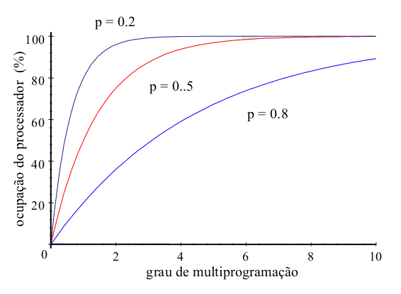

O número de processos que devem estar em memória têm de ser otimizados. O número de processos em memória depende do número de processos I/O intensivos (`I/O-bound`) ou CPU intensivos (`CPU-bound`)

## Hierarquia da memória
Para melhorar a eficiência do sistema e reduzir os custos, as memórias devem ser otimizadas para as funções que vão desempenhar:

\begin{table}[H]
\centering
\begin{tabular}{@{}lccc@{}}
				& Cache        & Principal & Secundária \\ \toprule
 tamanho    & \begin{tabular}[c]{@{}c@{}}pequena \\ (dezenas de KB \\ ou unidades de MB)\end{tabular} 
 				& \begin{tabular}[c]{@{}c@{}}tamanho médio\\ (centenas de MB \\ ou unidades de MB)\end{tabular} 
				& \begin{tabular}[c]{@{}c@{}}Grande \\ (dezenas, centenas \\ ou milhares de GB)\end{tabular} \\
 velocidade & muito rápida & rápida    & lenta  \\
 preço      & cara  		   & razoável  & barata \\
 volátil    &  ✓           & ✓         & x \\ 
\end{tabular}
\vspace{5mm}
\caption{Comparação entre os diferentes tipos de memórias de um sistema computacional}
\end{table}


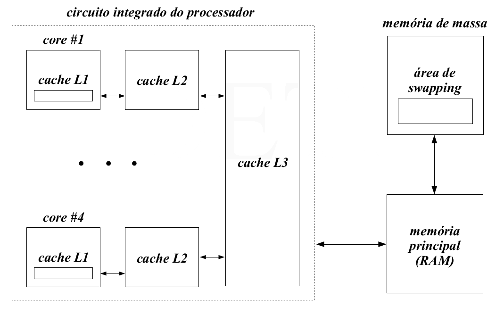

### Memória Cache
- Contém uma cópia das **posições** e **operandos** mais frequentementes referenciadas pelo processador num passador próximo
- Existem 3 tipos de `memória cache`
	- **L1:** localizada no **IC[^1] do processador**
	- **L2** e **L3:** localizadas num **IC autónomo** mas no mesmo substrato que L1
- O controlo da transferência de dados de/para a memória principal é feito de modo quase completamente **transparente** ao programador
- É útil devido ao **princípio da localidade de referência**


[^1]: IC: Integrated Circuit

### Memória Secundária
Duas funções principais:

- Armazenar de forma **não-volátil** a informação (dados e programas), através de um **sistema de ficheiros** implementado no dispositivo
- **extender a memória principal** para que o tamanho desta não seja limitativo ao número de processos que podem coexisitir em memória - `área de wapping`


### Princípo da Localidade da Referência

Temporal:
> Quando é acedido um endereço de memória (quer seja para r/w uma variável ou para ler uma instrução), a probabilidade de voltar a aceder a esse mesmo endereço de memória é mais elevada do que aceder a outros endereços de memória

Espacial:
> Quando é acedido um endereço de memória (quer seja +ara r/w de uma variável ou para ler uma instrução), a probabilidade de aceder a offsets do endereço de memória é mais elevada do que aceder a endereços muito distantes

Estes princípios baseiam-se no facto de que quanto **mais afastada** uma instrução/operando está do endereço atual que o processador está a executar, **menos vezes será referenciado**. 

O uso destes princípios no design de software e hardware tem como objetivo diminuir o tempo médio de acesso à referência.

Estes princípios foram derivados da **constatação heurística** do comportamento de um programa em execução. Conclui-se que as referências à memória durante a sua execução tendem a **concentrar-se** em **frações bem definidas do seu espaço de endereçamento** em intervalos de tempo mais ou menos longos

## Gestão da memória num ambiente multiprogramado
- **objetivo:** Tirar partido dos princípios anteriores


A função principal é **controlar a transferência de dados** entre a **memória principal** e a **memória secundária**, garantindo:

- Manter o _track_  das partes da **memória principal** que estão **ocupadas** e as partes que estão **livres**
- Reservar secções da memória para as necessidades dos processos
- Libertar secções da memória quando os processos terminam
- Transferir para a `área de swapping` a totlidade/parte do **espaço de endereçamento** de um processo quando a memória principal não consegue guardar todos os processos que coexistem em memória


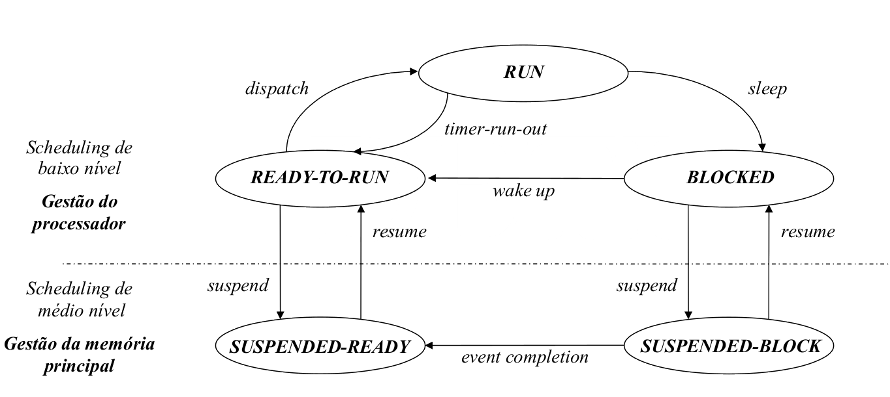


## Espaço de Endereçamento


- Os ficheiros `object` (resultantes da compilação), possuem todos os seus endereços das diversas instruções, constantes e variáveis calculados a partir do endereço 0 (início dos endereços do módulo)


Se a linkagem for **estática:**

- Após linkagem, os diferentes ficheiros objeto são reunidos num único ficheiro executável
	- São resolvidas as várias referências externas
	- As bibliotecas de sistema podem não estar incluídas na linkagem para minimizar o tamanho do ficheiro
- O `loader` constrói a **imagem binária do espaço de endereçamento do processo**
	- ficheiro executável + bibliotecas de sistema
	- Resolve todas as dependências externas que não foram incluídas no ficheiro executável no processo de linkagem


Se a linkagem for **dinâmica**, cada referência no código do processo é substituída por um `stub`:

- `stub`: pequeno conjunto de instruções que determina a localização de uma rotina
	- se a rotina estiver em memória princiapal, executa-a
	- se não estiver, força o seu carregamento para memória principal (e depois executa-a)
- Quando um `stub` é executado **pela primeira vez** obtém a referência para o endereço de memória da rotina
	- Substitui no **código do processo** o seu endereço pelo endereço da rotina
	- Executa a rotina
- Quando a secção de código onde era executado o `stub` é novamente atingida, a **rotina do sistema** é executada **diretamente**


Como vários processos independentes podem executar a mesma biblioteca do sistema, ao todos executarem uma cópia do código **minimiza-se** a ocupação da **memória principal**


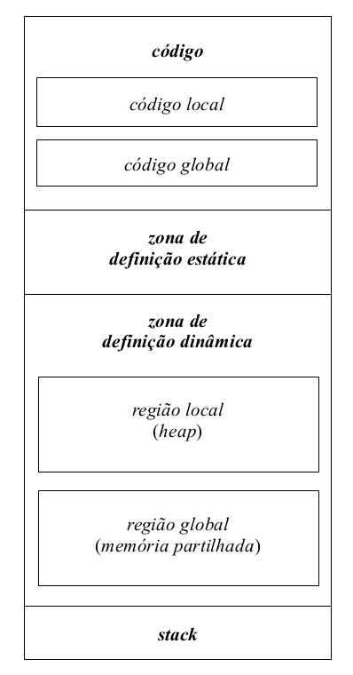

- As zonas de de código e definiçao estática de variáveis têm um **tamanho fixo**
	- Determinado pelo `loader`
- As `zonas de definição dinâmica` e a `stack` podem variar de tamanho ao longo da execução do programa
	- O espaço de memória referente à `zona de definição dinâmica` e à `stack` pode ser usada alternativamente entre eles
	- Quando o espaço para a `stack` cresce e o espaço disponível é esgotado pelo **lado da `stack`**, ocorre um `stack overflow`

### Exemplo
 Considerando o seguinte código fonte

```c
//ficheiro fonte
#include <stdio.h>
#include <stdlib.h>

int main (void)
{
	printf ("hello, world!\n");
	exit (EXIT_SUCCESS);
}
```

a produção do ficheiro objeto pode ser feita com:

```bash
gcc -Wall -c hello.c
```

e o executável gerado através de:

```bash
gcc -o hello hello.o
```

Antes da linkagem temos:

```bash
>> file hello.o
hello.o: ELF 32-bit LSB relocatable, Intel 80386, version 1 (SYSV), not stripped
```

```bash
>> objdump -fstr hello.o

hello.o:      file format elf32-i386
architecture: i386, flags 0x00000011:
HAS_RELOC, HAS_SYMS
start address 0x00000000
SYMBOL TABLE:
00000000 l     df *ABS* 00000000 hello.c
00000000 l     d .text            00000000
00000000 l     d .data            00000000
00000000 l     d .bss             00000000
00000000 l     d .rodata          00000000
00000000 l     d .note.GNU-stack 00000000
00000000 l     d .comment         00000000
00000000 g      F .text 0000002a main
00000000          *UND* 00000000 printf
00000000          *UND* 00000000 exit

RELOCATION RECORDS FOR [.text]:
OFFSET   TYPE              VALUE
00000014 R_386_32          .rodata
00000019 R_386_PC32        printf
00000026 R_386_PC32        exit

Contents of section .rodata:
 0000 68656c6c 6f20776f 726c6421 0a000000   hello world!....

Contents of section .comment:
 0000 00474343 3a202847 4e552920 332e332e   .GCC: (GNU) 3.3.
 0010 3120284d 616e6472 616b6520 4c696e75   1 (Mandrake Linu
 0020 7820392e 3220332e 332e312d 326d646b   x 9.2 3.3.1-2mdk
 0030 2900                                  ).
$
```

Após a linkagem temos:

```bash
>> file hello
hello: ELF 32-bit LSB executable, Intel 80386, version 1 (SYSV), for GNU/Linux
2.2.5, dynamically linked (uses shared libs), not stripped
```

```bash
>> objdump -fTR hello

hello:     file format elf32-i386
architecture: i386, flags 0x00000112:
EXEC_P, HAS_SYMS, D_PAGED
start address 0x080482d0
DYNAMIC SYMBOL TABLE:
0804829c      DF *UND* 000000e6 GLIBC_2.0      __libc_start_main
080482ac      DF *UND* 0000002d GLIBC_2.0      printf
080482bc      DF *UND* 000000c8 GLIBC_2.0      exit
080484b4 g    DO .rodata         00000004 Base         _IO_stdin_used
00000000 w    D *UND* 00000000                 __gmon_start__
DYNAMIC RELOCATION RECORDS
OFFSET   TYPE              VALUE
080495cc R_386_GLOB_DAT    __gmon_start__
080495c0 R_386_JUMP_SLOT   __libc_start_main
080495c4 R_386_JUMP_SLOT   printf
080495c8 R_386_JUMP_SLOT   exit
$
```

Podemos verificar que passam a existir mais instruções no ficheiro `object`:

- A função `main` tem de ser executada por alguém...
- É preciso construir o `argv` e o `argc` para passar à `main`
- Implica codigo adicional 

### Espaço de endereçamento lógico vs físico
- **espaço de endereçamento lógico:** espaço de endereçamento realocável
- **espaço de endereçamento físico:** região da memória principal onde o processo é carregado para ser executado


Uma vez que a **Imagem binária do espaço de endereçamento de um processo** é mapeada no **espaço lógico** do processo, em sistemas multiprogramados é necessário garantir:

- **mapeamento dinâmico:** capacidade de conversão em `run-time` de um **endereço lógico** num **endereço físico**
	- Passo intermédio para permitir o armazenamento do espaço de endereçamento de um processo em qualquer região da memória principal (incluindo a sua mudança em `run-time`)
- **proteção dinâmica:** impedimento em `run-time` de referenciar endereços que estão localizados fora do espaço de endereçamento do processo (aka, `core dumped`)


# Arquitecturas de Memória Particionadas

## Arquitectura de partições fixas
- A memória principal (restante) é dividida num **conjunto fixo de partições**
	- Mutualmente exclusivas
	- Não necessariamente iguais
- Cada uma das partições contém o espaço de endereçamento físico de um processo


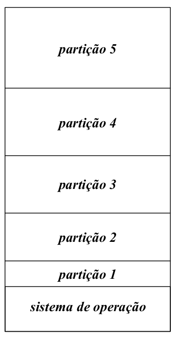


- A memória principal vai sendo dividida à medida que vai recebendo solicitações
- Podem ser utilizadas diferentes filosofias de escalonamento
	- **Valorização do critério de justiça**
		- Escolher o primeiro processo da fila de espera dos processos `Suspended-Ready` cujo **espaço de endereçamento cabe na partição**
	- **Valorização da ocupação da memória principal**
		- Escolher o primeiro processo da fila de espera dos processos `Suspended-Ready` com o **espaço de endereçamento de tamanho maior** que caiba na partição
		- Corre-se o risco de adiamento indefinido de processos com espaço de endereçamento pequeno (`starvation`)
		- Por isso associa-se um contador a cada processo
			- o contador é incrementado a cada passagem
			- contador > valor pré-definido $\implies$ **processo já não pode ser descartado**
			- Passa-se a aplicar a 1ª  regra


### Vantagens e Desvantagens
**Vantagens:**

- `simples de implementar`: não exige hardware ou estruturas de dados especiais para gerir a memória
- `eficiente`: a seleção pode ser feita rapidamente com qualquer das políticas acima


**Desvantagens:**

- `fragmentação interna da memória principal`: o espaço restante de cada partição que não é alocado pelo processo é desperdiçado
- `política direcionada para certos tipos de aplicações`: 
	- O tamanho das partições é fixo
	- A única maneira de ser evita o desperdício de memória é através da adequação do tamanho das partições ao tipo de processos a utilizar
		- número de processos
		- tipo de processos
		- tamanho do seu espaço de endereçamento
	- torna a solução pouco generalizável


## Arquitectura de posições variáveis
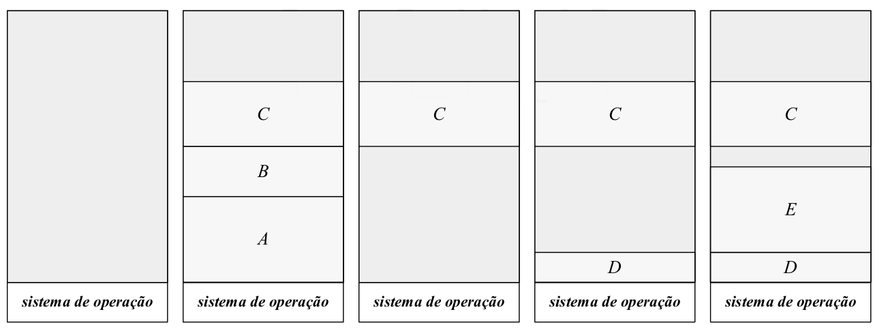

- Toda a parte disponível da memória constitui um bloco único
	- Sucessivamente são alocadas alocadas/atribuídas/reservadas regiões de tamanho suficiente para conter o espaço de endereçamento dos processos que vão sendo criados/`swapped-in`
	- Posteriormente ao processo terminar, os espaços de endereçamento deixam de ser usados e são libertados


### Gestão do espaço
Como a memória é reservada dinamicamente, o sistema de operação tem de manter um registo atualizado de:

- **Regiões livres:**
	- regiões ainda disponíveis na memória para armazenar o espaço de endereçamento dos novos processos:
		- criados
		- transferidos da `área de swapping`
- **Regiões Ocupadas:**
	- localiza as regiões que foram reservadas para armazenamento do espaço	de endereçamento dos processos que residem em memória principal


usando uma lista biligada (ou simplesmente ligada) para cada região. Estas listas:

- Não vão sempre indicar os espaços livres 
- Podem ser alargadas
- A sua gestão em feita em blocos
	- Posso adicionar blocos à lista medida que vou libertando blocos da memória principal
	- Se o bloco a libertar estiver contíguo a um (ou dois) bloco(s) livre(s) tenho de modificar a lista (e não simplesmente introduzir um novo bloco)


**Problema:** Se a região de memória reservada for exatamente a suficiente para o espaço de armazenamento do processo, existe o risco de `fragmentar` o disco em regiões de memória tão pequenas que não podem ser utilizadas. Para complicar, estas partições seriam introduzidas na lista de regiões livres tornando a lista mais complexa e aumentando o seu custo de processamento

**Solução:** A memória principal é dividida em múltiplos de **blocos de tamanho fixo** que constituem a unidade de trabalho para a alocação de partições

### Exemplo
Considerando o seguinte diagrama e tabela que mostra a distribuição de 3 processos em memória, juntamente com o espaço ocupado pelo sistema operativo e, temos:

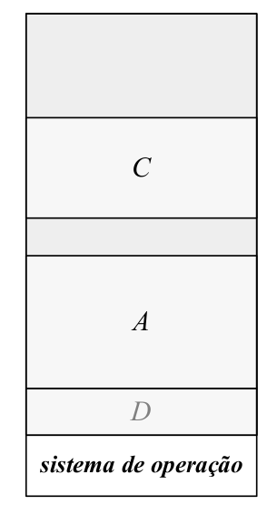

|		                     | Tamanho (bytes) |
|:------------------------:|:---------------:|
| Memória Principal        | 256 M				|
| Sistema de Operação      | 4M					|
| Unidade de reserva [^3]  | 4K					|
| Processo A               | 4M					|
| Processo C               | 3M					|
| Processo D               | 1M 				   |

: Distribuição da ocupação da memória 

Tamanho mínimo de uma partição. Todos os endereços em memória são múltiplos da unidade de reserva


A obtenção da `lista das regiões ocupadas` e da `lista das regiões livres` pode ser determinada de forma trivial:


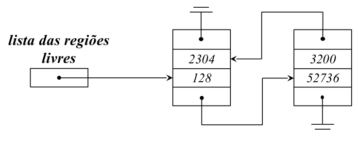


### Políticas de Escalonamento
 
A **valorização do critério de justiça** é a disciplina de escalonamento mais adotada.

- É escolhido o **primeiro** processo da **fila de espera** dos processos `Suspended-Ready` cujo espaço de endereçamento pode ser colocado em memória principal
- O **principal problema** de uma arquitectura de partições variáveis é o `grau de fragmentação externa` que é produzido na memória principal
	- sucessivas **alocações** e **libertações** das partições do espaço de endereçamento dos processos
	- em casos críticos, podemos ter situações em que apesar de **haver memória livre em quantidade suficiente**, ela **não é continua** e não é possível alocar espaço em memória para um novo processo
- A solução passa por efetuar `garbage collection`
	- agrupar todas as posições/partições de memória livres num dos extremos da memória
	- obriga a mudança em memória de todos os processos realocados
	- exige a paragem de todo o processamento
	- se a memória for grande, tem um tempo de execução elevado


Para a escolha da região de memória principal a ser reservada para o armazenamento do processo, dominam as seguintes políticas:
1.`first fit`
	- A lista de regiões livres é pesquisada desde o princípio
	- A região de memória a ocupar é a primeira região com tamanho suficiente encontrada
2. `next fit`
	- Variante do `first fit`, com os mesmos princípios de decisão 
	- No entanto, a pesquisa é iniciada do ponto de paragem da pesquisa anterior
3. `best fit`
	- A lista de regiões livres é pesquisada na sua totalidade
	- Escolhe-se a região mais pequena de tamanho igual ou maior ao espaço de endereçamento do processo
4. `worst fit`
	- A lista de regiões livres é pesquisada na sua totalidade
	- A região escolhida é a maior região existente


Algumas considerações:

- Uma política que seja boa/rápida a inserir elementos na fila será má/lenta a removê-la
- É difícil encontrar soluções que sejam tão rápidas a inserir como a remover da fila de partições
- Os diferentes métodos possuem diferentes desempenhos:
	- grau e tipo de fragmentação causado
	- eficiência na reserva/libertação do espaço


### Vantagens vs Desvantagens

**Vantagens:**

- `Geral`: O âmbito da sua aplicação é independente do:
	- tipo de processos que vão ser executados
	- número
	- e tamanho do seu espaço de endereçamento (com algumas limitações)
- `pouco complexo`
	- não exige `hardware` especial
	- as estruturas reduzem-se a listas biligadas


**Desvantagens:**

- `Grande fragmentação externa da memória principal`
	- Uma fração da memória principal acaba por ser desperdiçada
	- É dividida em regiões reduzidas que não são úteis
	- O desperdício de memória pode chegar a um terço (regra dos 50%)
- `Pouco Eficiente`
	- Não é possível desenvolver algoritmos que sejam eficientes quer a:
		- **reservar/alocar espaço** 
		- **libertar espaço**


# Organização da memória real

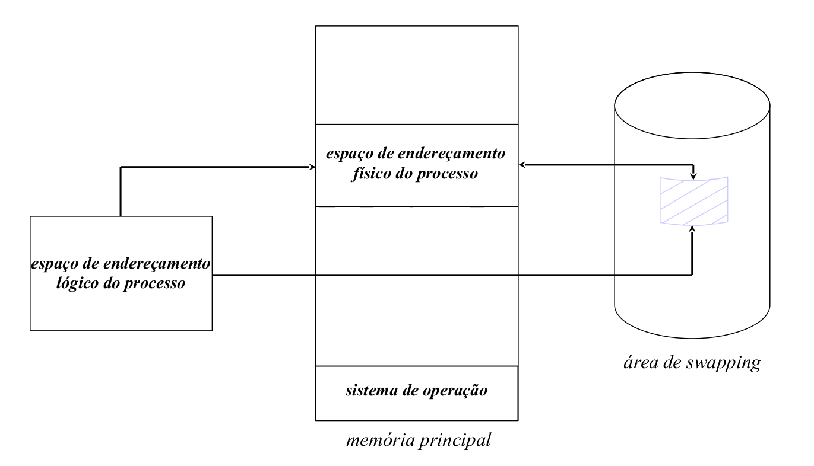

Existe uma correspondência biunívoca [^2] entre o **espaço de endereçamento lógico** de um processo e o **espaço de endereçamento físico** de um processo. Isto implica

- O **espaço de endereçamento de um processo é limitado**
	- O espaço de endereçamento de um processo nunca pode ser superior ao tamanho de memória principal disponível
	- Os mecanismos que o tentem fazer devem ser bloqueados
- O **espaço de endereçamento físico de um processo deve ser contíguo**
	- Não e uma condição estritamente necessária
	- Simplifica e torna mais eficiente se o espaço de endereçamento de um processo for obrigado a ser contíguo
- A **existência de uma área de swapping**
	- Serve como extensão da memória principal
	- Armazena espaços de endereçamentos de processos que não podem residir em memória principal por falta de espaço

[^2]: De um para um

## Tradução de um endereço lógico num endereço físico

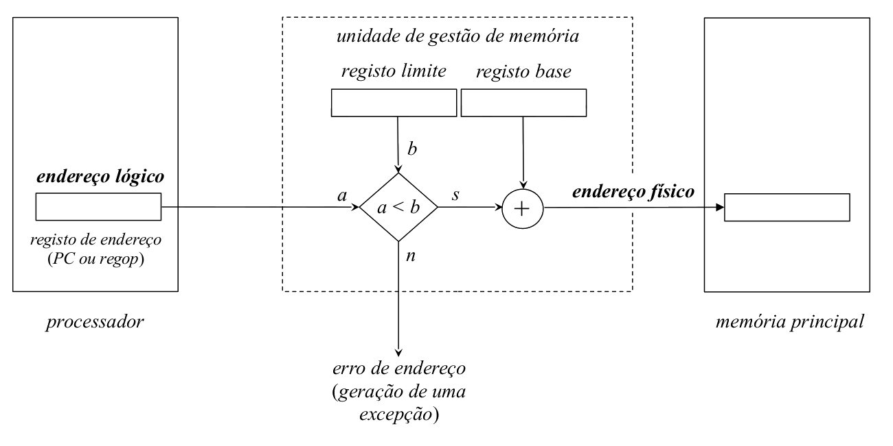

- `registo base`: endereço do início da região de memória principal onde está alojado o espaço de endereçamento físico do processo
- `registo limite`: tamanho em _bytes_ do espaço de endereçamento


Na comutação de processos:

- `dispatch` carrega o registo base e o registo limite da tabela de controlo de processos do processo que vai ser calendarizado para discussão


Sempre que há uma referência à memória, o **endereço lógico** comparado com o **registo limite** e:

- Se for **maior** $\implies$ **referência inválida**
	- Acesso à memória nulo é executado (aka `dummy cycle`)
	- É gerada uma exceção por erro de endereço
- Se for **menor** $\implies$ **referência válida**
	- a referência aponta para dentro do espaço de endereçamento do processo
	- o conteúdo do registo base é adicionado ao endereço lógico para produzir o endereço físico


## Memória real e o ciclo de vida de um processo

Depois de carregado o Sistema Operativo, o que resta da memória principal é usado para conter o espaço de endereçamento dos diferentes processos

### Criação de um processo

- O processo está no estado `CREADTED`
- São inicializadas as estruturas de dados destinadas a geri-lo
	- A imagem binária do seu espaço de endereçamento é construída
	- O valor do campo `registo limite` da entrada da tabela de controlo de processos é determinado
- Se houver espaço em memória
	- o espaço de endereçamento do processo é carregado
	- o campo `registo base` é atualizado com o endereço inicial da região reservada
	- o processo transita para o estado `Ready-to-Run` e é colocado na respetiva fila de espera
- Se não houver espaço em memória
	- O processo transita para o estado `Suspended-Ready`
	- O processo é colocado na respetiva fila de espera
	- O seu espaço de endereçamento é armazenado temporariamente na `área de swap` 


### Ciclo de Vida do processo
- Ao longo da sua execução, o espaço de endereçamento do processo pode ser deslocado temporariamente para a `área de wapping`.
	- `Ready-to-Run` $->$ `Suspended-Ready`
	- `Blocked` $->$ `Suspended-Blocked`
- Sempre que há espaço em memória
	- Um dos processos presentes na fila de espera dos processos `Suspended-Ready` é selecionado
	- O seu espaço de endereçamento é carregado
	- O campo `registo base` da entrada da **tabela de controlo de processos** é atualizada com o endereço inicial da região reservada
	- O processo é colocado na fila de espera `Ready-to-Run`, transitando para esse estado
- Caso a lista de espera `Suspended-Ready` estiver vazia e existirem processos na fila de espera dos processos `Suspended-block`, um desses processos pode ser selecionado
	- À semelhança da transição `Suspended-Ready` para `Ready`, na transição `Suspended-Blocked` para `Blocked` as mesmas inicializações são feitas
	

### Fim de Vida do processo
- O processo transita para o estado `Terminated`
- O seu espaço de endereçamento é transmitido para a `área de swapping` (se não estiver lá), para aguardar o fim das operações


# Organização da memória virtual
- Num sistema com emmória virtual, o `espaço de endereçamento lógico` e o `espaço de endereçamento físico` de um processo estão **totalmente dissociados**


Como consequência:

- `O espaço de endereçamento de um processo não está limitado à memória física`
	- O espaço de endereçamento virtual é "ilimitado"
	- Podem criar-se mecanismos que permitam a um processo ocupar mais do que a memória principal disponível
- `Não continuidade do espaço de endereçamento físico`
	- O espaço de endereçamento dos processos podem estar dispersos por toda a memória
		- quer os blocos sejam de tamanho fixo ou variável
	- Garante-se uma ocupação mais eficiente do espaço disponível
- `Área de swapping`
	- Serve como extensão da memória principal
	- Guarda uma imagem atualizada dos espaços de endereçamento dos processos que coexistem de forma concorrente
	- guarda também as variáveis dinamicamente alocadas:
		- stack
		- zona de definição estática


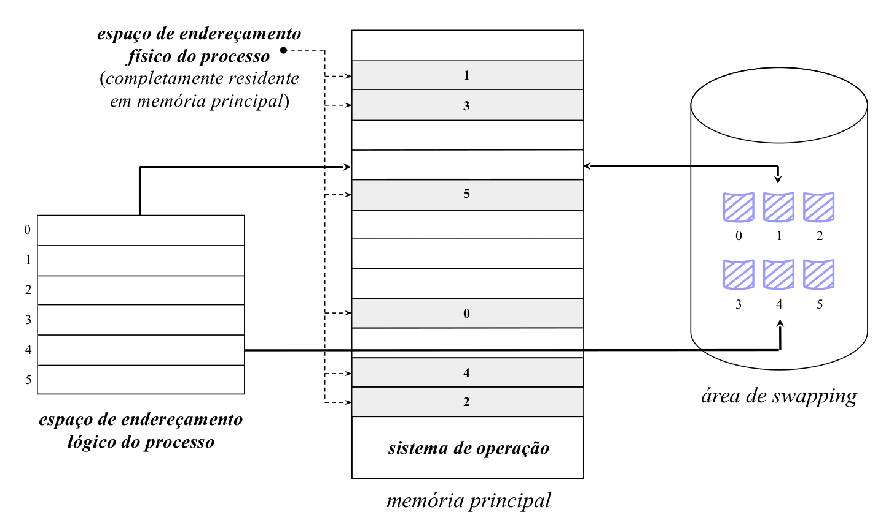


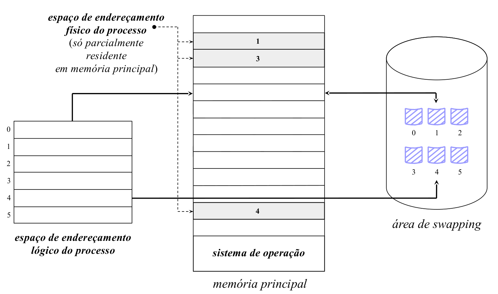


Acesso à memória decomposto em 3 fases
- Camp ndk é comaprado com o registo limite do tD (tabela de blocos)
	- saber se o processo está ou não a aceder a um bloco válido
		- inválido: segmentation fault
- é trazido para hardware o registo base e o registo
- tem de ser verificado se o processo está em memória
	- transferit da swap para a memória
- Se há condições, é executado
- Se não condições
	- processp no extado blocked
		- ativada uma exceçãoq ue faz a transferir dos blocos de memória da swap para a memoria principal
- Sefor válido o endereço limite
	- é feita a soma com o registo base
- Qualquer acesso pode provocar dois acesso
	- Trazer para memória o bloco de memória do processo (Ir à memória buscar)
	- Aceder à memória
	- Tem de ser decomposto m 2 acessos

- Princípio da localidade da referência:
	- O MMU faz caching dos valores dos registos dos últimos 
- Tempo médio de acessso:
	- Acesso ao TLB + acesso à memória principal

- QUando o rpocesso inicia
	- Os escaloadores tentam sempre garantir que o registo PC e a stack estão em memória
		- São as condições principais para que um programa possa ser executado

## Falta de bloco
- Salvaguadar o contexto do processo
- Situações de falta de página degridem muito a qualidade do sistema


\newpage
**NOT FINNISHED**

