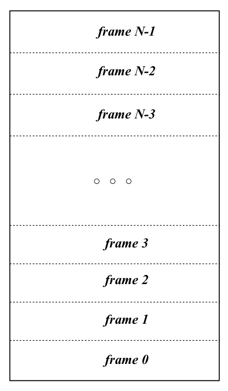
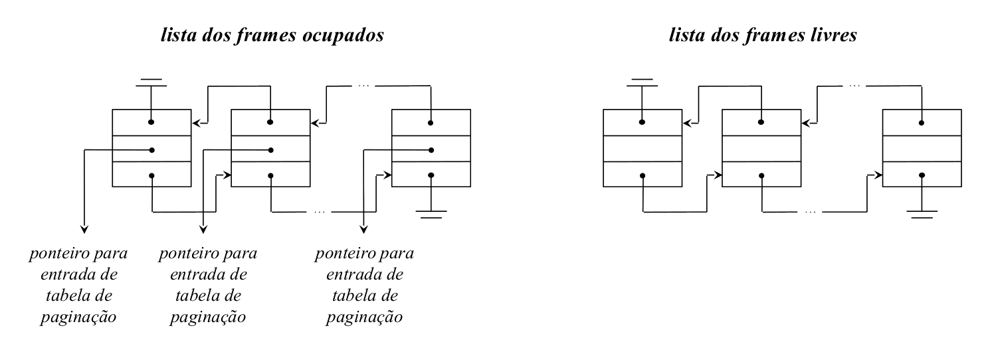
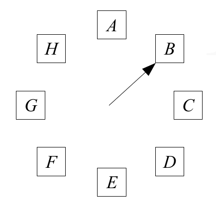

# Políticas de Substituição de páginas em memória

Numa arquitectura paginada ou segmentada/paginada a memória principal é vista como dividida operacionalmente me frames do tamanho de cada página

- Cada `frame` vai permitir o armazenamento do conteúdo de uma página do espaço de endereçamento lógico de um processo
- As páginas podem estar em dois estados diferentes:
	- `locked`: **Não podems er removidas de memória**
		- páginas associadas com o _kernel_ do SO
		- _buffer cache_ do sistema de ficheiros
		- _memory mapped file_
		- _memory mapped variables_
		- _memory mapped IO_
	- `unlocked`: **podem ser removidas de memória**
		- páginas associadas aos processos convencionais

Os `frames` estão associados em listas biligadas:

- se ocupados e associados a páginas `unlocked` $\implies$ `frames` passíveis de substituição.
- `frames` livres

O tipo de memória implementado pela **lista dos frames** ocupados depende do **algoritmo de substituição utilizado**

Quando ocorre uma **falta de página** (programa tenta aceder a uma dada página que não está em memória):

- a situação mais provável é a lista dos `frames livres` estar vazia
	- torna-se necessário selecionar um `frame` para substituição da lista dos `frames ocupados`
	- alternativamente, pode manter-se sempre na `lista dos frames livres` alguns `frames`
		- usa-se um deles para carregar a página em falta
		- procede-se de seguida **substituição de um `frame ocupado`**
		- é o **método mais eficiente** (as operações decorrem em paralelo)

É necessário ir mudando dinamixamente as páginas dos vários processos que vão existindo em memória. Se assumirmos ainda que os processos em execução ocupam toda a memória disponível, se um dos processos que está em execução precisar de aceder a um bloco que ainda não está em memória, como faço?

O problema que se coloca é: **Que frame escolher para a substituição?**. Em teoria deve ser um `frame` que:

- não irá ser mais referenciado
- ou a sê-lo, sê-lo-á o mais tarde possível

A condição anterior enuncia o **Princípio da Otimalidade**. Ao aplicar estes critérios na escolha da página **Minimiza-se** a ocorrência de outras **faltas de página**

**PROBLEMA:** o princípio da otimalidade é **não-causal**. Não pode ser diretamente implementado.

**Objetivo:** Encontrar estratégias de substituição que sejam realizáveis e que ao mesmo tempo, se aproximem tanto quanto possível do princípio da otimalidade

## Algoritmo LRU - Least Recently Used
- Visa encontrar o `frame` que não é referenciado à mais tempo
- Assumo que cada processo vai usar às paginas que usou à menos tempo
- Partindo do **princípio da localidade de referência**, se um `frame` não é referenciado há muito tempo, é fortemente provável que não venha a ser referenciado num futuro próximo
- Cada referência à memória precisa de ser sinalizada com o instante da sua ocorrência (conteúdo de um `timer` ou um contador)
	- Preciso de ordenar cronologicamente quantas páginas possuo em memória
	- Como é pouco provável que a unidade de gestão de memória possua a capacidade de o fazer, será necessário _hardware_ especializado
	- Ou então tenho de ir à memória ler a lista em cada pedido de acesso à memória
- Sempre que ocorre uma **falta de página**, a **lista biligada** dos `frames` ocupados tem de ser percorrida para determinar qual o `frame` que foi acedido à mais tempo
	- HEAD: página acedida à menos tempo
		- tem de ser atualizada a cada acesso à memória
	- TAIL: página acedida à mais tempo

Possui um **custo de implementação elevado e pouco eficiente**

### Algoritmo NRU	- Not Recently used
- Aproximação menos exigente e relativamente eficiente do LRU.
- Usa os bits `Ref` e `Mod` que são processados tipicamente por uma unidade de gestão de memória convencional:
	- Sempre que uma página é acedida para leitura, o campo Ref é colocado a 1
	- Sempre que uma página é acedida para escrita, o campo Ref e Mod são colocados a 1
- Periodicamente o SO percorre a `lista dos frames ocupados` e coloca a **zero o bit `Ref`**
- Quando ocorre uma falta de página os `frames ocupados` enquadram-se numa das classes seguintes

		Classes		 Ref	    Mod
     ---------- --------- --------
 	  classe 0		 0			  0
 	  classe 1		 0			  1
 	  classe 2		 1			  0
 	  classe 3		 1			  1

A seleção da página a substituir será feita entre aquelas pertencentes à classe de ordem mais baixa existente atualmente na lista dos frames ocupados

## Algoritmo FIFO - First In, First Out
- Critério baseado no tempo de estadia das páginas em memória principal
- Baseia-se no pressuposto que **quanto mais tempo as páginas residirem em memória, menos provável será que elas sejam referenciadas a seguir**
- A `lista dos frames` ocupados está organizada num FIFO que espelha a **ordem de carregamento** das páginas correspondentes em memória principal

	 
Quando ocorre uma **falta de página:**

- retira-se do FIFO o elemento correspondente à **página há mais tempo em memória**

Algoritmo extremamente falível! Por exemplo:

- Páginas associadas com o código de um editor de texto
- compilador
- bibliotecas do sistema

## Algoritmo da Segunda Oportunidade
- A lista dos `frames ocupados` está organizada num FIFO que espelha a ordem de carregamento das páginas correspondentes em memória principal
- Quando ocorre uma **falta de página:**
	- retira-se do FIFO o **elemento correspondente à página há mais tempo em memória**
	- se o seu bit `Ref` estiver a **zero** $\implies$ a página é escolhida para **substituição**
	- caso contrário, coloca-se o seu bit `Ref` a **zero**
		- o nó é reintroduzido no fim da FIFO
		- o processo repete-se

## Algoritmo do relógio
- Segue a estratégia subjacente ao algoritmo da segunda oportunidade
- Torna a mais eficiente implementando a FIFO numa lista circular
- As operações `fifoIn` e `fifoOut` correspondem a incrementos de um ponteiro

Quando ocorre uma **falta de página:**

- Enquanto o bit `Ref` do `frame` pelo ponteiro **não for zero**:
	- O bit `Ref` é colocado a zero
	- O ponteiro avança uma posição
- A página apontada é escolhida para substituição
- O ponteiro avança uma posição

	
# Working set
- Quando um processo é colocado pela primeira vez na fila de espera dos processos `READY-TO-RUN`, só a 1ª  e última página do seu espaço de endereçamento (início do código e _stack_, respetivamente) é que são carregadas em memória
- Quando o processador for atribuído ao processo, suceder-se-ão inicialmente várias **faltas de página** a um ritmo rápido, porque não possui as páginas necessárias à sua execução em memória principal
- De seguida o número de flatas de página diminui e o processo entra numa fase da execução sem faltas de página
- Dado o princípio da localidade da referência, um processo vai aceder às mesmas variáveis e instruções.
- Assim, todas as páginas associadas à fração do espaço de endereçamento que o processo está atualmente a referenciar já estão todas presentes em memória principal

**working set:** conjunto de páginas é designado o working set do processo

Ao longo do tempo o `working set` do processo vai variar, não só no que respeita ao número, mas também às páginas concretas que o definem

Se o working set não consegue estar todo em memória vão ocorrer muitas **faltas de página** e o ritmo de execução será muito lento. Ocorre `trashning`:

- `frames` do working set a passarem para da memória para a swap 
- `frames` do `working set` na swap a serem passados para a memória

Se não correr `trashing`, o processo alterna entre períodos curtos que sofrerá muitas **faltas de páginas** e períodos longos quase sem **faltas de página**

O **objetivo prioritário** de qualquer política de substituição é garantir que mantem sempre o `working set` do processo em memória principal

Uma estratégia consiste em atribuir novos `frames`ao process sempre que este se encontre num período elevado de **faltas de página** e retirar-lhe `frames` quando as ocorrência de faltas de página baixar.

# Demand paging vs prepaging
Quando um processo é introduzido na fila de espera dos processos `READY-TO-RUN` pela 1ª  vez ou em resultado de uma suspensão, é preciso decidir que páginas colocar em memória principal.

- `Demand paging`: Estratégia  minimalista e menos eficiente
	- nenhuma página é colocada
	- o mecanismos de geração de **faltas de página** é que é responsável por formar o `working set` do processo
- `prepaging`: estratégia mais eficiente
	- procura-se adivinhar o `working set` do processo para minimizar a geração de faltas de página
	- na 1ª vez são colocadas as primeiras duas páginas atrás referidas
	- nas vezes seguintes, são colocadas o conjunto de páginas que residiam em memória no **momento em que o processo foi suspenso**

## Substituição global vs substituição local
Qual o âmbito da aplicação dos algoritmos de substituição? 

- **local**: a escolha é efetuada entre o conjunto de `frames` de um processo
- **global**: a escolha é efetuada entre o conjunto de todos os `frames` que continuem a lista de `frames` ocupados

É preferível o âmbito de aplicação global:

- Penso em cada processo globalmente
	- É mais fácil gerir `working sets` que mudam de dimensão
	- Permite-me suportar grandes variações de `working set` dos processos sem resultar desperdício de memória ou `trashing`
	- Desde que os processos não for em demasia, é possível minimizar o `thrashing`
		- Se a soma dos `working sets` de todos os processos é superior ao número de `frames unlocked` disponíveis em memória principal, entro em `thrashing`
		- A solução passa por ir suspendendo processos até que o `trashing` desapareça

