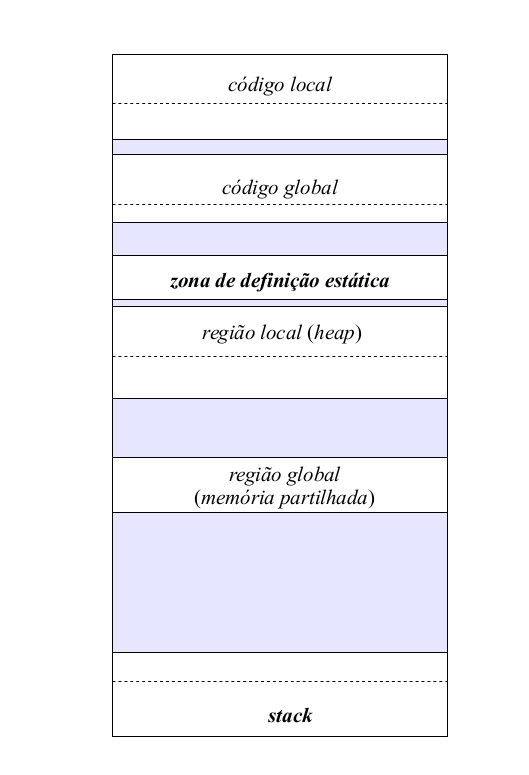
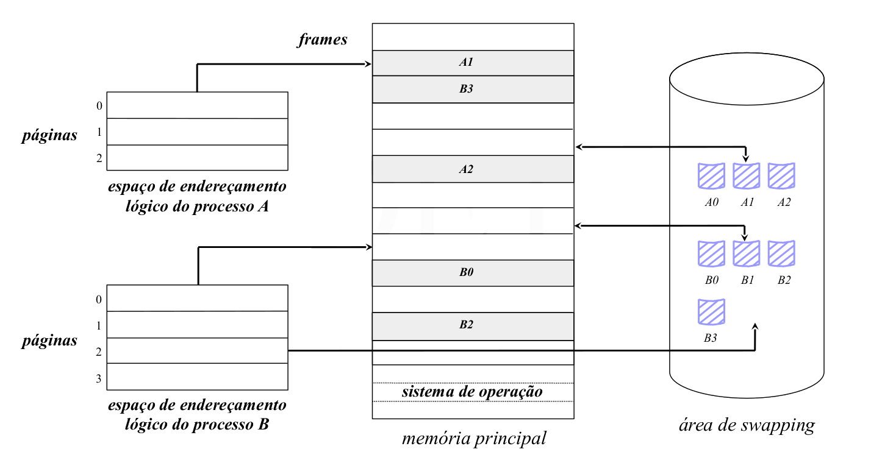
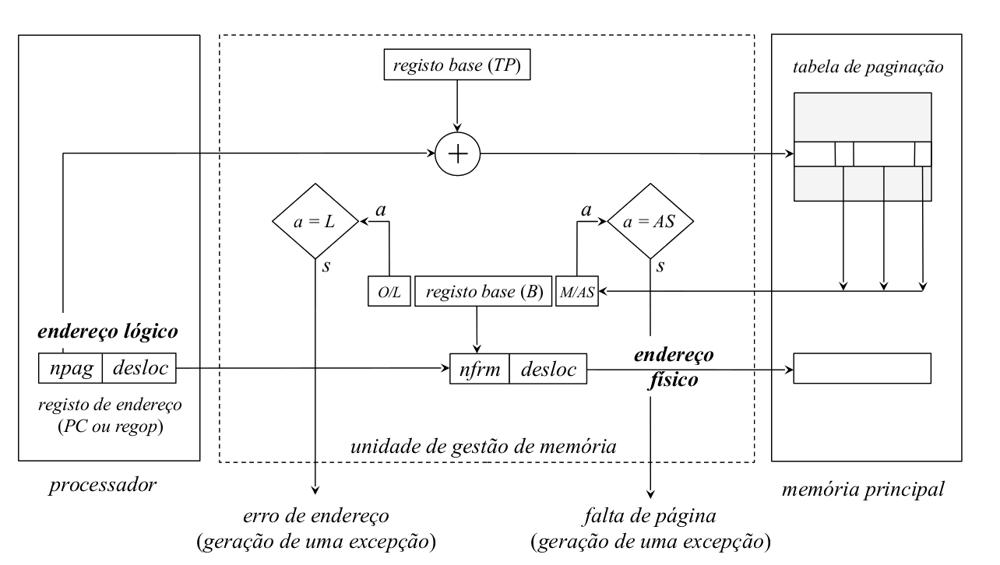
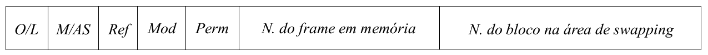

# Arquitectura paginada

Os blocos do espaço de endereçamento do processo passam a ser designados de **páginas**.

- São todos iguais
- Tamanho múltiplo de uma potência de 2
	- Tipicamente 4 ou 8 KB
- 

O espaço de endereçamento lógico é endereçado usando:

- **bits mais significativos:** número da página
- **bits menos significativos:** deslocamento

A memória principal é dividida em blocos da **mesma dimensão** que as **páginas**. A estes blocos chamamos **frames**

O `linker` organiza o espaço de endereçamento lógico do processo atribuindo o início de uma nova página a cada uma das regiões funcionalmente distintas:

- código local
- código global
- zona de definição estática
- região local _(heap)_
- região global _(shared memory)_
- `stack` (neste caso, atribuí o fim da página)

## Acesso à memória

- Deixa de ser necessário o registo limite na tabela de paginação do processo
	- A Tabela de paginação do processo só precisa do registo base
	- Não é necessário o endereço limite de uma página articular 
	- O endereço físico é formado pela concatenação entre os campos:
		- `nfrm` (identifica o frame da memória principal onde a página está localizada) 
		- `desloc` (identifica o deslocamento dentro da página/frame
		- endereço físico = nfrm | desloc
	- O endereço lógico é a concatenação de (32 bits):
		- bits MSB: número da página	(20 bits)
		- bits LSB: offset dentro da página (12 bits)
	- É possível estruturar o espaço de endereçamento lógico do processo de modo a mapear a totalidade (ou pelo menos uma fração) do espaço de endereçamento do processador
	- Estas frações de espaço podem ser maiores ou iguais ao tamanho da memória principal existente
- Diretamente resultam duas consequências:
	- É possível reservar espaço na zona de definição dinâmica 
	- A stack pode atingir a máxima amplitude possível
- As páginas correspondentes à zona de **definição dinâmica** (heap) e à **stack** só são criadas **quando necessário**
	- Permite poupar área de swapping
	- Origina um erro de endereço sempre que se tenta aceder a uma página que ainda não existe
		- Erro de segmento != Falta de página
			- Acesso a um endereço invalido != Acesso a um endereço válido mas que não existe em memória de swap
### Conteúdo da entrada da tabela de paginação

- **O/L** (Ocupada/Livre): bit que sinaliza a ocupação ou não desta entrada (a não ocupação significa que ainda não foi reservado espaço na área de swapping para esta página)
- **M/AS** (Memória/Área de Swap): bit que sinaliza se a página está ou não `residente em memória principal`
- **Ref** (Referenciada): bit que sinaliza se a página foi ou não `referenciada para leitura e/ou escrita`
- **Mod** (Modificada): bit que sinaliza se a página foi ou não `referenciada para escrita`
- **Perm** (Permissões): indicação do tipo de acesso permitido
	- `ronly` (read-only)
	- `read/write`
	- `rwx` (ler/escrever operandos, executar instruções)
- **Número do frame em memória (nfrm):** localização da página, se residente em memória principal
- **Número do bloco na área de swapping:** localização da página na área de swapping, se lhe foi atribuído espaço

## Vantagens e Desvantagens

### Vantagens
- **geral:** o âmbito da aplicação é **independente do tipo de processos** que vão ser executados (número e tamanho do espaço de endereçamento)
- **grande aproveitamento da memória principal:** 
	- não conduz à fragmentação externa
	- desfragmentação interna desprezável
- **não exige requisitos especiais de hardware:** a unidade de gestão de memória (MMU) existente nos processadores atuais já vem preparada para a sua implementação
	- Gera as exceções, os processadores é que têm de tratar delas
- As páginas só vão sendo atribuídas ao processos à medida das necessidades

### Desvantagens
- **acesso à memória mais longo:** 
	- cada acesso à memória transforma-se num duplo acesso devido à consulta prévia da tabela de paginação
	- pode ser minimizado usando a TLB, `translation lookaside buffer` para armazenar as entradas da tabela de paginação recentemente mais referenciadas
- **operacionalidade muito exigente:** 
	- a sua implementação exige que o SO possua um conjunto de operações de apoio complexas
	- essas operações têm de ser cuidadosamente estabelecidas para que não existam perdas grandes de eficiência
	- As entradas das tabelas de paginação são mais completas

