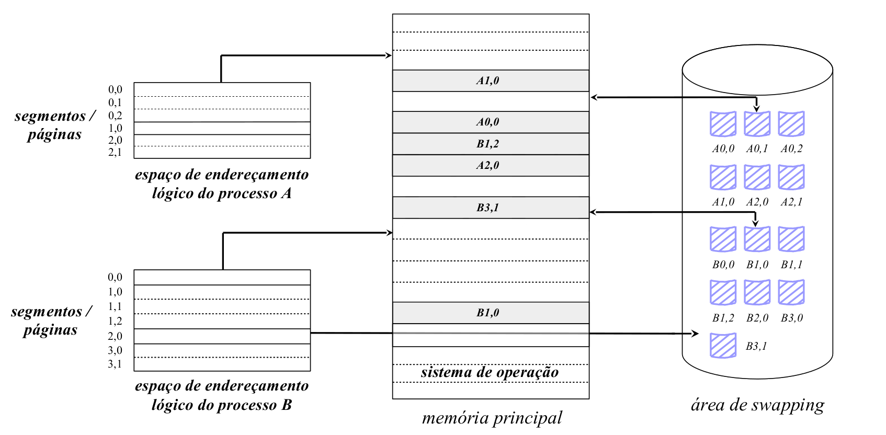
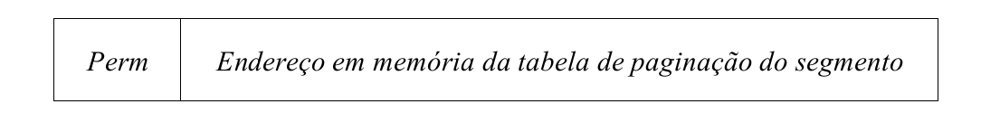
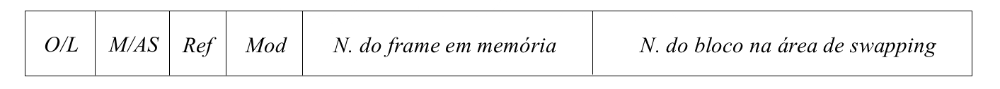

# Arquitectura Segmentada/Paginada
- Arquitectura mista que combina as características desejáveis das duas arquitecturas anteriores:
	- O **espaço de endereçamento lógico** é dividido em segmentos, com a atribuição na fa se de linkagem de múltiplos espaços de endereçamento autónomos
	- Cada um dos **segmentos** (espaços de endereçamento lineares) é divido em **páginas**
		- Origina um mecanismo de carregamento de blocos em memória principal com todas as características da arquitectura paginada

## Tradução de um endereço lógico num endereço físico numa arquitectura segmento-paginada

- O endereço lógico passa a possuir 3 campos:
	1. `nseg`: número do segmento
	2. `npah`: identifica a página no segmento
	3. `desloc`: localiza uma posição de memória concreta dentro da página (offset)
- A unidade de gestão de memória contém três registos base e um registo limite associados:
	- **endereço da tabela de segmentação** do processo: registo base (TS)
	- **número de entradas na tabela de segmentação**: registo limite
	- **endereço da tabela de paginação do segmento** que está a ser referenciado: registo base (TP)
	- **frame da memória principal** onde está localizada a página: registo base (P)
- Cada acesso à memória transforma-se em **3 acessos**:
	1. Referencio a **tabela de segmentação do processo** associada com o segmento descrito no campo `nseg` do endereço lógico para obter o **endereço da tabela de paginação do segmento**
	2. Referencio a entrada da **tabela de paginação do segmento** associada com a página  descrita no campo `npag` do endereço lógico para obter o `frame` da memória principal onde está localizada a página
	3. Referencio a posição de memória pretendida, concatenando o `nfrm` com o campo `desloc`

O campo `Perm` é deslocado para a entrada que descreve o segmento. O aceso pode ser tratado de maneira global, sendo as permissões aplicadas ao segmento.

Do ponto de vista do processo passam a ser precisas várias tabelas de paginação e várias tabelas de segmentação, sendo que cada tabela de segmentação pode ter mais que uma tabela de paginação.
 
## Vantagens vs Desvantagens

### Vantagens
- **geral:** pode ser aplicado independentemente do tipo de processos que vão ser executados. quer em número como em tamanho do seu espaço de endereçamento
- **grande aproveitamento da memória principal**: 
	- não conduz à fragmentação externa da memória
	- fragmentação interna +e desprezável
- **gestão mais eficiente da memória no que respeita a regiões de crescimento dinâmico**
- minimização do número de páginas que têm de estar residentes em memória principal em cada execução do processo

	 
### Desvantagens
- **Exige requisitos especiais de hardware**
	- Nem todos os processadores atuais de uso geral estão preparados para a sua implementação
- **Acesso à memória mais longo**
	- Cada acesso à memória é um **triplo acesso**
	- Pode ser minimizado se a unidade de gestão de memória contiver um **TLB** `translation lookaside buffer`
		- Seria usado para armazenamento das entradas da tabela de paginação recentemente referenciadas no segmento
- **Operacionalmente muito exigente**
	- A sua implementação por parte do SO é mais exigente do que a arquitectura paginada

