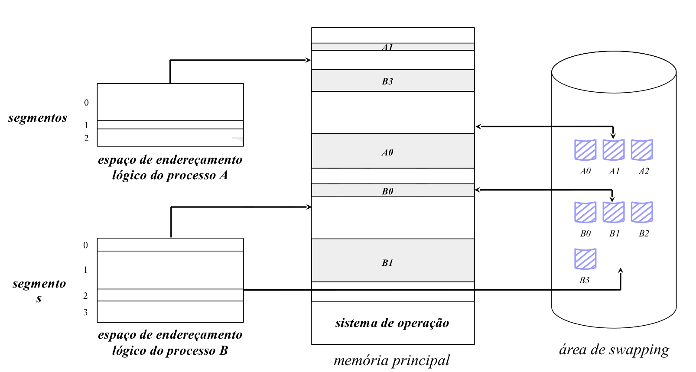
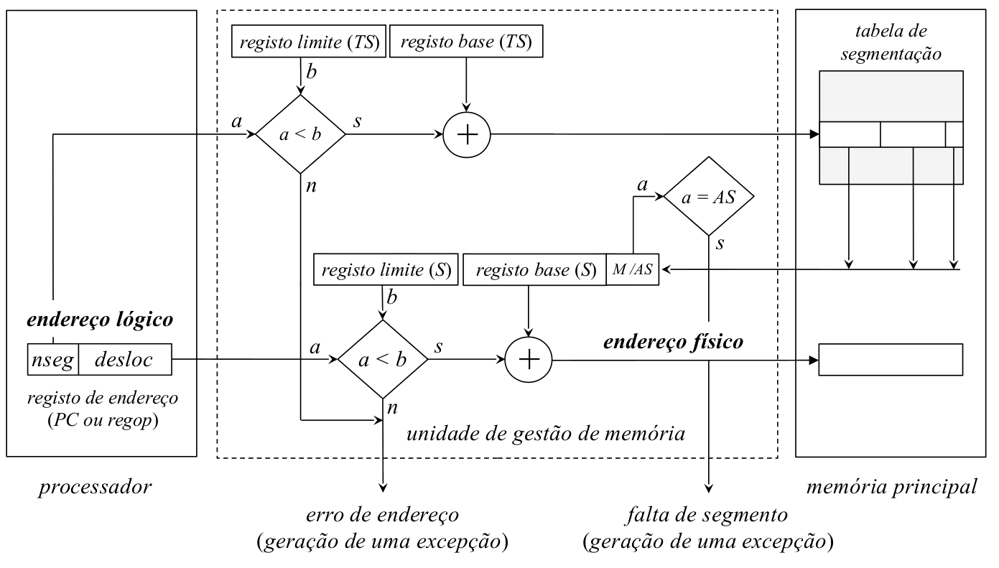

# Arquitectura Segmentada
- Divide o espaço de endereçamento lógico do processo em segmentos
	- **Divisão cega**. 
	- Não leva em consideração qualquer informação sobre a  estrutura do programa
	- Apenas efetua a divisão tendo em contas as regiões do código funcionalmente distintas (distinguidas atrás)
	- Não é possível trabalhar com grupos de segmentos
	- Na prática cada segmento é tratado de forma independente

Tem como consequência:

- A estrutura modular que está na base do desenvolvimento de software complexo **não é tida em conta**
	- **Não é possível usar o princípio da localidade da referência** para minimizar o número de páginas que tenham de estar residentes em memória principal em cada etapa de execução do processo
- A **gestão do espaço disponível** entre a zona de **definição dinâmica** e **stack** torna-se difícil e pouco eficiente
	- É agravada no caso de surgirem em run-time múltiplas regiões de dados partilhados de tamanho variável ou estruturas de dados de crescimento contínuo 

Uma solução consiste em desdobrar o espaço de endereçamento lógico do processo. Passamos de um espaço de endereçamento linear único (como na arquitectura paginada) para uma multiplicidade de espaços de endereçamento lineares autónomos definidos na fase de linkagem

- Cada módulo [^1] da aplicação irá originar dois espaços de endereçamento autónomos:
	1. código
	2. zona de definição estática:
		- variáveis globais á aplicação (definidas localmente) 
		- variáveis localmente globais (internas ao módulo)
-  Cada um destes espaços de endereçamento autónomo designa-se por `segmento`
	-  possui uma organização em memória virtual
- Os blocos/segmentos podem ser de comprimento variável

[^1]: ficheiro em código fonte de compilação separada

## Tipos de Segmentos:
- **região de código:** um segmento por cada módulo que contenha código (global ou local)
- **região de definição estática:** um segmento por cada módulo que contenha a definição de variáveis globais à aplicação ou módulo
- **zona de definição dinâmica local (heap):** um segmento
- **zona de definição dinâmica global:** um segmento por cada região de memória de partilha de dados
- **stack:** um segmento

## Tradução de um endereço lógico num endereço físico

## Conclusão
A arquitectura segmentada, na sua versão pura, possui pouco interesse prático. Ao tratar a memória principal como um espaço contínuo, exige que sejam aplicadas técnicas de reserva de espaço para carregamento de um segmento de memória. 

Estas técnicas assemelham-se ao que acontece numa estrutura de memória real com partições variáveis

Como consequência, existe uma grande **desfragmentação externa da memória principal**, resultando no **desperdício de espaço**

Coloca-se outro problema referente a segmentos de dados de crescimento contínuo:

- pode ser necessário efetuar um acréscimo de espaço ao tamanho do segmento mas este poderá não ser realizado na sua localização presente
	- obriga à transferência total para outra região de endereçamento de memória
	- no caso limite não existe memória disponível para essa expansão
		- o processo é bloqueado/suspenso
		- o seu segmento ou a totalidade do espaço de endereçamento são movidos para a área de swapping

