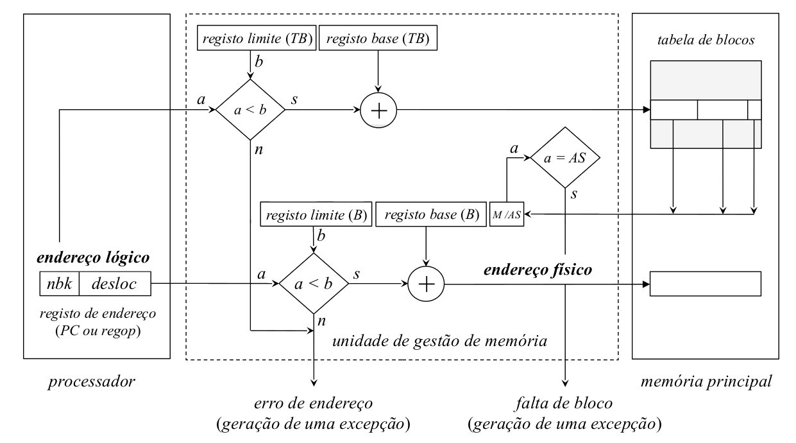
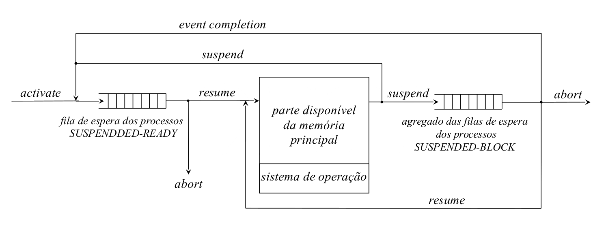

# Organização da memória virtual
- Num sistema com memória virtual, o `espaço de endereçamento lógico` e o `espaço de endereçamento físico` de um processo estão **totalmente dissociados**

Como consequência:

- `O espaço de endereçamento de um processo não está limitado à memória física`
	- O espaço de endereçamento virtual é "ilimitado"
	- Podem criar-se mecanismos que permitam a um processo ocupar mais do que a memória principal disponível
- `Não continuidade do espaço de endereçamento físico`
	- O espaço de endereçamento dos processos podem estar dispersos por toda a memória
		- quer os blocos sejam de tamanho fixo ou variável
	- Garante-se uma ocupação mais eficiente do espaço disponível
- `Área de swapping`
	- Serve como extensão da memória principal
	- Guarda uma imagem atualizada dos espaços de endereçamento dos processos que coexistem de forma concorrente
	- guarda também as variáveis dinamicamente alocadas:
		- stack
		- zona de definição estática

## Tradução de um endereço lógico num endereço físico

O endereço lógico é formado por dois campos:

- **nbk:** identificador de um bloco específico
- **desloc:** localiza uma posição de memória concreta dento do bloco, através do cálculo da distância ao seu erro

A **unidade de gestão de memória** contém dois pares de `registos base` e `limite`

1. Associado com a **tabela de blocos do processo**:
	- descreve a localização dos vários blocos me que o espaço de endereçamento do processo está dividido
2. Descrição de um bloco particular

Quando ocorre uma **comutação de processos** a operação de `dispatch` carrega o `registo base` e o `registo limite` da tabela de blocos com os valores na tabela de controlo de processos (associada com o processo que vai ser calendarizado para execução)

	- O valor do `registo base da tabela de blocos` representa o **endereço do início da região de memória principal** onde está alojada a tabela de blocos do processo
	- O valor do `registo limite` está relacionado com o número de entradas na tabela

### Acesso à memória
- Decomposto em 3 fases

1. Campo `ndk` do `endereço lógico` é comparado com o valor do **registo limite da tabela de blocos**
	- $ nbk < registo limite (TB) $
		- nbk é adicionado ao conteúdo do `regiso base da tabela de blocos` para produzir o endereço da entrada da tabela de blocos
	- $ ndk >= registo limite (TB) $
		- A referência é inválida e não é efetuado nenhuma acesso à memória
		- A instrução é interrompida por uma instrução de acesso à memória nulo _(dummy cycle)_
		- Gera-se uma exceção por erro de endereço: _`segmentation fault`_
2. É efetuada a avaliação do registo `M/AS`(_Memória/Área de Swap_)
	- se `M`: os **campos** da entrada da **tabela de blocos** referenciada são transferidos para os **registos respetivos** da unidade de gestão de memória.
	- se `AS`: 
		- o bloco não está **atualmente em memória**
			- tem de ser transferido para a instrução puder continuar
		- Instrução finalizada com um acesso à memória nulo
		- Gera-se uma exceção por falta de bloco
			- será responsável por iniciar a transferência dos blocos da swap para a memória principal
		- Processo transita para o estado `blocked`
3. o campo `desloc` (deslocamento) do `endereço lógico` é comparado com o valor do `registo limite (B)` (do bloco)
	- $ desloc < registo\ limite\ (B) \implies$ **referência válida
		- A referência é efetuada para dentro do espaço de endereçamento do bloco
		- `desloc` é adicionado ao conteúdo do registo base do bloco para produzir o endereço físico
	- $ desloc >= registo\ limite\ (B) \implies$ **referência inválida**
		- é efetuado um acesso à memória nulo _(dummy cycle)_
		- gera-se uma exceção por erro de endereço _`segmentation fault`_

A gestão do espaço de memória principal usando uma organização de memória virtual possui a vantagem de permitir maior versatilidade, mas também possui o custo associado de que **cada pedido de acesso à memória (r/w) requer dois acessos para puder ser executado**

- **1ª Acesso:**
	- Referencia a entrada da tabela de blocos do processo, usando o campo `nbk` do endereço lógico como endereço do bloco em memória que contém o endereço da posição de memória que se quer ler/escrever
- **2º Acesso:** É feita referência à posição de memória específica (que se deseja efetivamente aceder)
	- O cálculo do seu endereço é efetuado adicionando o campo `desloc` do endereço lógico ao endereço que corresponde ao início do bloco em memória

- A organização em memória virtual causa um **fracionamento do espaço de endereçamento lógico** do processo.
- Os blocos/frações são tratadas dinamicamente como sub espaços de endereçamento **autónomos** numa organização de memória real
	- A memória real pode estar organizada em partições físicas ou em partições variáveis
- A diferença entre uma organização de memória virtual vs uma organização de memória real é que passas a existir a possibilidade de ocorrer o acesso a um bloco que atualmente não reside em memória principal
	- Nestas condições o sistema é capaz de anular a instrução de acesso atual
	- Meter em marcha a sequência de instruções que permite carregar esse bloco para memória principal
	- repetir a instrução assim que o bloco for carregado
	 

Evidentemente, a necessidade do duplo acesso à memória pode ser minimizada tirando partido do **Princípio da localidade da referência:**

- Os acessos tenderão a estar concentrados num conjunto bem definido de blocos durante grandes intervalos de tempo de execução do processo
- A MMU faz caching do conteúdo das entradas da tabela de blocos que forma ultimamente referenciadas, usando uma memória associativa _(`translation lookaside buffer (TLB)`)_:
	- Cada acesso passa assim a ser um:
		- `hit`: 
			- a entrada está armazenada no processador
			- o acesso é interno
			- não é referenciada memória na 1ª fase
		- `miss`:
			- a entrada não está armazenada na TLB
			- é preciso um acesso externo à memória principal na 1ª fase 
- O tempo médio de acesso a uma instrução/operado tende para:
	- Acesso ao TLB + acesso à memória principal

## Ciclo de vida de um processo

### Criação de um processo

- estado: `CREATED`
- são inicializadas a estruturas de dados destinadas a geri-lo
	- É construída a imagem binária do seu espaço de endereçamento
	- É transferida para a área de swapping a sua parte variável
	- A tabela de blocos associada é organizada 
		- Se existir espaço livre em memória é carregado em memória principal:
			- o 1º bloco de código do processo
			- o bloco da stack
			- as entradas correspondentes da tabela de blocos são atualizadas
			- estado: `READY-TO-RUN`
			- colocado na fila de espera de processos prontos a serem executados
		- Se não existir:
			- estado: `SUSPENDED-READY`
			- colocado na fila de espera de processos suspensos mas prontos a serem transferidos para memória principal e executados
- Os escalonadores tentam sempre garantir que o registo PC, a stack estão em memória e o primeiro bloco de instruções de estão em memória
		- São as condições principais para que um programa possa ser executado

### Ao longo da execução
- Se ocorrer um acesso a um bloco não residente em memória principal:
	- estado passa a `BLOCKED`
		- permanece `BLOCKED` enquanto ocorre a transferência do bloco para memória principal
		- quando a transferência terminar, passa a `READY-TO-RUN`
		- é colocado na fila de espera de processos `READY-TO-RUN`
- Os blocos residentes na memória principal pertencentes a um mesmo processo podem ser `swappeed-in`
	- os seus blocos são "movidos" para a área de swap
	- o estado passa de:
		- `READY-TO-RUN` -> `SUSPENDED-READY`
		- `BLOCKED` -> `SUSPENDED-BLOCK`
- Sempre que há espaço memória:
	- um dos processo presentes na fila de espera `SUSPENDED-READY` é selecionado
	- A tabela de blocos e um grupo de blocos do seu espaço de endereçamento são carregados
	- As entradas correspondentes na tabela são atualizadas com os endereços iniciais das regiões reservadas
	- o processo é colocado na fila de espera de processos `READY-TO-RUN`
- Se a lista `SUSPENDED-READY` estiver vazia e **houver processos na fila de espera** dos processos `SUSPENDED-BLOCK`
	- Pode ser selecionado um destes processos
	- Passa para o estado `BLOCKED` e é inserido na respetiva lista de espera

### Término de um processo
- estado: `TERMINATED`
- A imagem do seu espaço de endereçamento residente na área de swapping (ou pelo menos a sua parte variável) é atualizada
	- libertação de todos os blocos existentes em memória principal
	- Aguarda pelo fim das operações

## Exceção por falta de bloco
- A rotina de serviço a esta interrupção/exceção é responsável por em marcha as ações que permitam:
	- a transferência desse bloco da área de swapping para a memória principal
	- a repetição da instrução que produziu a referência

- Estas operações são realizadas de forma totalmente transparente ao utilizador

Se um processo estivesse continuamente a gerar exceções por falta de bloco:

- o ritmo de processamento seria muito lento
- o _`throughput`_ do sistema computacional seria mais baixo

Isto não acontece (pelo menos com tanta frequência devido à hierarquia da memória e principalmente há `Translation Lookaside Bffer` da unidade de memória, usando o princípio da localidade de referência.

Apesar da fração do espaço de endereçamento variar com o tempo, o custo em carregar vários  blocos pontualmente para memória, relativamente a outras soluções é reduzido, podendo progredir a execução do processo praticamente sem ocorrerem faltas de bloco.

Situações de falta de página degridem muito a qualidade do sistema

### Sequência de instruções
1. Salvaguardar o contexto do processo na entrada correspondente na tabela de controlo de processos
	- estado: `BLOCKED`
	- atualizar o seu \$PC [^1] para o endereço que produziu a falta de bloco
2. Determinar se existe espaço em memória para carregar o bloco em falta
	- Caso **exista**: selecionar uma região livre
	- Caso **não exista**: selecionar uma região cujo bloco vai ser substituído
		- se tiver sido modificado -> transferi-lo para a `área de swapping`
		- atualizar a entrada da tabela de blocos do processo a que o bloco pertence
			- indicar que o bloco já não se encontra em memória (registo `M/AS`)
3. Transferir o bloco em falta da área de swapping para a região selecionada
4. Invocar o escalonador para calendarizar a execução de um dos processos da fila de espera `READY-TO-RUN`
5. Quando a transferência estiver concluída
	- Atualizar a entrada da tabela de blocos do processo
		- indicar que o processo está residente em memória
		- indicar a sua localização
	- estado: `READY-TO-RUN`
	- colocar o processo na fila de espera `READY-TO-RUN`

[^1]: \$PC: registo do Program Counter
