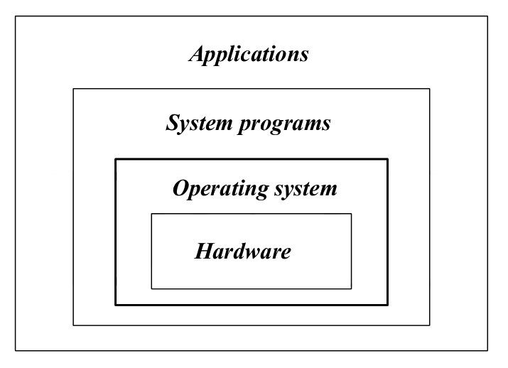
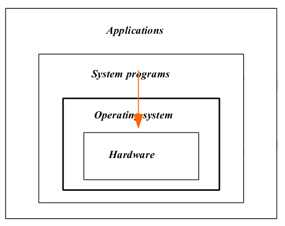
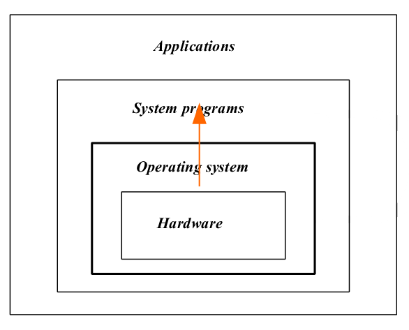
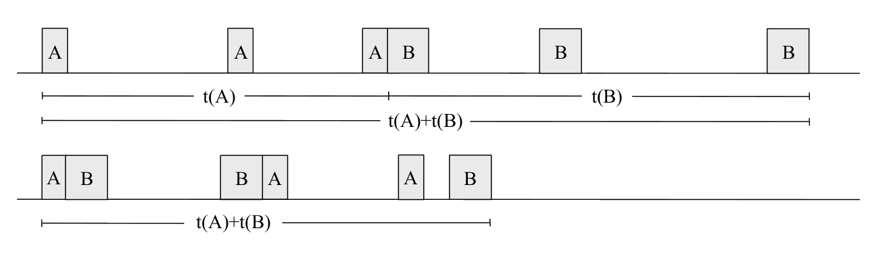
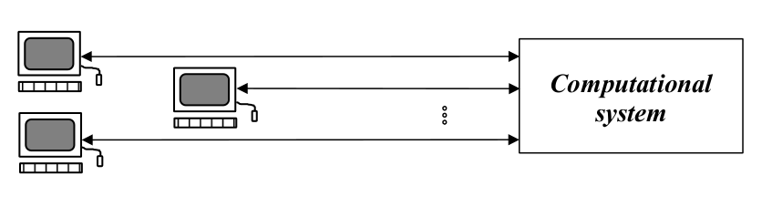
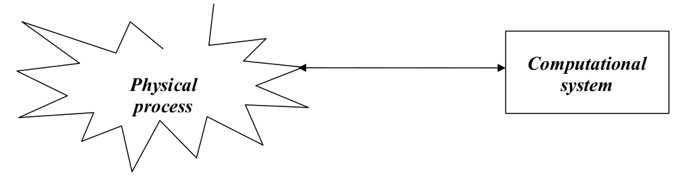
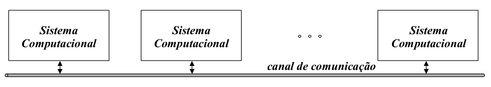
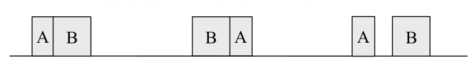

# Sistemas de Computação

## Vista simplificada de um sistema de computação
Um sistema operativo é um sistema/programa base que é executado pelo sistema computacional.

- Controla diretamente o `hardware`
- Providencia uma **camada de abstração** para que os restantes **programas** possam **interagir com o `hardware`** de forma indireta

Podem ser classificados em dois tipos:

1. **gráficos:** 
	- utilizam um contexto de **janelas** num ambiente gráfico
	- os elementos principais de interação são os **ícones** e os **menus**
	- a principal ferramente de `input` da interação humana é o rato
2. **textuais _(shell)_:**
	- baseado em comandos introduzidos através do teclado
	- uma linguagem de scripting/comandos[^1]

[^1]: Linguagem de programação baseada em comandos. Otimizada para a escrita de scripts e comandos mais complexos a partir de comandos mais simples

**Os dois tipos não são mutualmente exclusivas.**

- Windows: sistema operativo gráfico que pode lançar uma aplicação para ambiente textual
- Linux: sistema operativo textual que pode lançar ambiente gráfico

## Vista geral

Os sistemas de operação podem ser vistos segundo duas perspectivas:

1. `Extended Machines`
2. `Resource Manager`

### Extended Machine

O sistema operativo fornece **níveis de abstração** (APIs) para que os programas possam aceder a partes físicas do sistema,  criando uma **"máquina virtual":**

- Os programas e programadores têm uma visão virtual do computador, um **modelo funcional**
	- Liberta os programadores de serem obrigados a saber os detalhes do hardware
- Acesso a componentes do sistema mediado através de `system calls`
	- Executa o core da sua função em root (com permissões de super user)
	- Existem funções que só podem correr em super user
	- Todas as chamadas ao sistema são interrupções
	- Interface uniforme com o `hardware`
	- Permite as aplicações serem **portáteis** entre sistemas de computação **estruturalmente diferentes**
- O sistema operativo controla o **espaço de endereçamento físico** criando uma camada de abstração **(memória virtual)**
		

#### Tipos de funções da extended machine
- Criar um ambiente interativo que sirva de interface máquina-utilizador
- Disponibilizar mecanismos para desenvolver, testar e validar programas
- Disponibilizar mecanismos que controlem e monitorizem a execução de programas, incluindo a sua intercomunicação e e sincronização
- Isolar os espaços de endereçamento de cada programa e gerir o espaço de cada um deles tendo em conta as limitações físicas da memória principal do sistema
- Organizar a memória secundária [^2] em sistema de ficheiros 
- Definir um modelo geral de acesso aos dispositivos de I/O, independentemente das suas características individuais
- Detetar situações de erros e estabelecer protocolos para lidar com essas situações

[^2]: Dispositivos de armazenamento não volátil: Disco rígidos
 
### Resource Manager

Sistema computacional composto por um conjunto de recursos:

- processador(es)
- memória
	- principal
	- secundária
- dispositivos de I/O e respetivos controladores

O sistema operativo é visto como um programa que gere todos estes recursos, efetuando uma gestão controlada e ordenada dos recursos pelos diferentes programas que tentam aceder a estes. O seu objetivo é **maximizar a performance** do sistema, tentando garantir a maior eficiência no uso dos recursos, que são **multiplexados no tempo e no espaço**.
 
## Evolução dos Sistemas Operativos
 
Primórdios : Sistema Electromecânico

- 1ª Geração: 1945 - 1955
	- Vacuum tubes
	- electromechanical relays
	-No operating system
	-programed in system
	- Program has full control of the machine
	- Cartões perfurada (ENIAC)
- 2ª geração: Transistores individuais

- 4ª Geração (1980 - presente)

	|Technology|Notes|
	|:----:|:-----:|
	| LSI/VLSI | Standard Operation systems (MS-DOS, Macintosh, Windows, Unix) |
	| personal computers (microcomputers) | Network operation systems |
	| network | |

- 5ª Geração (1990 - presente)

|Technology|Notes|
|:----:|:---:|
|Broadband, wireless | mobile operation systems (Symbian, iOS, Android)|
|system on chip|cloud computing|
|smartphone|ubiquitous computing|

# Taxonomia de Sistemas Operativos

## Classificação com base no tipo de processamento
- Processamento em série
- Batch Processing
	- Single
	- Multiprogrammed batch
- Time-sharing System
- Real-time system
- Network system
- Distributed System

### Multiprogrammed batch
- **Propósito:** Otimizar a utilização do processador
- **Método de Otimização:** Enquanto um programa está à espera pela conclusão de uma operação de I/O, outro programa usa o processador

	

### Interactive System (Time-Sharing)
-  **Propósito:** 
	- Proporcionar uma interface `user-friendly` 
	- Minimizar o tempo de resposta a pedidos externos
- **Método:**
	- Vários utilizadores mas cada um no seu terminal
	- Todos os terminais têm comunicação direta e em simultâneo com o sistema
	- Usando multiprogramação, o uso do processador é multiplexado no tempo, sendo atribuído um time-quantum a cada utilizador
	- No `macrotempo` é criada a ilusão ao utilizador que possui o sistema só para si

### Real Time System
-  **Propósito:** Monitorizar e (re)agir processo físicos 
- **Método:** Variante do Sistema Interativo que permite import limites máximos aos tempos de resposta para diferentes classes de eventos externos

### Network Operating System
-  **Propósito:** Obter vantagem com as interconexões de `hardware` existentes de sistemas computacionais para estabelecer um conjunto de serviços comuns a uma comunidade.

A máquina é mantêm a sua individualidade mas está dotada de um conjunto de primitivas que permite a comunicação com outras máquinas da mesma rede:

- partilha de ficheiros (ftp)
- acesso a sistemas de ficheiros remotos (NFS)
- Partilha de recursos (e.g. impressoras)
- Acesso a sistemas computacionais remotos:
	- telnet
	- remote login
	- ssh
- servidores de email
- Acesso à internet e/ou Intranet

### Distributed Operating System
-  **Propósito:** Criar uma rede de computadores para explorar as vantagens de usar **sistemas multiprocessador**, estabelecendo uma cada de abstração onde o utilizador vê a computação paralela distribuída por todos os computadores da rede como uma única entidade
- **Metodologia:** Tem de garantir uma completa **transparência ao utilizador** no acesso ao processador e outros recursos partilhados (e.g. memória, dados) e permitir:
	- distribuição da carga de `jobs` (programas a executar) de forma dinâmica e estática
	- automaticamente aumentar a sua capacidade de processamento de forma dinâmica se
		- um novo computador se ligar à rede
		- forem incorporados novos processadores/computadores na rede
	- a paralelização de operações
	- implementação de mecanismos tolerantes a falhas

## Classificação com base no propósito
- Mainframe
- Servidor
- Multiprocessador
- Computador Pessoal
- Real time
- Handheld
- Sistemas Embutidos
- Nós de sensores
- Smart Card

 
# Multiprocessing vs Multiprogramming
 
## Paralelismo

- Habilidade de um computador **executar simultaneamente** um ou mais programas
- Necessita de possuir uma estrutura multicore
	- Ou processadores com mais que um core
	- Ou múltiplos processadores por máquina
	- Ou uma estrutura distribuída
	- Ou uma combinação das anteriores

Se um sistema suporta este tipo de arquitectura, suporta **multiprocessamento**

O **multiprocessamento** pode ser feito com diferentes arquitecturas:

- **SMTP** - symmetric processing (SMP)
	- Computadores de uso pessoal
	- Vários processadores
	- A memória principal é partilhada por todos os processadores
	- Cada core possui cache própria
	- Tem de existir **mecanismos de exclusão mútua** para o hardware de suporte ao multiprocessamento
	- Cada processador vê toda a memória (como memória virtual) apesar de ter o acesso limitado
- **Planar Mesh** 
	- Cada processador liga a 4 memória adjacentes

 
## Concorrência 
-  Ilusão criada por um sistema computacional de "aparentemente" ser capaz de executar mais programas em simultâneo do que o seu número de processadores
- Os processador(es) devem ser atribuídos a diferentes programas de forma multiplexada no tempo

Se um sistema suporta este tipo de arquitectura suporta **multiprogramação**

 
# Estrutura Interna de um Sistema Operativo

Um sistema operativo deve:

- Implementar um ambiente gráfico para interagir com o utilizador
- Permitir mais do que um utilizador
	- Tanto simultânea como separadamente
- Ter capacidade de ser `multitasking`, i.e., executar vários programas ao mesmo tempo
- Implementar memória virtual
- Permitir o acesso, de forma transparente ao utilizador, a:
	- sistemas de ficheiros locais e/ou remotos (i.e., na rede)
	- dispositivos de I/O, independentemente da sua funcionalidade
- Permitir a ligação da máquina por rede a outras máquinas
- Conter um bom conjunto de `device drivers`
- Permitir a ligação de dispositivos `plug and play` [^1]

## Design de um sistema operativo
 Por estas razões, um sistema operativo é **complexo**, com milhões de linhas de código. O design e implementação do seu `kernel`pode seguir as seguintes filosofias:

- Monolithic 
- Layered (por camada)
- Microkernels
- Client-Server Model
- Virtual Machines
- Exokernels

[^1]: Dispositivos plug-and-play são dispositivos que podem ser ligados e desligados _"a quente"_, enquanto o computar está ligado

### Monolithic system
- A perspectiva mais utilizada
- Só existe um **único programa** a ser executado em `kernel mode`
- Um **único entry point**
	- Todos os pedidos ao sistema são feitos usando este `entry-point`
- Comunicação com o sistema através de `syscall` [^2]
	- Implementadas por um conjunto de rotinas 
	- Existe ainda outro conjunto de funções auxiliares para a system call
- Qualquer parte do sistema (aka `kernel`) pode "ver" qualquer outra parte do sistema
	- **Vantagem:** eficiência no acesso a informação e dados
	- **Desvantagem:** Sistema difícil de testar e modificar

[^2]: syscall: system call

### Layered Approach: Divisão por camadas
-  Perspetiva modular
	- O sistema operativo é constituído por um conjunto de camadas, com diferentes níveis hierárquicos
- A interação **só é possível entre camadas adjacentes**
	- Uma função da camada mais superior não pode chamar uma função da camada mais abaixo
	- Tem de chamar uma função da camada imediatamente abaixo que irá tratar de chamar funções das camadas mais abaixo (estilo `sofs`)
- Não é simples de projetar
	- É preciso definir claramente que funcionalidades em que camada, o que pode ser difícil de decidir
- **Fácil de testar e modificar**, mas uma **grande perda de eficiência**
	- A eficiência pode piorar se a divisão de funções não for bem feita
	- Existe um `overhead` adicional causado pelo chamada de funções entre as várias camadas
- Facilita a divisão de funções entre o modo de utilizador e o modo de `kernel`

|Layer|Function|
|:---:|:---:|
| 5 | Operador |
| 4 | Programas do Utilizador|
| 3 | Gestão de dispositivos de I/O |
| 2 | Comunicação Operator- Process |
| 1 | Memory and drum management |
| 0 | Alocação do processador e gestão do ambiente multiprogramado |

: Estrutura de um sistema operativo por camadas - Retirada do livro _Modern Operating Systems, Andrew Tanenbaum & Herbert Bos_

### Microkernel
-  Posso ter **modularidade** sem ser obrigado a usar camadas em níveis hierárquicos diferentes
- Defino um conjunto de módulos de "pequena dimensão", com funcionalidades bem definidas
	- apenas o `microkernel` é executado em `kernel space`, com permissões de `root`
	- todos os outros módulos são executados em `user space` e comunicam entre si usando os mecanismos de comunicação providenciados pelo `microkernel`
	- Os módulos que são executados em `user space` podem ser lançados no startup ou dinamicamente à medida que são precisos (dispositivos `plug-and-play` [^1])
- O `microkernel` é responsável por:
	- Gestão de Processos
	- Gestão da Memória
	- Implementar sistemas simples de comunicação interprocess
	- Escalonamento do Processador (Processor Scheduling)
	- Tratar das interrupções
- Sistema robusto
	- Manipulação de um filesystem é feita em `user space`. Se houver problemas a integridade do sistema físico não é afetada

### Virtual machine (hypervisors)
- Criam plataformas virtuais onde podem ser instalados `guess OSs`
- Existem dois tipos de hypervisors
	- Type-1 (`native hypervisor`): executa o `guest OS` **diretamente** no `hardware` da máquina `host` (máquina física onde a máquina virtual vai ser executada). Exemplos:
		- z/VM
		- Xen
		- Hyper-V
		- VMware ESX
	- Type-2 (`hosted supervisor`): executa o `guest OS` **indiretamente** no `hardware` da máquina, sendo a máquina virtual executada "em cima" do sistema operativo do `host`. Exemplos:
		- VirtualBox
		- VMware Workstation
		- Parallels
- Existem exemplos de `hypervisors` híbridos, que tanto podem ser executar o `guest OS` indiretamente (por cima do sistema operativo) ou diretamente no `hardware` da máquina:
	- KVM
	- bhyve

### Client-Server
-  Implementação modular, baseada na relação cliente-servidor
	- A comunicação é feita através de **pedidos e respostas**
	- Para isso é usada `message-passing`
- Pode estar presente um `microkernel` que manipula operações de baixo nível
- Pode ser generalizado e usado em sistemas `multimachine`

### Exokernels
-  Usa um `kernel` com funcionalidades reduzidas
	- Apenas providencia algumas abstrações de `hardware`
- Segue a filosofia de _"Em vez de clonar a máquina virtual, divido-a"_
	- Os recursos são **divididos em partições**, em vez de clonados
	- Os recursos são alocados às `virtual machines` e a sua utilização é controlada pelo `microkernel`
- Permite a implementação de **camadas de abstração personalizadas** consoante as necessidades
- **Eficiente:** Poupa uma camada destinada a efetuar o mapeamento

## Estruturas Internas do Unix/Linux e Windows
### Estrutura Interna do Unix (tradicional)

Legenda:

- `trap`: interrupção por software (única instrução que muda o modo de execução)
- `buffercache:` espaço do disco onde são mantidos todos os ficheiros em cache (aka abertos)
	- **desmontar uma pen:** forçar a escrita da buffer cache para a pen

Unix considera tudo como sendo ficheiros:
	- ou blocos (buffer cache)
	- ou bytes 

`open`, `close`, `fork` **não são system calls**. São funções de biblioteca que acedem às `system call` (implementadas no `kernel`). São um interface amigável para o utilizador ter acesso a estas funcionalidades.
 
### Estrutura Global do Unix
 

### Estrutra do Kernel Unix
 

### Estrutura do Kernel Windows
 

