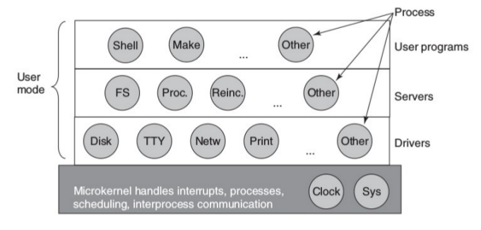
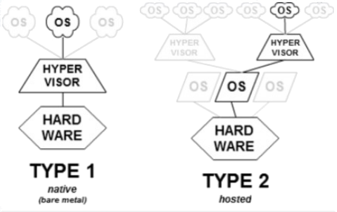
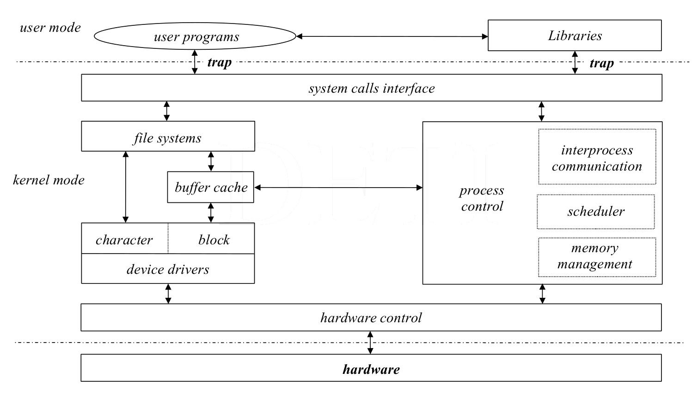
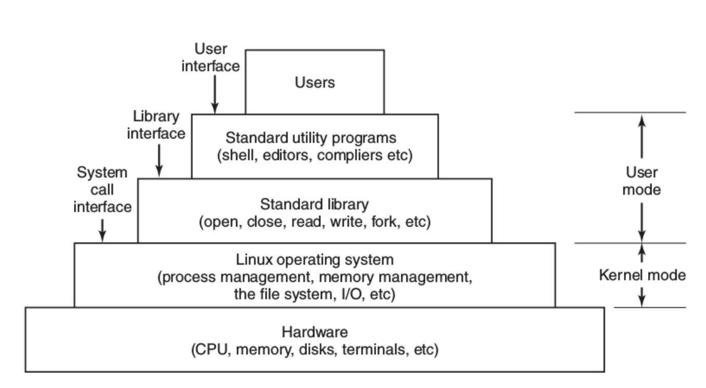
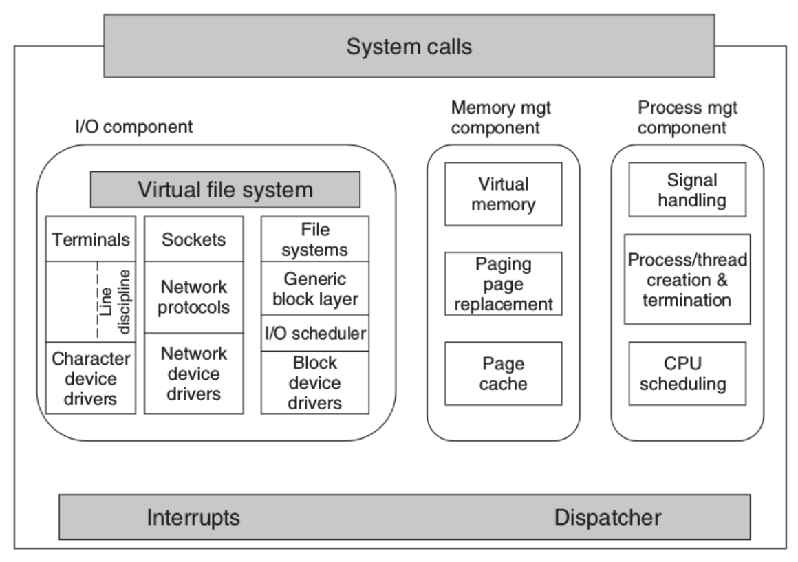
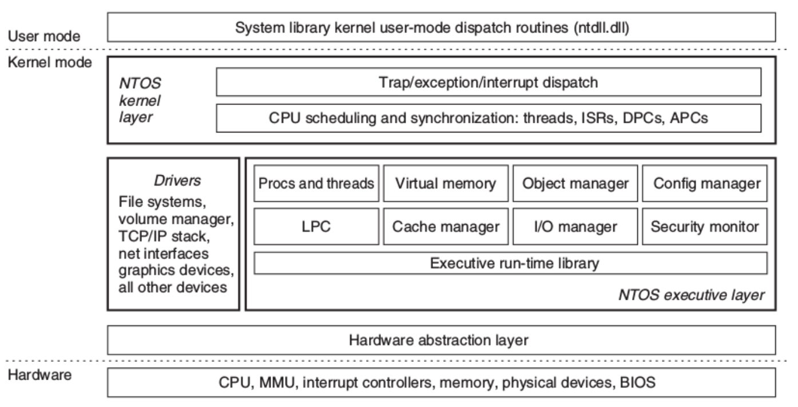

# Estrutura Interna de um Sistema Operativo

Um sistema operativo deve:

- Implementar um ambiente gráfico para interagir com o utilizador
- Permitir mais do que um utilizador
	- Tanto simultânea como separadamente
- Ter capacidade de ser `multitasking`, i.e., executar vários programas ao mesmo tempo
- Implementar memória virtual
- Permitir o acesso, de forma transparente ao utilizador, a:
	- sistemas de ficheiros locais e/ou remotos (i.e., na rede)
	- dispositivos de I/O, independentemente da sua funcionalidade
- Permitir a ligação da máquina por rede a outras máquinas
- Conter um bom conjunto de `device drivers`
- Permitir a ligação de dispositivos `plug and play` [^1]

## Design de um sistema operativo
 Por estas razões, um sistema operativo é **complexo**, com milhões de linhas de código. O design e implementação do seu `kernel`pode seguir as seguintes filosofias:

- Monolithic 
- Layered (por camada)
- Microkernels
- Client-Server Model
- Virtual Machines
- Exokernels

[^1]: Dispositivos plug-and-play são dispositivos que podem ser ligados e desligados _"a quente"_, enquanto o computar está ligado

### Monolithic system
- A perspectiva mais utilizada
- Só existe um **único programa** a ser executado em `kernel mode`
- Um **único entry point**
	- Todos os pedidos ao sistema são feitos usando este `entry-point`
- Comunicação com o sistema através de `syscall` [^2]
	- Implementadas por um conjunto de rotinas 
	- Existe ainda outro conjunto de funções auxiliares para a system call
- Qualquer parte do sistema (aka `kernel`) pode "ver" qualquer outra parte do sistema
	- **Vantagem:** eficiência no acesso a informação e dados
	- **Desvantagem:** Sistema difícil de testar e modificar

[^2]: syscall: system call

### Layered Approach: Divisão por camadas
-  Perspetiva modular
	- O sistema operativo é constituído por um conjunto de camadas, com diferentes níveis hierárquicos
- A interação **só é possível entre camadas adjacentes**
	- Uma função da camada mais superior não pode chamar uma função da camada mais abaixo
	- Tem de chamar uma função da camada imediatamente abaixo que irá tratar de chamar funções das camadas mais abaixo (estilo `sofs`)
- Não é simples de projetar
	- É preciso definir claramente que funcionalidades em que camada, o que pode ser difícil de decidir
- **Fácil de testar e modificar**, mas uma **grande perda de eficiência**
	- A eficiência pode piorar se a divisão de funções não for bem feita
	- Existe um `overhead` adicional causado pelo chamada de funções entre as várias camadas
- Facilita a divisão de funções entre o modo de utilizador e o modo de `kernel`

|Layer|Function|
|:---:|:---:|
| 5 | Operador |
| 4 | Programas do Utilizador|
| 3 | Gestão de dispositivos de I/O |
| 2 | Comunicação Operator- Process |
| 1 | Memory and drum management |
| 0 | Alocação do processador e gestão do ambiente multiprogramado |

: Estrutura de um sistema operativo por camadas - Retirada do livro _Modern Operating Systems, Andrew Tanenbaum & Herbert Bos_

### Microkernel
-  Posso ter **modularidade** sem ser obrigado a usar camadas em níveis hierárquicos diferentes
- Defino um conjunto de módulos de "pequena dimensão", com funcionalidades bem definidas
	- apenas o `microkernel` é executado em `kernel space`, com permissões de `root`
	- todos os outros módulos são executados em `user space` e comunicam entre si usando os mecanismos de comunicação providenciados pelo `microkernel`
	- Os módulos que são executados em `user space` podem ser lançados no startup ou dinamicamente à medida que são precisos (dispositivos `plug-and-play` [^1])
- O `microkernel` é responsável por:
	- Gestão de Processos
	- Gestão da Memória
	- Implementar sistemas simples de comunicação interprocess
	- Escalonamento do Processador (Processor Scheduling)
	- Tratar das interrupções
- Sistema robusto
	- Manipulação de um filesystem é feita em `user space`. Se houver problemas a integridade do sistema físico não é afetada

### Virtual machine (hypervisors)
- Criam plataformas virtuais onde podem ser instalados `guess OSs`
- Existem dois tipos de hypervisors
	- Type-1 (`native hypervisor`): executa o `guest OS` **diretamente** no `hardware` da máquina `host` (máquina física onde a máquina virtual vai ser executada). Exemplos:
		- z/VM
		- Xen
		- Hyper-V
		- VMware ESX
	- Type-2 (`hosted supervisor`): executa o `guest OS` **indiretamente** no `hardware` da máquina, sendo a máquina virtual executada "em cima" do sistema operativo do `host`. Exemplos:
		- VirtualBox
		- VMware Workstation
		- Parallels
- Existem exemplos de `hypervisors` híbridos, que tanto podem ser executar o `guest OS` indiretamente (por cima do sistema operativo) ou diretamente no `hardware` da máquina:
	- KVM
	- bhyve

### Client-Server
-  Implementação modular, baseada na relação cliente-servidor
	- A comunicação é feita através de **pedidos e respostas**
	- Para isso é usada `message-passing`
- Pode estar presente um `microkernel` que manipula operações de baixo nível
- Pode ser generalizado e usado em sistemas `multimachine`

### Exokernels
-  Usa um `kernel` com funcionalidades reduzidas
	- Apenas providencia algumas abstrações de `hardware`
- Segue a filosofia de _"Em vez de clonar a máquina virtual, divido-a"_
	- Os recursos são **divididos em partições**, em vez de clonados
	- Os recursos são alocados às `virtual machines` e a sua utilização é controlada pelo `microkernel`
- Permite a implementação de **camadas de abstração personalizadas** consoante as necessidades
- **Eficiente:** Poupa uma camada destinada a efetuar o mapeamento

## Estruturas Internas do Unix/Linux e Windows
### Estrutura Interna do Unix (tradicional)

Legenda:

- `trap`: interrupção por software (única instrução que muda o modo de execução)
- `buffercache:` espaço do disco onde são mantidos todos os ficheiros em cache (aka abertos)
	- **desmontar uma pen:** forçar a escrita da buffer cache para a pen

Unix considera tudo como sendo ficheiros:
	- ou blocos (buffer cache)
	- ou bytes 

`open`, `close`, `fork` **não são system calls**. São funções de biblioteca que acedem às `system call` (implementadas no `kernel`). São um interface amigável para o utilizador ter acesso a estas funcionalidades.
 
### Estrutura Global do Unix
 

### Estrutra do Kernel Unix
 

### Estrutura do Kernel Windows
 

