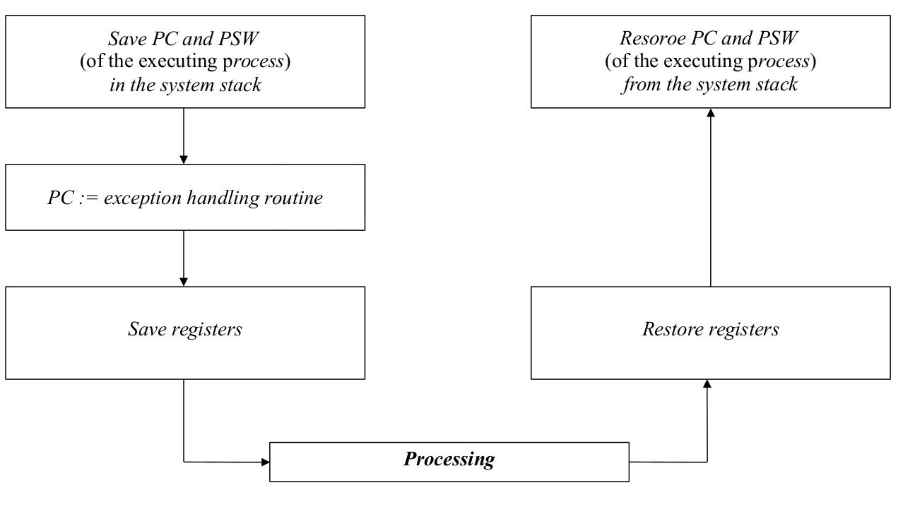
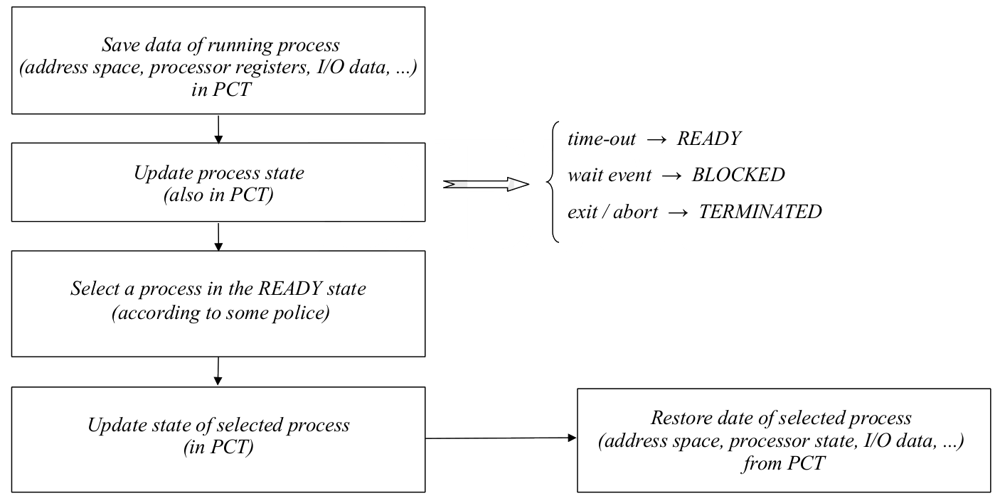

# Process Switching

Revisitando a o diagrama de estados de um processador `multithreading`

Os processadores atuais possuem **dois modos de funcionamento:**

1. `supervisor mode`
	- Todas as instruções podem ser executadas
	- É um modo **privilegiado**, **reservado para o sistema operativo**
	- O modo em que o **sistema operativo devia funcionar**, para garantir que pode aceder a todas as funcionalidades do processador
	
2. `user mode`
	- Só uma **secção reduzida do instruction set** é que pode ser executada
	- Instruções de I/O e outras que modifiquem os registos de controlo não são executadas em `user mode`
	- É o **modo normal de operação**

A **troca entre os dois modos de operação**, `switching`, só é possível através de `exceções`. Uma `exceção` pode ser causada por:

- Interrupção de um dispositivo de I/O
- Instrução ilegal
	- divisão por zero
	- bus error
	- ...
- trap instruction (aka interrupção por _software_)

As **funções do `kernel`**, incluindo as `system calls` só podem ser lançadas por:

- **hardware** $\implies$ `interrupção`
- **traps** $\implies$ `intreeupção por software`

O ambiente de operação nestas condições é denominado de `exception handling`

## Exception Handling

A **troca do contexto de execução** é feita guardando o estado dos registos PC e PSW na stack do sistema, saltando para a rotina de interrupção e em seguida salvaguardando os registos que a rotina de tratamento da exceção vai precisar de modificar. No fim, os valores dos registos são restaurados e o programa resume a sua execução

## Processing a process switching

O algoritmo é bastante parecido com o tratamento de exceções:

1. Salvaguardar todos os dados relacionados com o processo atual
2. Efetuar a troca para um novo processo
3. Correr esse novo processo
4. Restaurar os dados e a execução do processo anterior

