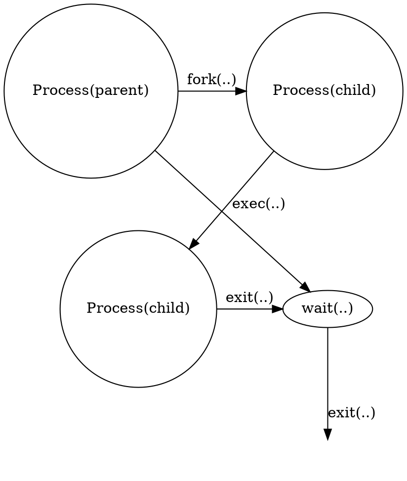

# Processes and Threads

1. Arquitectura típica de um computador
**Inserir imagem do Artur**

2. Programa vs Processo
- *programa*: conjunto de instruções que definem como uma tarefa é executada num computador
	- É apenas um conjunto de intruções (código máquina), nada mais
	- Para realizar essas funções/instruções/tarefas o código (ou a versão compilada dele) tem de ser executado(a)
- *processo:* Entidade que representa a execução de um programa
	- Representa a sua atividade
	- Tem associado a si
		- código qe ao contrário do programa está armazenado num conteudo de memória (addressing space)
		- dados (valores das diferentes variáveis) da execução corrente
		- valores atuais dos registos internos do processador
		- dados dos I/Os, ou seja, dados que estão a ser transferidos entre dispositivos de input e output
		- Estado da execução do programa, ou seja., qual a proxima execução a ser executada (registo PC)
	- Podem existir diferentes processos do mesmo programa
	- Ambiente **multiprogramado** - mais processos que processadores
	- 

3. Execução num ambiente multiprogramado
- O OS é que é responsável por:
	- tratar de mudança de contexto de execução
	- chamar o processo que vai ocpar agoa co CPU
	- Espear que ele acabe e realize as suas operações ou emovê-lo doprocessador a meio
	- **Inseririm imagm 4do sto paf 4r*
	- 
- 

4. Modelo de Processos	
- Num ambiente **multiptogramado**
	 - Devido ao   elelevada numero de processo e ao multiprograming, , torna-se difícl de saber qual o procecco qu e está a ser exwcutado e qual a fila de processos as ser executada
- É mais fácil assumir um conjunto de processadores virtuais, em que cada um corre um processo
	- "atribui-se" um processo a um processador virtual
	- O processador virtual está:
		- **ON:** se o processo que tem atribuido está a ser exectuado
		- **OFF:** se o processo que tem atribuido não está a ser executado
- Efetuar o _Turning Off_ de um processo virutal e o _Turning On_ de outro processo virtual é equivalente a uma operaçao de switching
- Como cada processo tem um processador virutal associado e só pode estar um deles a ser executado ao mesmo tempo, num amboente multiprogamado, oO número de processadores virutais ativos é menor (ou igual, se for um ambiente single processor) ao número de processadores reais
## Switching entre processos
- A operação e switching entre processos e consequentemente entre processadores virtuais pode ocorrer por diferentes razões
	- Essas razões podem não ser controladas pelo programa a correr
- Para ser viável, o modelo permite:
	- A execução de um processo não é afetada pelo instante temporal nem a localização no código em que o processo é interrompido e é efetuado o switching
	- Não existem restrições do número de vezes que qualquer processo pode ser executado, quer seja total ou parcialmente	
- **Inserir imagem virtual process**


5. Diagrama de Estados de um Processo
- Um processo possui um conjunto de estados que pode assumir ao longo do seu tempo de vida
- Os mais importantes:
	- **run:** O processo está a correr, tendo a posse do processador
	- **blocked:** O processo está em espera de um evento externo para puder ficar novamente disponível para puder retomar a sua execução. Esse evento exerno pode ser:
		- Acesso a um recurso da máquina
		- Fim de uma operação de I/O
		- ...
	- **ready:** O processo está pronto a ser executado, mas está à espera que o processador fique disponível para (re)iniciar a sua execução

- As transições emtre estados resultam de:
	- eventos externos (situação normal)
	- situações em que o processo força uma transição:
		- termina a sua execução
		- Leitura/Escrita em I/O

- (Process) Scheduler
	- Módulo do kernel que monitoriza e gere as transições entre processos
		- parte integral do kernel
	- Existem diferentes políticas que permitem controlar a execução destas transições

- _Triggers:_
	- **dispatch:** Do conjunto de processos prontos a serem executados, **um** é selecioando e é lhe atribuído o processador
	- **event wait:** O processo a ser executado é impedido de continuar e removido do processador. Fica à espera da ocorrência de um evento externo que o faça avançar para o estado ready
	- **event occurs:** Ocorreu um evento que fez um processo transitar do estado _blocked_ para o estado _ready_, ficando agora à espera que lhe seja atribuído o processador
	- **time_out:** O processo esgotyou o seu time-slot e é removido do processador, ficando no estado _ready_ até ter um novo time-slot para si disponível
	- **preempt:** Um processo de prioridade mais elevada que o processo que está a correr no processador está ready. Isto implica que o processo que está a correr no processador seja removido e passe para o estado ready


```dot
diagraph StateDiagram1 {
RUN -> BLOCKED [label="event wait"]
BLOCKED -> READY [label="event occurs"]
READY -> RUN [label="dispatch"]
RUN -> READY [label="time-out / preempt"]
}
```

- **PROBLEMA:** A memória principal (RAM) é finita	$\implies$ O número e processos coexistents é limitado
- **SOLUÇÂO:** Usar a memória secundária (Disco Rígido) para extender a memória principal e aumentar a capacidade de armazenamento

## Swap Area
- Pode ser uma partição de um disco
- Pode ser um ficheiro
- Qualquer processo que não esteja a correr por ser _swapped out_
	- Liberta memória principal para outros processos
- Pode depois ser _swapped in_, quando existir memória principal livre
- Implica a adição de dois novos estados ao diagrama de estados:
	- **suspended-ready:** O processo está no estado _ready_, mas foi _swapped-out_
	- **suspended-blocked:* O processo está no estado _blocked_, mas foi _swapped-out_
- Implica a adição de dois novos tipos de transições:
	- **suspend:** O processo é _swapped out_
	- **activate:** O processo é _swapped in_

```dot
diagraph StateDiagram2 {
RUN -> BLOCKED [label="event wait"]
BLOCKED -> READY [label="event occurs"]
READY -> RUN [label="dispatch"]
RUN -> READY [label="time-out / preempt"]

BLOCKED -> SUSPENDED-BLOCKED [label="suspend"]
SUSPENDED-BLOCKED -> BLOCKED [label="activate"]
SUSPENDED-BLOCKED -> SUSPENDED-READY [label="event occurs"]
SUSPENDED-READY -> READY [label="activate"]
READY -> SUSPENDED-READY [label="suspend"]
}
```


- **Problema:** O diagrama assume que os processos são imtemporais
	- Existem pocuos processos nesta categoria
	- Para a maioria dos processos, 
		1. São criados
		2. Existem (por algum tempo)
		3. Terminam
- **Solição:** São necessários dois novos estados:
	- **new:** 
		- O processo foi criado
		- Ainda não foi atribuido à _pool_ de processos a serem executáveis
		- A estrutura de dados associado ao processo é inicializada
	- **terminated:** O processo foi descartado da fila de processos executáveis
		- Antes de ser descartado existem algumas ações que este temd e tomar antes de puder ser descartado
- Em consequência dos novos estados, novas transições:
		- **admit:** O processo é admitido pelo OS para a _pool_ de processos executáveis
		- **exit:** O processo informa o SO que terminou a sua execução
		- **abort:** Um processo é forçado aterminar.
			- Ocorreu um _fatal error_
			- Um processo autorizado abortou a sua execução

```dot
diagraph StateDiagram3 {
NEW -> { READY ; SUSPENDED-READY } [label="admit"]
RUN -> TERMINATED [label="exit/abort"]
{READY ; SUSPENDED-READY ; SUSPENDED-BLOCKED ; BLOCKED } -> TERMINATED [label="abort"]
RUN -> BLOCKED [label="event wait"]
BLOCKED -> READY [label="event occurs"]
READY -> RUN [label="dispatch"]
RUN -> READY [label="time-out / preempt"]

BLOCKED -> SUSPENDED-BLOCKED [label="suspend"]
SUSPENDED-BLOCKED -> BLOCKED [label="activate"]
SUSPENDED-BLOCKED -> SUSPENDED-READY [label="event occurs"]
SUSPENDED-READY -> READY [label="activate"]
READY -> SUSPENDED-READY [label="suspend"]
}
```

6. State Diagram of a Unix Process
- **Inserir diagrama Artur**
- Existem dois estados **run**
	- **kernel running**
	- **user running**
	- Estes estados são feirentes porque:
		- O modo em que o processador executa o código máquina é diferente
			- Existem mais instruções e diretivas disponíveis
		- O supervisor e o user são diferentes
- O estado **ready** é dividido em dois estados:
	- **ready to run in memory:** O processo está pronto a ser executado/continuar a execução, estando guardado o seu estado em memória
	- **preempted:** O processo que estava a correr foi forçado a sair do processador porque existe um processo mais prioritário para correr
	- Estes estados são equivalentes porque quando um processo é _preempted_ continua pronto a correr (não precisa de nenhuma informação de I/O) e está armazenado em memória.
		- Partilham a mesma fila (_queue_) de processos, logo são tratados de forma semelhante pelo OS
- Quando um processo do utilizador abandona o modo de _supervisor_ (corre com permissões _root_), pode ser preempted
- A transição de _time-out_ que existe no diagrama dos estados de um processo em UNIX é coberta pela transição _preempted_

## Supervisor preempting
- Tradicionalmente, a execução de um processo em modo supervisor (_root_) implicava que o código nõa pudesse ser interrompido (_preempted_)
	- O UNIX não permitia _real-time processing_
- Nas novas versões:
	- O código está dividido em **regiões atómicas**
		- Nestas regiões a execução não pode ser interrompida
		- Garante a preservação da informação das estruturas de dados a manipular
		- Fora das regiões atómicas é seguro interromper a execução do código
	- Isto traduz-se numa nova transição, _return to kernel_  entre os estados _preempted_ e _kernel running_,

7. Unix – traditional login
-**INSERIR IMAGEM ARTUR**

8. Criação de Processos
- 


