# Conceitos Introdutórios
Num ambiente multiprogramado, os processos podem ser:

- Independentes:
	- Nunca interagem desde a sua criação à sua destruição
	- Só possuem uma interação implícita: **competir por recursos do sistema**
		- e.g.: jobs num sistema bacth, processos de diferentes utilizadores
	- É da responsabilidade do sistema operativo garantir que a atribuição de recursos é feita de forma controlada
		- É preciso garantir que não ocorre perda de informação
		- Só **um processo pode usar um recurso num intervalo de tempo** - _**Mutual Exclusive Acess**_
- Cooperativos:
	- **Partilham Informação** e/ou **Comunicam** entre si
	- Para **partilharem** informação precisam de ter acesso a um **espaço de endereçamento comum**
	- A comunicação entre processos pode ser feita através de:
		- Endereço de memória comum
		- Canal de comunicação que liga os processos
	- É da **responsabilidade do processo** garantir que o acesso à zona de memória partilhada ou ao canal de comunicação é feito de forma controlada para não ocorrerem perdas de informação
		- Só **um processo pode usar um recurso num intervalo de tempo** - _**Mutual Exclusive Acess**_
		- Tipicamente, o canal de comunicação é um recurso do sistema, pelo quais os **processos competem**

O acesso a um recurso/área partilhada é efetuada através de código. Para evitar a perda de informação, o código de acesso (também denominado zona cŕitica) deve evitar incorrer em **race conditions**.

## Exclusão Mútua
Ao forçar a ocorrência de exclusão mútua no acesso a um recurso/àrea partilhada, podemos originar:

- **deadlock:**
	- Vários processos estão em espera **eternamente** pelas condições/eventos que lhe permitem aceder à sua respetiva **zona crítica**
		- Pode ser provado que estas condições/eventos **nunca se irão verificar**
	- Causa o bloqueio da execução das operações
- **starvation:**
	- Na competição por acesso a uma zona crítica por vários processos, verificam-se um conjunto de circunstâncias na qual novos processos, com maior prioridade no acesso às suas zonas críticas, continuam a aparecer e **tomar posse dos recursos partilhados**
	- O acesso dos processos mais antigos à sua zona crítica é sucessivamente adiado

# Acesso a um Recurso
No acesso a um recurso é preciso garantir que não ocorrem **race conditions**.
Para isso, **antes** do acesso ao recurso propriamente dito é preciso **desativar o acesso** a esse recurso pelos **outros processos** (reclamar _ownership_) e após o acesso é preciso restaurar as condições iniciais, ou seja, **libertar o acesso** ao recurso.


```c
/* processes competing for a resource - p = 0, 1, ..., N-1 */
void main (unsigned int p)
{
	forever
	{	
		do_something();
		access_resource(p);
		do_something_else();
	}	
}

void acess_resource(unsigned int p)
{
	enter_critical_section(p);
	use_resource();		//	critical section
	leave_critical_section(p);
}
```

# Acesso a Memória Partilhada
O acesso à memória partilhada é muito semelhante ao aceso a um recurso (podemos ver a memória partilhada como um recurso partilhado entre vários processos).

Assim, à semelhança do acesso a um recurso, é preciso **bloquear o acesso de outros processos à memória partilhada** antes de aceder ao recurso e após aceder, **re-ativar o acesso a memória partilhada** pelos outros processos.

```c
/* shared data structure */
shared DATA d;

/* processes sharing data - p = 0, 1, ..., N-1 */
void main (unsigned int p)
{
	forever
	{
		do_something();
		access_shared_area(p);
		do_something_else();
	}
}

void access_shared_area(unsigned int p)
{
	enter_critical_section(p);
	manipulate_shared_area(); // critical section
	leave_critical_section(p);
}
```

## Relação Produtor-Consumidor
O acesso a um recurso/memória partilhada pode ser visto como um problema Produtor-Consumidor:

- Um processo acede para **armazenar dados**, **escrevendo** na memória partilhada _(Produtor)_
- Outro processo acede para **obter dados**, **lendo** da memória partilhada _(Consumidor)_

### Produtor
O produtor "produz informação" que quer guardar na FIFO e enquanto não puder efetuar a sua escrita, aguarda até puder **bloquear** e **tomar posse** do zona de memória partilhada

```c
/* communicating data structure: FIFO of fixed size */
shared FIFO fifo;

/* producer processes - p = 0, 1, ..., N-1 */
void main (unsigned int p)
{
	DATA val;
	bool done;


	forever
	{
		produce_data(&val);
		done = false;
		do
		{
			// Beginning of Critical Section
			enter_critical_section(p);
			if (fifo.notFull())
			{
				fifo.insert(val);
				done = true;
			}
			leave_critical_section(p);
			// End of Critical Section
		} while (!done);
		do_something_else();
	}
}
```

### Consumidor
O consumidor quer ler informação que precisa de obter da FIFO e enquanto não puder efetuar a sua leitura, aguarda até puder **bloquear** e **tomar posse** do zona de memória partilhada

```c
/* communicating data structure: FIFO of fixed size */
shared FIFO fifo;

/* consumer processes - p = 0, 1, ..., M-1 */
void main (unsigned int p)
{
DATA val;
bool done;
	forever
	{
		done = false;
		do
		{
			// Beginning of Critical Section
			enter_critical_section(p);
			if (fifo.notEmpty())
			{
				fifo.retrieve(&val);
				done = true;
			}
			leave_critical_section(p);
			// End of Critical Section
		} while (!done);
		consume_data(val);
		do_something_else();
	}
}
```

# Acesso a uma Zona Crítica
Ao aceder a uma zona crítica devem ser verificados as seguintes condições:

- **Efective Mutual Exclusion:** O **acesso** a uma **zona crítica** associada com o mesmo recurso/memória partilhada só pode ser **permitida a um processo de cada vez** entre **todos os processos** a competir pelo acesso a esse mesmo recurso/memória partilhada
- **Independência** do número de processos intervenientes e na sua velocidade relativa de execução
- Um processo fora da sua zona cŕitica não pode impedir outro processo de entrar na sua zona crítica
- Um processo **não deve ter de esperar indefinidamente** após pedir acesso ao recurso/memória partilhada para que possa aceder à sua zona crítica
- O período de tempo que um processo está na sua **zona crítica** deve ser **finito**

## Tipos de Soluções
Para controlar o acesso às zonas críticas normalmente é usado um endereço de memória. A gestão pode ser efetuada por:

- **Software:**
	- A solução é baseada nas instruções típicas de acesso à memória
	- Leitura e Escrita são indepentes e correspondem a instruções diferentes
- **Hardware:**
	- A solução é baseada num conjunto de instruções especiais de acesso à memória
	- Estas instruções permitem ler e de seguida escrever na memória, de forma **atómica**

## Alternância Estrita _(Strict Alternation)_
**Não é uma solução válida**

- Depende da velocidade relativa de execução dos processos intervenientes
- O processo com menos acessos impõe o ritmo de acessos aos restantes processos
- Um processo fora da zona crítica não pode prevenir outro processo de entrar na sua zona crítica
- Se não for o seu turno, um processo é obrigado a esperar, mesmo que não exista mais nenhum processo a pedir acesso ao recurso/memória partilhada

```c
/* control data structure */
#define R 		/* process id = 0, 1, ..., R-1 */

shared unsigned int access_turn = 0;
void enter_critical_section(unsigned int own_pid)
{
	while (own_pid != access_turn);
}

void leave_critical_section(unsigned int own_pid)
{
	if (own_pid == access_turn)
		access_turn = (access_turn + 1) % R;
}
```

## Eliminar a Alternância Estrita

```c
/* control data structure */
#define R 2 	/* process id = 0, 1 */

shared bool is_in[R] = {false, false};

void enter_critical_section(unsigned int own_pid)
{
	unsigned int other_pid_ = 1 - own_pid;

	while (is_in[other_pid]);
	is_in[own_pid] = true;
}

void leave_critical_section(unsigned int own_pid)
{
	is_in[own_pid] = false;
}
```

Esta solução não é válida porque não garante **exclusão mútua**. 

Assume que:

- $P_0$ entra na função `enters_critical_section` e testa `is_in[1]`, que retorna  Falso
- $P_1$ entra na função `enter_critical_section` e testa `is_in[0]`, que retorna Falso
- $P_1$ altera `is_in[0]` para _true_ e entra na zona crítica
- $P_0$ altera `is_in[1]` para _true_ e entra na zona crítica

Assim, ambos os processos entra na sua zona crítica **no mesmo intervalo de tempo**.

O principal problema desta implementação advém de **testar primeiro** a variável de controlo do **outro processo** e só **depois** alterar a **sua variável** de controlo.

## Garantir a exclusão mútua

```c
/* control data structure */
#define R 2 	/* process id = 0, 1 */

shared bool want_enter[R] = {false, false};

void enter_critical_section(unsigned int own_pid)
{
	unsigned int other_pid_ = 1 - own_pid;

	want_enter[own_pid] = true;
	while (want_enter[other_pid]);
}

void leave_critical_section(unsigned int own_pid)
{
	want_enter[own_pid] = false;
}
```

Esta solução, apesar de **resolver a exclusão mútua**, **não é válida** porque podem ocorrer situações de **deadlock**. 

Assume que:

- $P_0$ entra na função `enter_critical_section` e efetua o _set_ de `want_enter[0]`
- $P_1$ entra na função `enter_critical_section` e efetua o _set_ de `want_enter[1]`
- $P_1$ testa `want_enter[0]` e, como é _true_, **fica em espera** para entrar na zona crítica
- $P_0$ testa `want_enter[1]` e, como é _true_, **fica em espera** para entrar na zona crítica

Com **ambos os processos em espera** para entrar na zona crítica e **nenhum processo na zona crítica** entramos numa situação de **deadlock**.

Para resolver a situação de deadlock, **pelo menos um dos processos** tem recuar na intenção de aceder à zona crítica.

## Garantir que não ocorre deadlock

```c
/* control data structure */
#define R 2 	/* process id = 0, 1 */

shared bool want_enter[R] = {false, false};

void enter_critical_section(unsigned int own_pid)
{
	unsigned int other_pid_ = 1 - own_pid;

	want_enter[own_pid] = true;
	while (want_enter[other_pid])
	{
		want_enter[own_pid] = false;	// go back
		random_dealy();
		want_enter[own_pid] = true;		// attempt a to go to the critical section
	}
}

void leave_critical_section(unsigned int own_pid)
{
	want_enter[own_pid] = false;
}
```

A solução é quase válida. Mesmo um dos processos a recuar ainda é possível ocorrerem situações de **deadlock** e **starvation**:

- Se ambos os processos **recuarem ao "mesmo tempo"** (devido ao `random_delay()` ser igual), entramos numa situação de **starvation**
- Se ambos os processos **avançarem ao "mesmo tempo"** (devido ao `random_delay()` ser igual), entramos numa situação de **deadlock**

A solução para **mediar os acessos** tem de ser **determinística** e não aleatória.

## Mediar os acessos de forma determinística: _Dekker agorithm_

```c
/* control data structure */
#define R 2 	/* process id = 0, 1 */

shared bool want_enter[R] = {false, false};
shared uint p_w_priority = 0;

void enter_critical_section(unsigned int own_pid)
{
	unsigned int other_pid_ = 1 - own_pid;

	want_enter[own_pid] = true;
	while (want_enter[other_pid])
	{
		if (own_pid != p_w_priority)			// If the process is not the prioritary process
		{
			want_enter[own_pid] = false;		// go back
			while (own_pid != p_w_priority);	// waits to acess to his critical section while
												//  its is not the prioritary process 
			want_enter[own_pid] = true;			// attempt to go to his critical section
		}
	}
}

void leave_critical_section(unsigned int own_pid)
{
	unsigned int other_pid_ = 1 - own_pid;
	p_w_priority = other_pid;					// when leaving the its critical section, assign the
												// priority to the other process
	want_enter[own_pid] = false;				
}
```

É uma **solução válida**:

- Garante exclusão mútua no acesso à zona crítica através de um mecanismo de alternância para resolver o conflito de acessos
- **deadlock** e **starvation** **não estão presentes**
- Não são feitas suposições relativas ao tempo de execução dos processos, i.e., o algoritmo é **independente** do tempo de execução dos processos

No entanto, **não pode ser generalizado**  para mais do que 2 processos e garantir que continuam a ser satisfeitas as condições de **exclusão mútua** e a ausência de **deadlock** e **starvation**


## Dijkstra algorithm (1966)

```c
/* control data structure */
#define R 2 	/* process id = 0, 1 */

shared uint want_enter[R] = {NO, NO, ..., NO};
shared uint p_w_priority = 0;

void enter_critical_section(uint own_pid)
{
	uint n;
	do
	{
		want_enter[own_pid] = WANT;					// attempt to access to the critical section
		while (own_pid != p_w_priority)				// While the process is not the prioritary process
		{
			if (want_enter[p_w_priority] == NO)		// Wait for the priority process to leave its critical section
				p_w_priority = own_pid;
		}

		want_enter[own_pid] = DECIDED;				// Mark as the next process to access to its critical section

		for (n = 0; n < R; n++)				// Search if another process is already entering its critical section
		{
			if (n != own_pid && want_enter[n] == DECIDED)	// If so, abort attempt to ensure mutual exclusion
				break;
		}
	} while(n < R);
}

void leave_critical_section(unsigned int own_pid)
{
	p_w_priority = (own_pid + 1) % R;			// when leaving the its critical section, assign the
												// priority to the next process
	want_enter[own_pid] = false;				
}
```

Pode sofrer de **starvation** se quando um processo iniciar a saída da zona crítica e alterar `p_w_priority`, atribuindo a prioridade a outro processo, outro processo tentar aceder à zona crítica, sendo a sua execução interompida no for. Em situações "especiais", este fenómeno pode ocorrer sempre para o mesmo processo, o que faz com que ele nunca entre na sua zona crítica


## Peterson Algorithm (1981)

```c
/* control data structure */
#define R 2 	/* process id = 0, 1 */

shared bool want_enter[R] = {false, false};
shared uint last;

void enter_critical_section(uint own_pid)
{
	unsigned int other_pid_ = 1 - own_pid;

	want_enter[own_pid] = true;
	last = own_pid;
	while ( (want_enter[other_pid]) && (last == own_pid) );		// Only enters the critical section when no other
																// process wants to enter and the last request
																// to enter is made by the current process
}

void leave_critical_section(unsigned int own_pid)
{
	want_enter[own_pid] = false;
}
```

O algoritmo de _Peterson_ usa a **ordem de chegada** de pedidos para resolver conflitos:

- Cada processo tem de **escrever o seu ID numa variável partilhada** (_last_), que indica qual foi o último processo a pedir para entrar na zona crítica
- A **leitura seguinte** é que vai determinar qual é o processo que foi o último a escrever e portanto qual o processo que deve entrar na zona crítica


\begin{table}[H]
\centering
\renewcommand{\arraystretch}{1.2}
\begin{tabular}{lccccc}
\multicolumn{1}{c}{ } & \multicolumn{2}{c}{$P_0$ quer entrar} & & \multicolumn{2}{c}{$P_1$ quer entrar} \\ \cmidrule{2-3} \cmidrule{5-6}
\multicolumn{1}{c}{\multirow{-2}{*}} & \multicolumn{1}{c}{$P_1$ não quer entrar} & \multicolumn{1}{c}{$P_1$ quer entrar} & & $P_0$ não quer entrar & $P_0$ quer entrar \\ \toprule
\multicolumn{1}{l}{last = $P_0$} & \multicolumn{1}{c}{$P_0$ entra} & \multicolumn{1}{c}{$P_1$ entra} & & - & $P_1$ entra \\
last = $P_1$ & - & $P_0$ entra & & $P_1$ entra & $P_0$ entra \\ \bottomrule
\end{tabular}
\end{table}


É uma solução válida que:

- Garante exclusão mútua
- Previne deadlock e starvation
- É independente da velocidade relativa dos processos 
- Pode ser generalizada para mais do que dois processos (variável partilhada -> fila de espera)

## Generalized Peterson Algorithm (1981)

```c
/* control data structure */
#define R ... 	/* process id = 0, 1, ..., R-1 */

shared bool want_enter[R] = {-1, -1, ..., -1};
shared uint last[R-1];

void enter_critical_section(uint own_pid)
{
	for (uint i = 0; i < R -1; i++)				
	{
		want_enter[own_pid] = i;		
		
		last[i] = own_pid;

		do
		{
			test = false;
			for (uint j = 0; j < R; j++)
			{
				if (j != own_pid)
					test = test || (want_enter[j] >= i)
			}
		} while ( test && (last[i] == own_pid) );		// Only enters the critical section when no other
																// process wants to enter and the last request
																// to enter is made by the current process
	}
}

void leave_critical_section(unsigned int own_pid)
{
	want_enter[own_pid] = -1;
}
```

> _needs clarification_

# Soluções de Hardware

## Desativar as interrupções

Num ambiente computacional com **um único processador:**

- A alternância entre processos, num ambiente **multiprogramado**, é sempre causada por um evento/dispositivo externo
	- **real time clock (RTC):** origina a transição de time-out em sistemas _preemptive_
	- **device controller:** pode causar transições _preemptive_ no caso de um fenómeno de _wake up_ de um **processo mais prioritário**
	- Em qualquer dos casos, o **processador é interrompido** e a execução do processo atual parada
- A garantia de acesso em **exclusão mútua** pode ser feita desativando as interrupções
- No entanto, só pode ser efetuada em **modo kernel**
	- Senão código malicioso ou com _bugs_ poderia bloquear completamente o sistema

Num ambiente computacional **multiprocessador**, desativar as interrupções num único processador não tem qualquer efeito.

Todos os outro processadores (ou _cores_) continuam a responder às interrupções.

## Instruções Especiais em Hardware

### Test and Set (TAS primitive)
A função de hardware, `test_and_set` se for implementada atomicamente (i.e., sem interrupções) pode ser utilizada para construir a primitiva  **lock**, que permite a entrada na zona crítica

Usando esta primitiva, é possível criar a função _lock_, que permite entrar na zona crítica


```c
shared bool flag = false;

bool test_and_set(bool * flag)
{
	bool prev = *flag;
	*flag = true;
	return prev;
}

void lock(bool * flag)
{
	while (test_and_set(flag);	// Stays locked until and unlock operation is used
}

void unlock(bool * flag)
{
	*flag = false;
}
```

### Compare and Swap
Se implementada de forma atómica, a função `compare_and_set` pode ser usada para implementar a primitiva lock, que permite a entrada na zona crítica

O comportamento esperado é que coloque a variável a 1 sabendo que estava a 0 quando a função foi chamada e vice-versa.

```c
shared int value = 0;

int compare_and_swap(int * value, int expected, int new_value)
{
	int v = *value;
	if (*value == expected)
		*value = new_value;
	return v;
}

void lock(int * flag)
{
	while (compare_and_swap(&flag, 0, 1) != 0);
}

void unlock(bool * flag)
{
	*flag = 0;
}
```

## Busy Waiting
Ambas as funções anteriores são suportadas nos _Instruction Sets_ de alguns processadores, implementadas de forma atómica

No entanto, ambas as soluções anteriores sofrem de **busy waiting**. A primitva lock está no seu **estado ON** (usando o CPU) **enquanto espera** que se verifique a condição de acesso à zona crítica. Este tipo de soluções são conhecidas como **spinlocks**, porque o processo oscila em torno da variável enquanto espera pelo acesso

Em sistemas **uniprocessador**, o **busy_waiting** é **indesejado** porque causa:

- **Perda de eficiência:** O **time quantum** de um processo está a ser desperdiçado porque não está a ser usado para nada
- ** Risco de deadlock**: Se um **processo mais prioritário** tenciona efetuar um **lock** enquanto um processo menos prioritário está na sua zona crítica, **nenhum deles pode prosseguir**.
	- O processo menos prioritário tenta executar um unlock, mas não consegue ganhar acesso a um _time qantum_ do CPU devido ao processo mais prioritário
	- O processo mais prioritário não consegue entrar na sua zona crítica porque o processo menos prioritário ainda não saiu da sua zona crítica


Em sistemas **multiprocessador** com **memória partilhada**, situações de busy waiting podem ser menos críticas, uma vez que a troca de processos _(preempt)_ tem custos temporais associados. É preciso:

- guardar o estado do processo atual
	- variáveis
	- stack
	- $PC
- copiar para memória o código do novo processo


## Block and wake-up
Em **sistemas uniprocessor** (e em geral nos restantes sistemas), existe a o requerimento de **bloquear um processo** enquanto este está à espera para entrar na sua zona crítica

A implementação das funções `enter_critical_section` e `leave_critical_section` continua a precisar de operações atómicas.


```c
#define  R ... /* process id = 0, 1, ..., R-1 */

shared unsigned int access = 1;		// Note that access is an integer, not a boolena

void enter_critical_section(unsigned int own_pid)
{
	// Beginning of atomic operation
	if (access == 0) 
		block(own_pid);
	
	else access -= 1;
	// Ending of atomic operation
}

void leave_critical_section(unsigned int own_pid)
{
	// Beginning of atomic operation
	if (there_are_blocked_processes)
		wake_up_one();
	 else access += 1;
	// Ending of atomic operation
}
```

```c
/* producers - p = 0, 1, ..., N-1 */
void producer(unsigned int p)
{
	DATA data;
	forever
	{
		produce_data(&data);
		bool done = false;
		do
		{
			lock(p);
			if (fifo.notFull())
			{
				fifo.insert(data);
				done = true;
			}
		unlock(p);
	} while (!done);
	do_something_else();
	}
}
```

```c
/* consumers - c = 0, 1, ..., M-1 */
void consumer(unsigned int c)
{
	DATA data;
	forever
	{
		bool done = false;
		do
		{
			lock(c);
			if (fifo.notEmpty())
			{
				fifo.retrieve(&data);
				done = true;
			}
			unlock(c);
		} while (!done);
		consume_data(data);
		do_something_else();
	}
}
```

---
title: Semáforos
---

# Semáforos
No ficheiro `IPC.md` são indicadas as condições e informação base para:

- Sincronizar a entrada na zona crítica
- Para serem usadas em programação concurrente
- Criar zonas que garantam a exclusão mútua

Semáforos são **mecanismos** que permitem por implementar estas condições e **sincronizar a atividade** de **entidades concurrentes em ambiente multiprogramado**

Não são nada mais do que **mecanismos de sincronização**.


## Implementação
Um semáforo é implementado através de:

- Um tipo/estrutura de dados
- Duas operações **atómicas**:
	- down (ou wait)
	- up (ou signal/post)

```c
typedef struct
{
	unsigned int val;	/* can not be negative */
	PROCESS *queue;		/* queue of waiting blocked processes */
} SEMAPHORE;
```

### Operações
As únicas operações permitidas são o **incremento**, up, ou **decremento**, down, da variável de controlo. A variável de controlo, `val`, **só pode ser manipulada através destas operações!**

Não existe uma função de leitura nem de escrita para `val`.

- `down`
	- **bloqueia** o processo se `val == 0`
	- **decrementa** `val` se `val != 0`
- `up`
	- Se a `queue` não estiver vazia, **acorda** um dos processos
	- O processo a ser acordado depende da **política implementada**
	- **Incrementa** `val` se a `queue` estiver vazia

### Solução típica de sistemas _uniprocessor_

```c
/* array of semaphores defined in kernel */
#define R /* semid = 0, 1, ..., R-1 */

static SEMAPHORE sem[R];

void sem_down(unsigned int semid)
{
	disable_interruptions;
	if (sem[semid].val == 0)
		block_on_sem(getpid(), semid);
	else
		sem[semid].val -= 1;
	enable_interruptions;
}

void sem_up(unsigned int semid)
{
	disable_interruptions;
	if (sem[sem_id].queue != NULL)
		wake_up_one_on_sem(semid);
	else
		sem[semid].val += 1;
	enable_interruptions;
}
```

A solução apresentada é típica de um sistema _uniprocessor_ porque recorre à diretivas **disable_interrutions** e **enable_interruptions** para garantir a exclusão mútua no acesso à zona crítica.

Só é possível garantir a exclusão mútua nestas condições se o sistema só possuir um único processador, poruqe as diretivas irão impedir a interrupção do processo que está na posse do processador devido a eventos externos. Esta solução não funciona para um sistema multi-processador porque ao  executar a diretiva **disable_interrutions**, só estamos a **desativar as interrupções para um único processador**. Nada impede que noutro processador esteja a correr um processo que vá aceder à mesma zona de memória partilhada, não sendo garantida a exclusão mútua para sistemas multi-processador.

Uma solução alternativa seria a extensão do **disable_interruptions** a todos os processadores. No entanto, iriamos estar a impedir a troca de processos noutros processadores do sistema que poderiam nem sequer tentar aceder às variáveis de memória partilhada.

## Bounded Buffer Problem

```c
shared FIFO fifo; /* fixed-size FIFO memory */

/* producers - p = 0, 1, ..., N-1 */
void producer(unsigned int p)
{
	DATA data;
	forever
	{
		produce_data(&data);
		bool done = false;
		do
		{
			lock(p);
			if (fifo.notFull())
			{
				fifo.insert(data);
				done = true;
			}
			unlock(p);
		} while (!done);
	do_something_else();
	}
}

/* consumers - c = 0, 1, ..., M-1 */
void consumer(unsigned int c)
{
	DATA data;
	forever
	{
		bool done = false;
		do
		{
			lock(c);
			if (fifo.notEmpty())
			{
				fifo.retrieve(&data);
				done = true;
			}
			unlock(c);
		} while (!done);
		consume_data(data);
		do_something_else();
	}
}
```

### Como Implementar usando semáforos?
A solução para o _Bounded-buffer Problem_ usando semáforos tem de:

- Garantir **exclusão mútua**
- Ausência de busy waiting

```c
shared FIFO fifo;	/*fixed-size FIFO memory */
shared sem access;	/*semaphore to control mutual exclusion */
shared sem nslots;	/*semaphore to control number of available slots*/
shared sem nitems;	/*semaphore to control number of available items */


/* producers - p = 0, 1, ..., N-1 */
void producer(unsigned int p)
{
	DATA val;

	forever
	{
		produce_data(&val);
		sem_down(nslots);
		sem_down(access);
		fifo.insert(val);
		sem_up(access);
		sem_up(nitems);
		do_something_else();
	}
}

/* consumers - c = 0, 1, ..., M-1 */
void consumer(unsigned int c)
{
	DATA val;

	forever
	{
		sem_down(nitems);
		sem_down(access);
		fifo.retrieve(&val);
		sem_up(access);
		sem_up(nslots);
		consume_data(val);
		do_something_else();
	}
}
```

Não são necessárias as funções `fifo.empty()` e `fifo.full()` porque são implementadas indiretamente pelas variáveis:

- **nitens:** Número de "produtos" prontos a serem "consumidos"
	- Acaba por implementar, indiretamente, a funcionalidade de verificar se a FIFO está empty
- **nslots:** Número de slots livres no semáforo. Indica quantos mais "produtos" podem ser produzidos pelo "consumidor"
	- Acaba por implementar, indiretamente, a funcionalidade de verificar se a FIFO está full


Uma alternativa **ERRADA** a uma implementação com semáforos é apresentada abaixo:

```c
shared FIFO fifo;	/*fixed-size FIFO memory */
shared sem access;	/*semaphore to control mutual exclusion */
shared sem nslots;	/*semaphore to control number of available slots*/
shared sem nitems;	/*semaphore to control number of available items */


/* producers - p = 0, 1, ..., N-1 */
void producer(unsigned int p)
{
	DATA val;

	forever
	{
		produce_data(&val);
		sem_down(access);		// WRONG SOLUTION! The order of this
		sem_down(nslots);		// two lines are changed 
		fifo.insert(val);
		sem_up(access);
		sem_up(nitems);
		do_something_else();
	}
}

/* consumers - c = 0, 1, ..., M-1 */
void consumer(unsigned int c)
{
	DATA val;

	forever
	{
		sem_down(nitems);
		sem_down(access);
		fifo.retrieve(&val);
		sem_up(access);
		sem_up(nslots);
		consume_data(val);
		do_something_else();
	}
}
```

A diferença entre esta solução e a anterior está na troca de ordem de instruções  `sem_down(access)` e `sem_down(nslots)`. A função `sem_down`, ao contrário das funções anteriores, **decrementa** a variável, não tenta decrementar. 

Assim, o produtor tenta aceder à sua zona crítica sem primeiro decrementar o número de slots livres para ele guardar os resultados da sua produção _(needs_clarification)_

## Análise de Semáforos

### Vantagens
- **Operam ao nível do sistema operativo:**
	- As operações dos semáforos são implementadas no _kernel_
	- São disponibilizadas aos utilizadores através de _system_calls_
- São **genéricos** e **modulares**
	- por serem implementações de baixo nível, ganham **versatilidade**
	- Podem ser usados em qualquer tipo de situação de programão concurrente


### Desvantagens
- Usam **primitivas de baixo nível**, o que implica que o programador necessita de conhecer os **princípios da programação concurrente**, uma vez que são aplicadas numa filosofia _bottom-up_
		- Facilmente ocorrem **race conditions**
		- Facilmente se geram situações de **deadlock**, uma vez que **a ordem das operações atómicas são relevantes**
- São tanto usados para implementar **exclusão mútua** como para **sincronizar processos**

### Problemas do uso de semáforos
Como tanto usados para implementar **exclusão mútua** como para **sincronizar processos**, se as condições de acesso não forem satisfeitas, os processos são bloqueados **antes** de entrarem nas suas regisões críticas.

- Solução sujeita a erros, especialmente em situações complexas
	- pode existir **mais do que um ponto de sincronismos** ao longo do programa
	
## Semáforos em Unix/Linux

**POSIX:**

- Suportam as operações de `down` e `up`
	- `sem_wait`
	- `sem_trywait`
	- `sem_timedwait`
	- `sem_post`
- Dois tipos de semáforos:
	- **named semaphores:**
		- São criados num sistema de ficheiros virtual (e.g. /dev/sem)
		- Suportam as operações:
			- `sem_open`
			- `sem_close`
			- `sem_unlink`
	- **unnamed semaphores:**
		- São _memory based_
		- Suportam as operações
			- `sem_init`
			- `sem_destroy`

**System V:** 

- Suporta as operações:
	- `semget` : criação
	- `semop` : as diretivas `up` e `down`
	- `semctl` : outras operações


# Monitores
Mecanismo de sincronização de alto nível para resolver os problemas de sincronização entre processos, numa perspetiva __top-down__. Propostos independentemente por Hoare e Brinch Hansen

Seguindo esta filosofia, a **exclusão mútua** e **sincronização** são tratadas **separadamente**, devendo os processos:

1. Entrar na sua zona crítica
2. Bloquear caso nao possuam condições para continuar


Os monitores são uma solução que suporta nativamente a exclusão mútua, onde uma aplicação é vista como um conjunto de _threads_ que competem para terem acesso a uma estrutura de dados partilhada, sendo que esta estrutura só pode ser acedida pelos métodos do monitor.

Um monitor assume que todos os seus métodos **têm de ser executados em exclusão mútua**:

- Se uma _thread_ chama um **método de acesso** enquanto outra _thread_ está a exceutar outro método de acesso, a sua **execução é bloqueada** até a outra terminar a execução do método

A sincronização entre threads é obtida usando **variáveis condicionais**:

- `wait`: A _thread_ é bloqueada e colocada fora do monitor
- `signal`: Se existirem outras _threads_ bloqueadas, uma é escolhida para ser "acordada"


## Implementação
```cpp
	monitor example
	{
	/* internal shared data structure */
	DATA data;
	
	condition c; /* condition variable */
	
	/* access methods */
	method_1 (...)
	{
		...
	}
	method_2 (...)
	{
		...
	}
	
	...

	/* initialization code */
	...
```

## Tipos de Monitores

### Hoare Monitor
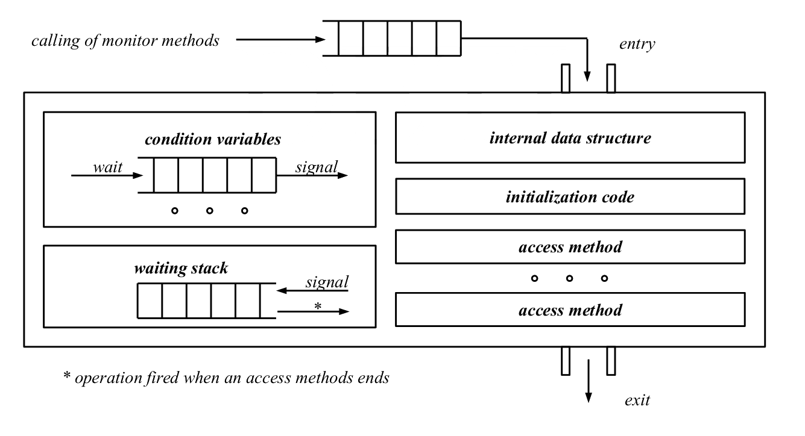

- Monitor de aplicação geral
- Precisa de uma stack para os processos que efetuaram um `wait` e são colocados em espera
- Dentro do monitor só se encontra a _thread_ a ser executada por ele
- Quando existe um `signal`, uma _thread_ é **acordada** e posta em execução


### Brinch Hansen Monitor
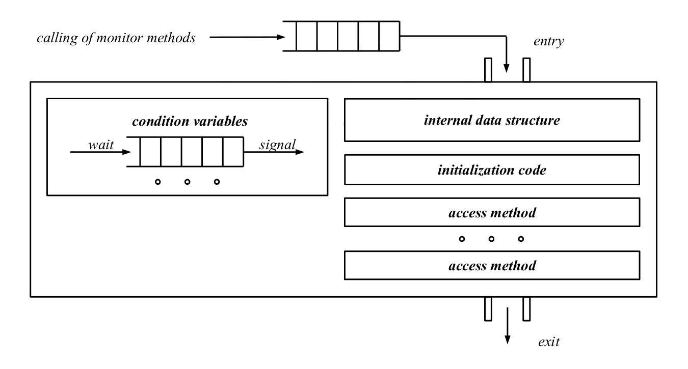

- A última instrução dos métodos do monitor é `signal`
	- Após o `signal` a  _thread_ sai do monitor
- **Fácil de implementar:** não requer nenhuma estrutura externa ao monitor
- **Restritiva:** **Obriga** a que cada método só possa possuir uma instrução de `signal`


### Lampson/Redell Monitors
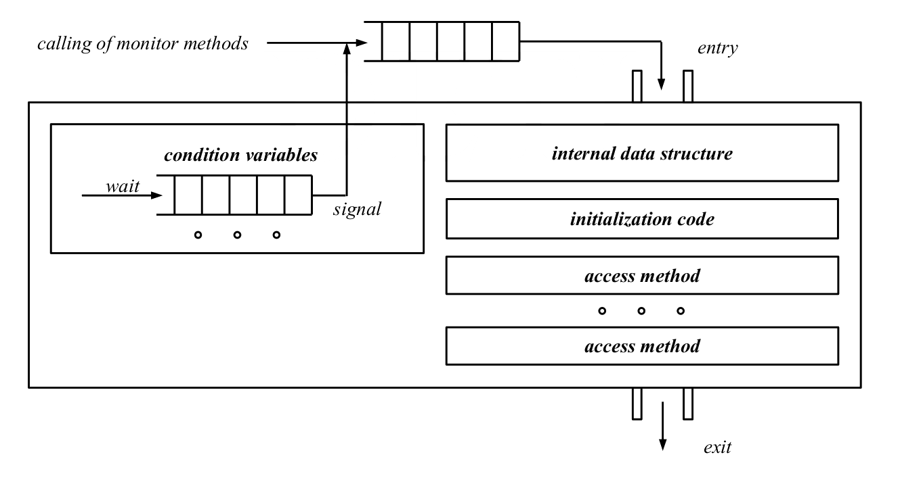

- A _thread_ que faz o `signal` é a que continua a sua execução (entrando no monitor)
- A _thread_ que é acordada devido ao `signal` fica fora do monitor, **competindo pelo acesso** ao monitor
- Pode causar **starvation**.
	- Não existem garantias que a __thread__ que foi acordada e fica em competição por acesso vá ter acesso
	- Pode ser **acordada** e voltar a **bloquear**
	- Enquanto está em `ready` nada garante que outra _thread_ não dê um `signal` e passe para o estado `ready`
	- A _thread_ que ti nha sido acordada volta a ser **bloqueada**


## Bounded-Buffer Problem usando Monitores
```c
shared FIFO fifo;			 /* fixed-size FIFO memory */
shared mutex access;		 /* mutex to control mutual exclusion */
shared cond nslots;		 /* condition variable to control availability of slots*/
shared cond nitems;		 /* condition variable to control availability of items */

/* producers - p = 0, 1, ..., N-1 */
void producer(unsigned int p)
{
	DATA data;
	forever
	{
		produce_data(&data);
		lock(access);
		if/while (fifo.isFull())
		{
			wait(nslots, access);
		}
		fifo.insert(data);
		unlock(access);
		signal(nitems);
		do_something_else();
	}
}

/* consumers - c = 0, 1, ..., M-1 */
void consumer(unsigned int c)
{
	DATA data;
	forever
	{
		lock(access);
		if/while (fifo.isEmpty())
		{
			wait(nitems, access);
		}
		fifo.retrieve(&data);
		unlock(access);
		signal(nslots);
		consume_data(data);
		do_something_else();
	}
}
```

O uso de `if/while` deve-se às diferentes implementações de monitores:

- `if`: **Brinch Hansen** 
	- quando a _thread_ efetua o `signal` sai imediatamente do monitor, podendo entrar logo outra _thread_
- `while`: **Lamson Redell**
	- A _thread_ acordada fica à espera que a _thread_ que deu o `signal` termine para que possa **disputar** o acesso
	

- O `wait` internamente vai **largar a exlcusão mútua**
	- Se não larga a exclusão mútua, mais nenhum processo consegue entrar
	- Um wait na verdade é um  `lock(..)` seguid de `unlock(...)`
- Depois de efetuar uma **inserção**, é preciso efetuar um `signal` do nitems
- Depois de efetuar um **retrieval** é preciso fazer um `signal` do nslots
	- Em comparação, num semáforo quando faço o up é sempre incrementado o seu valor
- Quando uma _thread_ emite um `signal` relativo a uma variável de transmissão, ela só **emite** quando alguém está à escuta
	- O `wait` só pode ser feito se a FIFO estiver cheia
	- O `signal` pode ser sempre feito
	
É necessário existir a `fifo.empty()` e a `fifo.full()` porque as variáveis de controlo não são semáforos binários.

O valor inicial do **mutex** é 0.


## POSIX support for monitors
A criação e sincronização de _threads_ usa o _Standard POSIX, IEEE 1003.1c_.

O _standard_ define uma API para a **criação** e **sincronização** de _threads_, implementada em unix pela biblioteca _pthread_

O conceito de monitor **não existe**, mas a biblioteca permite ser usada para criar monitores _Lampsom/Redell_ em C/C++, usando:

- `mutexes`
- `variáveis de condição`

	
As funções disponíveis são:

- `ptread_create`: **cria** uma nova _thread_ (similar ao _fork_)
- `ptread_exit`: equivalente à `exit`
- `ptread_join`: equivalente à `waitpid`
- `ptread_self`: equivalente à `getpid`
- `pthread_mutex_*`: manipulação de **mutexes**
- `ptread_cond_*`: manipulação de **variáveis condicionais**
- `ptread_once`: inicialização

# Message-passing

Os processos podem comunicar entre si usando **mensagens**. 

- Não existe a necessidade de possuirem memória partilhada
- Mecanismos válidos quer para sistemas **uniprocessador** quer para sistemas **multiprocessador**

	
A **comunicação** é efetuada através de **duas operações**:

- `send`
- `receive`

Requer a existência de um **canal de comunicação**. Existem 3 implementações possíveis:

1. **Endereçamento direto/indireto**
2. Comunicação **síncrona/assíncrona**
	- Só o `sender` é que indica o **destinatário**
	- O destinatário **não indica** o `sender`
	- Quando existem **caixas partilhadas**, normalmente usam-se mecanismos com políticas de **round-robin**
		1. Lê o processo $N$
		2. Lê o processo $N+1$
		3. etc...
	- No entanto, outros métodos podem ser usados
3. **Automatic or expliciting buffering**

## Direct vs Indirect

### Symmetric direct communication
O processo que pretende comunicar deve **explicitar o nome do destinatário/remetente:**

- Quando o `sender` envia uma mensagem tem de indicar o **destinatário**
	- `send(P, message`
- O destinatário tem de indicar de quem **quer receber** (`sender`)
	- `receive(P, message)`


A comunicação entre os **dois processos** envolvidos é **peer-to-peer**, e é estabelecida automaticamente entre entre um conjunto de processos comunicantes, só existindo **um canal de comunicação**

## Assymetric direct communications
Só o `sender` tem de explicitar o destinatário:

- `send(P, message`: 
- `receive(id, message)`: receve mensagens de qualquer processo

## Comunicação Indireta
As mensagens são enviadas para uma **mailbox** (caixa de mensagens) ou **ports**, e o `receiver` vai buscar as mensagens a uma `poll`

- `send(M, message`
- `receive(M, message)`


O canal de comunicação possui as seguintes propriedades:

- Só é estabelecido se o **par de processos** comunicantes possui uma **`mailbox` partilhada**
- Pode estar associado a **mais do que dois processos**
- Entre um par de processos pode existir **mais do que um link** (uma mailbox por cada processo)


Questões que se levantam. Se **mais do que um processo** tentar **receber uma mensagem da mesma `mailbox`**...

- ... é permitido?
	- Se sim. qual dos processos deve ser bem sucedido em ler a mensagem?


## Implementação
Existem várias opções para implementar o **send** e **receive**, que podem ser combinadas entre si:

- **blocking send:** o `sender` **envia** a mensagem e fica **bloquedo** até a mensagem ser entregue ao processo ou mailbox destinatária
- **nonblocking send:** o `sender` após **enviar** a mensagem, **continua** a sua execução
- **blocking receive:** o `receiver` bloqueia-se até estar disponível uma mensagem para si
- **nonblocking receiver:** o `receiver` devolve a uma mensagem válida quando tiver ou uma indicação de que não existe uma mensagem válida quando não tiver

## Buffering
O link pode usar várias políticas de implementação:

- **Zero Capacity:** 
	- Não existe uma `queue`
	- O `sender` só pode enviar uma mensagem de cada vez. e o envio é **bloqueante**
	- O `receiver` lê uma mensagem de cada vez, podendo ser bloqueante ou não
- **Bounded Capacity:**
	- A `queue` possui uma capacidade finita
	- Quando está cheia, o `sender` bloqueia o envio até possuir espaço disponível
- **Unbounded Capacity:**
	- A `queue` possui uma capacidade (potencialmente) infinita
	- Tanto o `sender` como o `receiver` podem ser **não bloqueantes**
 
## Bound-Buffer Problem usando mensanges
```c
shared FIFO fifo;			 /* fixed-size FIFO memory */
shared mutex access;		 /* mutex to control mutual exclusion */
shared cond nslots;		 /* condition variable to control availability of slots*/
shared cond nitems;		 /* condition variable to control availability of items */

/* producers - p = 0, 1, ..., N-1 */
void producer(unsigned int p)
{
	DATA data;
	MESSAGE msg;

	forever
	{
		produce_data(&val);
		make_message(msg, data);
		send(msg);
		do_something_else();
	}
}

/* consumers - c = 0, 1, ..., M-1 */
void consumer(unsigned int c)
{
	DATA data;
	MESSAGE msg;

	forever
	{
		receive(msg);
		extract_data(data, msg);
		consume_data(data);
		do_something_else();
	}
}
```

## Message Passing in Unix/Linux
**System V:**

- Existe uma fila de mensagens de **diferentes tipos**, representados por um inteiro
- `send` **bloqueante** se **não existir espaço disponível**
- A receção possui um argumento para espcificar o **tipo de mensagem a receber**:
	- Um tipo específico
	- Qualquer tipo
	- Um conjunto de tipos
- Qualquer que seja a política de receção de mensagens:
	- É sempre **obtida** a mensagem **mais antiga** de uma dado tipo(s)
	- A implementação do `receive` pode ser **blocking** ou **nonblocking**
- System calls:
	- `msgget`
	- `msgsnd`
	- `msgrcv`
	- `msgctl`

**POSIX**

- Existe uma **priority `queue`**
- `send` **bloqueante** se **não existir espaço disponível**
- `receive` obtêm a mensagem **mais antiga** com a **maior prioridade**
	- Pode ser blocking ou nonblocking
- Funções:
	- `mq_open`
	- `mq_send`
	- `mq_receive`

---
title: Shared Memory

author: Pedro Martins
---

# Shared Memory in Unix/Linux
- É um recurso gerido pelo sistema operativo

Os espaços de endereçamento são **independentes** de processo para processo, mas o **espaço de endereçamento** é virtual, podendo a mesma **região de memória física**(memória real) estar mapeada em mais do que uma **memórias virtuais**

## POSIX Shared Memory
- Criação:
	- `shm_open`
	- `ftruncate`
- Mapeamento:
	- `mmap`
	- `munmap`
- Outras operações:
	- `close`
	- `shm_unlink`
	- `fchmod`
	- ...

## System V Shared Memory
- Criação:
	- `shmget`
- Mapeamento:
	- `shmat`
	- `shmdt`
- Outras operações:
	- `shmctl`

---
title: "Deadlock"
author: Pedro Martins
---

# Deadlock
- **recurso:** algo que um processo precisa para proseeguir com a sua execução. Podem ser:
	- **componentes físicos** do sistema computacional, como:
		- processador
		- memória
		- dispositivos de I/O
		- ...
	- **estruturas de dados partilhadas**. Podem estar definidas 
		- Ao nível do sistema operativo
			- PCT
			- Canais de Comunicação
		- Entre vários processos de uma aplicação

Os recursos podem ser:

- **preemptable:** podem ser retirados aos processos que estão na sua posse por entidades externas
	- processador
	- regiões de memória usadas no espaço de endereçamento de um processo
- **non-preemptable:** os recursos só podem ser libertados pelos processos que estão na sua posse
	- impressoras
	- regiões de memória partilhada que requerem acesso por exclusão mútua

	
O **deadlock** só é importante nos recursos **non-preemptable**.

O caso mais simples de deadlock ocorre quando:

1. O processo $P_0$ pede a posse do recurso $A$
	- É lhe dada a posse do recurso $A$, e o processo $P_0$ passa a possuir o recurso $A$ em sua posse
2. O processo $P_1$ pede a posse do recurso $B$
	- É lhe dada a posse do recurso $B$, e o processo $P_1$ passa a possuir o recurso $B$ em sua posse
3. O processo $P_0$ pede agora a posse do recurso $B$ 
	- Como o recurso $B$ está na posse do processo $P_1$, é lhe negado
	- O processo $P_0$ fica em espera que o recurso $B$ seja libertado para puder continuar a sua execução
	- No entanto, o processo $P_0$ não liberta o recurso $A$
4. O processo $P_1$ necessita do recurso $A$
	- Como o recurso $A$ está na posse do processo $P_0$, é lhe negado
	- O processo $P_1$ fica em espera que o recurso $A$ seja libertado para puder continuar a sua execução
	- No entanto, o processo $P_1$ não liberta o recurso $B$
5. Estamos numa situação de **deadlock**. Nenhum dos processos vai libertar o recurso que está na sua posse mas cada um deles precisa do recurso que está na posse do outro

## Condições necessárias para a ocorrência de deadlock
Existem 4 condições necessárias para a ocorrência de **deadlock:**

1. **exclusão mútua:**
	- Pelo menos um dos recursos fica em posse de um processo de forma não partilhável
	- Obriga a que outro processo que precise do recurso espere que este seja libertado
2. **hold and wait:**
	- Um processo mantêm em posse pelo menos um recurso enquanto espera por outro recurso que está na posse de outro processo
3. **no preemption:**
	- Os recursos em causa são non-preemptive, o que implica que só o processo na posse do recurso o pode libertar
4. **espera circular:**
	- é necessário um conjunto de processos em espera tais que cada um deles precise de um recurso que está na posse de outro processo nesse conjunto

Se **existir deadlock**, todas estas condições se verificam. _(A => B)_

Se **uma delas não se verifica**, não há deadlock. _(~B => ~A)_

### O Problema da Exclusão Mútua 
Dijkstra em 1965 enunciou um conjunto de regras para garantir o acesso **em exclusão mútua** por processo em competição por recursos de memória partilhados entre eles.[^1]

1. **Exclusão Mútua:** Dois processos não podem entrar nas suas zonas críticas ao mesmo tempo
2. **Livre de Deadlock:** Se um process está a tentar entrar na sua zona crítica, eventualemnte algum processo (não necessariamento o que está a tentar entrar), mas entra na sua zona crítica
3. **Livre de Starvation:** Se um processo está atentar entrar na sua zona crítica, eentão eventualemnte esse processo entr na sua zona crítica
4. **First-In-First-Out:** Nenhum processo qa iniciar pode entrar na sua zona crítica antes de um processo que já está à espera do seu trunos para entrar na sua zona crítica


[^1]: _"Concurrent Programming, Mutual Exclusion (1965; Dijkstra)"._ Gadi Taubenfeld, The Interdisciplinary Center, Herzliya, Israel

## Jantar dos Filósofos
- 5 filósofos sentados à volta de uma mesa, com comida à sua frente
	- Para comer, cada filósofo precisa de 2 garfos, um à sua esquerda e outro à sua direita
	- Cada filósofo alterna entre períodos de tempo em que medita ou come
- Cada **filósofo** é um **processo/thread** diferente
- Os **garfos** são os **recursos**

Uma possível solução para o problema é:

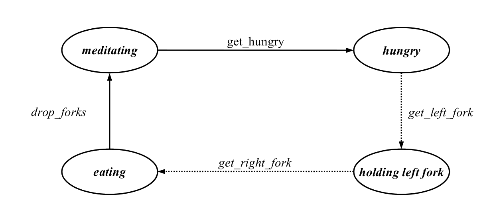

```c
enum {MEDITATING, HUNGRY, HOLDING, EATING};

typedef struct TablePlace
{
	int state;
} TablePlace;

typedef struct Table
{
	Int semid;
	int nplaces;
	TablePlace place[0];
} Table;

int set_table(unsigned int n, FILE *logp);
int get_hungry(unsigned int f);
int get_left_fork(unsigned int f);
int get_right_fork(unsigned int f);
int drop_forks(unsigned int f);
```

Quando um filósofo fica _hungry_:

1. Obtém o garfo à sua esquerda
2. Obtém o garfo à sua direita

A solução **pode sofrer de deadlock:**

1. **exclusão mútua:**
	- Os garfos são partilháveis
2. **hold and wait:**
	- Se conseguir adquirir o `left_fork`, o filósofo fica no estado `holding_left_fork` até conseguir obter o `right_fork` e não liberta o `left_fork`
3. **no preemption:**
	- Os garfos são recursos non-preemptive. Só o filósofo é que pode libertar os seus garfos após obter a sua posse e no fim de comer
4. **espera circular:**
	- Os garfos são partilhados por todos os filósofos de forma circular
		- O garfo à esquerda de um filósofo, `left_fork` é o garfo à direita do outro, `right_fork`

Se todos os filósofos estiverem a pensar e decidirem comer, pegando todos no garfo à sua esquerda ao mesmo tempo, entramos numa situação de **deadlock**.

## Prevenção de Deadlock
Se uma das condições necessárias para a ocorrência de deadlock não se verificar, não ocorre deadlock.

As **políticas de prevenção de deadlock** são bastantes **restritas**, **pouco efetivas** e **difíceis de aplicar** em várias situações.

- **Negar a exclusão mútua** só pode ser aplicada a **recursos partilhados**
- **Negar _hold-and-wait_** requer **conhecimento _a priori_ dos recursos necessários** e considera sempre o pior caso, no qual os recursos são todos necessários em simultâneo (o que pode não ser verdade)
- **Negar _no preemption_**, impondo a libertação (e posterior re-aquisição) de recursos adquiridos por processos que não têm condições (aka, todos os recursos que precisam) para continuar a execução pode originar grandes atrasos na execução da tarefa
- **Negar a _circular wait_** pode resultar numa má gestão de recursos

### Negar a exclusão mútua
- Só é possível se os recursos puderem ser partilhados, senão podemos incorrer em **race conditions**
- Não é possível no jantar dos filśofos, porque os garfos não podem ser partilhados entre os filósofos
- Não é a condição mais vulgar a negar para prevenir _deadlock_

### Negar _hold-and-wait_
- É possível fazê-lo se um processo é obrigado a pedir todos os recursos que vai precisar antes de iniciar, em vez de ir obtendo os recursos à medida que precisa deles
- Pode ocurrer **starvation**, porque um processo pode nunca ter condições para obter nenhum recurso
	- É comum usar _aging mechanisms_ to para resolver este problema
- No jantar dos filósofos, quando um filósofo quer comer, passa a adquirir os dois garfos ao mesmo tempo
	- Se estes não tiverem disponíveis, o filósofo espera no `hungry state`, podendo ocorrer **starvation**

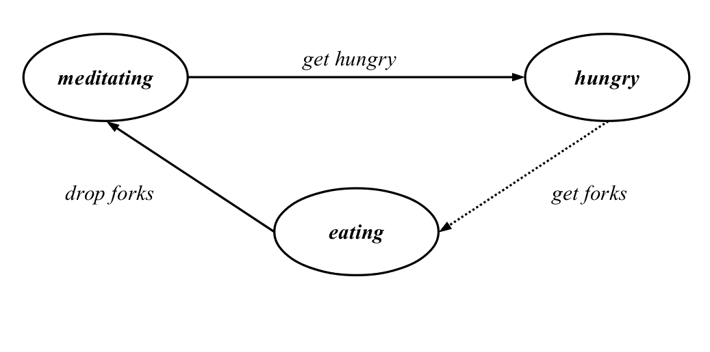

Solução equivalente à proposta por Dijkstra.

### Negar _no preemption_
- A condição de os recursos serem _non-preemptive_ pode ser implementada fazendo um processo libertar o(s) recurso(s) que possui se não conseguir adquirir o próximo recurso que precisa para continuar em execução
- Posteriormente o processo tenta novamente adquirir esses recursos
- Pode ocorrer **starvation** and **busy waiting**
	- podem ser usados _aging mechanisms_ para resolver a starvation
	- para evitar busy waiting, o processo pode ser bloqueado e acordado quando o recurso for libertado
- No janta dos filósofos, o filósofo tenta adquirir o `left_fork`
	- Se conseguir, tenta adquirir o `right_fork`
		- Se conseguir, come
		- Se não conseguir, liberta o `left_fork` e volta ao estado `hungry`


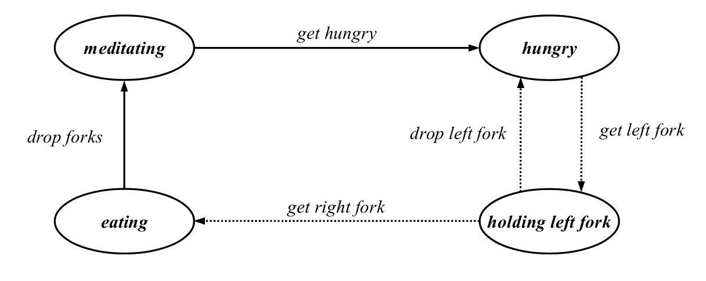


### Negar a espera circular
- Através do uso de IDs atribuídos a cada recurso e impondo uma ordem de acesso (ascendente ou descendente) é possível evitar sempre a espera em círculo
- Pode ocorrer **starvation**
- No jantar dos filósofos, isto implica que nalgumas situações, um dos filśofos vai precisar de adquirir primeiro o `right_fork` e de seguida o `left_fork`
	- A cada filósofo é atribuído um número entre 0 e N
	- A cada garfo é atribuído um ID (e.g., igual ao ID do filósofo à sua direita ou esquerda)
	- Cada filśofo adquire primeiro o garfo com o menro ID
	- obriga a que os filósofos 0 a N-2 adquiram primeiro o `left_fork` enquanto o filósofo N-1 adquir primeiro o `right_fork`

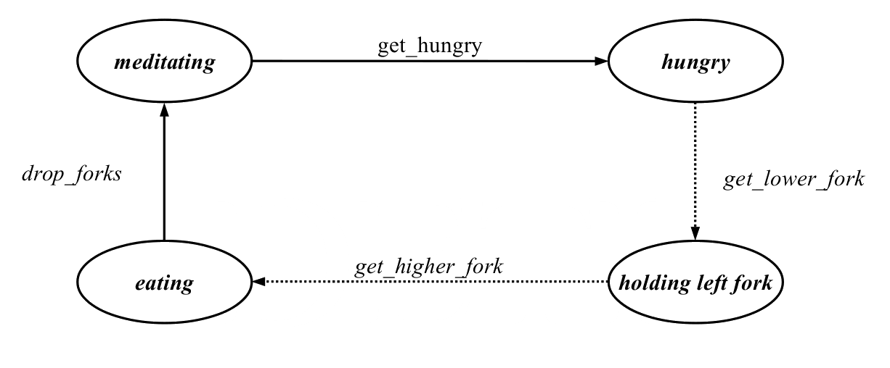

 
## Deadlock Avoidance
Forma menos restritiva para resolver situações de deadlock, em que **nenhuma das condições necessárias à ocorrência de deadlock é negada**. Em contrapartida, o sistema é **monitorizado continuamente** e um recurso **não é atribuído** se como consequência o sistema entrar num **estado inseguro/instável**

Um estado é considerado seguro se existe uma sequência de atribuição de recursos na qual todos os processos possa terminar a sua execução (não ocorrendo _deadlock_). 

Caso contrário, poderá ocorrer deadlock (pode não ocorrer, mas estamos a considerar o pior caso) e o estado é considerado inseguro.

Implica que:

- exista uma lista de todos os recursos do sistema
- os processos intervenientes têm de declarar _a priori_ todas as suas necessidades em termos de recursos


### Condições para lançar um novo processo
Considerando:

- $NTR_i$ - o número total de recursos do tipo `i` _(i = 0, 1, ..., N-1)_
- $R_{i, j}$: o número de recursos do tipo `i` requeridos pelo processo `j`, _(i=0, 1, ..., N-1 e j=0, 1, ..., M-1)_

O sistema pode impedir um novo processo, `M`, de ser exectuado se a sua terminação não pode ser garantida. Para que existam certezas que um novo processo pode ser terminado após ser lançado, tem de se verificar:

$$ NTR_i \geq R_{i, M} + \sum_{j=0}^{M-1} R_{i, j} $$

 
### Algoritmo dos Banqueiros
Considerando:

- $NTR_i$: o número total de recursos do tipo `i` _(i = 0, 1, ..., N-1)_
- $R_{i, j}$: o número de recursos do tipo `i` requeridos pelo processo `j`, _(i=0, 1, ..., N-1 e j=0, 1, ..., M-1)_
- $A_{i, j}$: o número de recursos do tipo `i` atribuídos/em posse do processo `j`, _(i=0, 1, ..., N-1 e j=0, 1, ..., M-1)_

Um novo recurso do tipo `i` só pode ser atribuído a um processo **se e só se** existe uma sequência $j'=f(i, j)$ tal que:

$$ R_{i, j'} - A_{i, j'}  < \sum_{k \geq ji'}^{M-1} A_{i, k} $$

\begin{table}[H]
\renewcommand{\arraystretch}{1.3}
\centering
\caption{Banker's  Algorithm Example} 
\begin{tabular}{cccccc}
						   &                            & A & B & C & D \\ \cline{3-6} 
						   & \multicolumn{1}{c}{total}  & 6 & 5 & 7 & 6 \\
						   & \multicolumn{1}{c}{free}   & 3 & 1 & 1 & 2 \\ \toprule
\multirow{3}{*}{maximum}   & p1                         & 3 & 3 & 2 & 2 \\
						   & p2                         & 1 & 2 & 3 & 4 \\
			 			   & p3                         & 1 & 3 & 5 & 0 \\ \midrule
\multirow{3}{*}{granted}   & p1                         & 1 & 2 & 2 & 1 \\
						   & p2                         & 1 & 0 & 3 & 3 \\
						   & p3                         & 1 & 2 & 1 & 0 \\ \midrule
\multirow{3}{*}{needed}    & p1                         & 2 & 1 & 0 & 1 \\
						   & p2                         & 0 & \cellcolor{blue!25}2 & 0 & 1 \\
						   & p3                         & 0 & 1 & \cellcolor{blue!25}4 & 0 \\ \midrule
\multirow{3}{*}{new Grant} & p1                         & 0 & 0 & 0 & 0 \\
						   & p2                         & 0 & 0 & 0 & 0 \\
						   & p3                         & 0 & 0 & 0 & 0 \\ \bottomrule
\end{tabular}
\end{table}

Para verificar se posso atribuir recursos a um processo, aos recursos `free` subtraio os recursos `needed`, ficando com os recursos que sobram. Em seguida simulo o que aconteceria se atribuisse o recurso ao processo, tendo em consideração que o processo pode usar o novo recurso que lhe foi atribuído sem libertar os que já possui em sua posse (estou a avaliar o pior caso, para garantir que não há deadlock)

Se o processo **p3** pedir 2 recursos do tipo C, o **pedido é negado**, porque **só existe 1 disponível**

Se o processo **p3** pedir 1 recurso do tipo B, o **pedido é negado**, porque apesar de existir 1 recurso desse tipo disponível, ao **longo da sua execução processo vai necessitar de 4** e só **existe 1 disponível**, podendo originar uma situação de **deadlock**, logo o **acesso ao recurso é negado**

#### Algoritmo dos banqueiros aplicado ao Jantar dos filósofos
- Cada filósofo primeiro obtém o `left_fork` e depois o `right_fork`
- No entanto, se um dos filósofos tentar obter um `left_fork` e o filósofo à sua esquerda já tem na sua posse um `left_fork`, o acesso do filósofo sem garfos ao `left_fork` é negado para não ocorrer **deadlock**

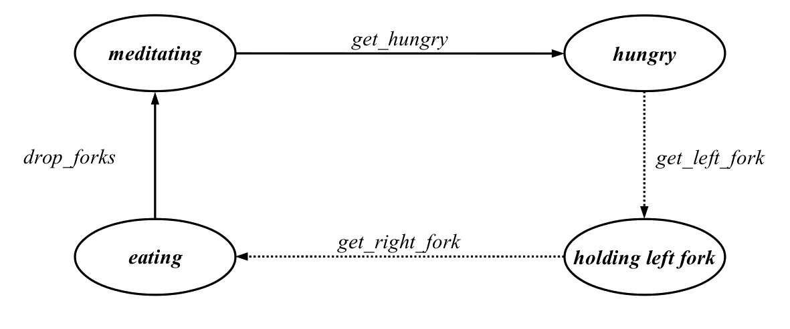


## Deadlock Detection
**Não são usados mecanismos nem para prevenir nem par evitar o deadlock**, podendo ocorrer situações de deadlock:

- O estado dos sistema deve ser examinado para determinar se ocorreu uma situação de deadlock
	- É preciso verificar se existe uma **dependência circular de recursos** entre os processos
	- Periodicamente é executado um algoritmo que verifica o estado do registo de recursos:
		- recursos `free` vs recursos `granted` vs recursos `needed`
	- Se tiver ocorrido uma situação de deadlock, o SO deve possuir uma **rotina de recuperação** de situações de deadlock e executá-la
- Alternativamente, de um ponto de vista "arrogante", o problema pode ser ignorado


Se **ocorrer uma situação de deadlock**, a rotina de recuperação deve ser posta em prática com o objetivo de interromper a dependência circular de processos e recursos.

Existem três métodos para recuperar de deadlock:

- **Libertar recursos de um processo**, se possível
	- É atividade de um processo é suspensa até se puder devolver o recurso que lhe foi retirado
	- Requer que o estado do processo seja guardado e em seguida recarregado
	- Método eficiente
- **Rollback**
	- O estado de execução dos diferentes processos é guardado periodicamente
	- Um dos processos envolvidos na situação de deadlock é _rolled back_ para o instante temporal em que o recurso lhe foi atribuído
	- A recurso é assim libertado do processo
- **Matar o processo**
	- Quando um processo entra em deadlock, é terminado
	- Método radical mas fácil de implementar

	
Alternativamente, existe sempre a opção de não fazer nada, entrando o processo em deadlock. Nestas situações, o utilizador é que é responsável por corrigir as situações de deadlock, por exemplo, terminando o programa com `CTRL + C`


\newpage

# Processes and Threads

## Arquitectura típica de um computador


## Programa vs Processo
- **programa**: conjunto de instruções que definem como uma tarefa é executada num computador
	- É apenas um **conjunto de instruções** (código máquina), nada mais
	- Para realizar essas **funções/instruções/tarefas** o código (ou a versão compilada dele) tem de ser executado(a)
- **processo:** Entidade que representa a **execução de um programa**
	- Representa a sua atividade
	- Tem associado a si:
		- código que ao contrário do programa está armazenado num endereço de memória (addressing space)
		- **dados** (valores das diferentes variáveis) da execução corrente
		- valores atuais dos registos internos do processador
		- dados dos I/Os, ou seja, dados que estão a ser transferidos entre dispositivos de input e output
		- Estado da execução do programa, ou seja, qual a próxima execução a ser executada (registo PC)
	- Podem existir diferentes processos do mesmo programa
		- Ambiente **multiprogramado** - mais processos que processadores
	 

## Execução num ambiente multiprogramado
O sistema assume que o processo que está na posse do processador irá **ser interrompido**, pudendo assim executar outro processo e dar a "sensação" em **macro tempo** de **simultaneidade**. Nestas situações, o OS é responsável por:

- tratar da **mudança do contexto de execução**, guardando
	- o valor dos registos internos
	- o valor das variáveis
	- o endereço da próxima instrução a ser executada
- chamar o novo processo que vai ocupar agora o CPU e:
	- Esperar que o novo processo termine a realização das suas operações **ou**
	- Interromper o processo,  **parando a sua execução no** processador quando este esgotar o seu `time quantum`
 
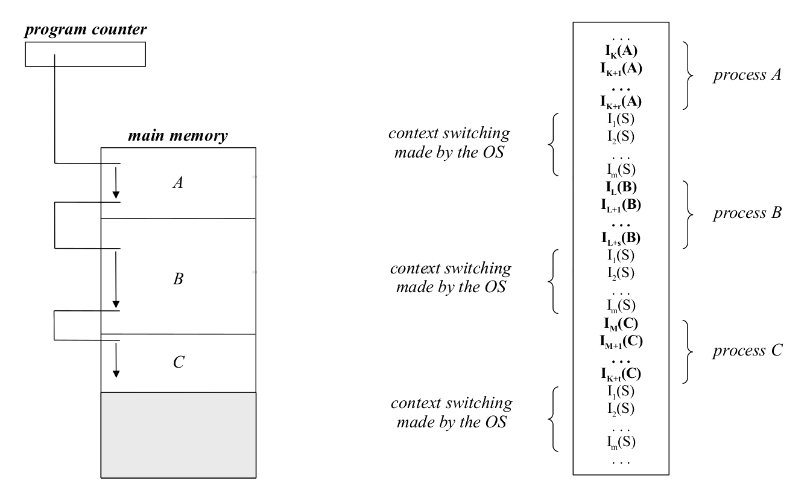


## Modelo de Processos	
Num ambiente **multiprogramado**, devido à constante **troca de processos**, é difícil expressar uma modelo para o processador. Devido ao elevado numero de processo e ao multiprogramming, torna-se difícil de saber qual o processo que está a ser executado e qual a fila de processos as ser executada.

É mais fácil assumir que o ambiente multiprogramado pode ser representado por um **conjunto de processadores virtuais**, estando um processo atribuído a cada um.

O processador virtual está:
	- **ON:** se o processo que lhe está atribuído está a ser executado
	- **OFF:** se o processo que lhe está atribuído não está a ser executado

Para este modelo temos ainda de assumir que:
- Só um dos processadores é que pode estar ativo num dado período de tempo
- O número de **processadores virtuais ativos é menor** (ou igual, se for um ambiente `single processor`) ao número de **processadores reais**
- A execução de um processo **não é afetada** pelo instante temporal nem a localização no código em que o processo é interrompido e é efetuado o switching
- Não existem restrições do número de vezes que qualquer processo pode ser interrompido, quer seja executado total ou parcialmente	

A operação de **switching entre processos** e consequentemente entre processadores virtuais ocorre de forma não **controlada** pelo programa a correr no CPU

Uma **operação de switching** é equivalente a efetuar o `Turning Off` de um processo virtual e o `Turning On` de outro processo virtual.

- `Turning Off` implica **guardar** todo o **contexto de execução**
- `Turning On` implica carregar todo o contexto de execução, **restaurando o estado do programa** quando foi interrompido


## Diagrama de Estados de um Processo
Durante a sua existência, um processo pode assumir diferentes estados, dependendo  das condições em que se encontra:

- **run:** O processo está em execução, tendo a posse do processador
- **blocked:** O processo está bloqueado à **espera de um evento externo** para estar em condições retomar a sua execução. Esse evento externo pode ser:
	- Acesso a um recurso da máquina
	- Fim de uma operação de I/O
	- ...
- **ready:** O processo está pronto a ser executado, mas está à espera que o processador lhe dê a ordem de `start/resume` para puder retomar a sua execução.

As **transições entre estados** normalmente resultam de **intervenções externas ao processo**, mas podem depender de situações em que o processo força uma transição:
	- termina a sua execução antes de terminar o seu `time quantum`
	- Leitura/Escrita em I/O (scanf/printf)

Mesmo que um processo **não abandone o processador por sua iniciativa**, o `scheduler` é responsável por **planear o uso do processador pelos diferentes processos**.

O `(Process) Scheduler` é um módulo do kernel que **monitoriza e gere as transições entre processos**. Assim, um `while(1)` não é executado _ad eternum_. Um processador `multiprocess` só permite que o ciclo infinito seja executado quando é atribuído `CPU time` ao processo.

Existem diferentes políticas que permitem controlar a execução destas transições

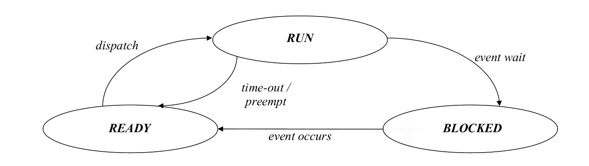


`Triggers` das transições entre estados:

- **dispatch:** 
	- O processo que estava em modo `run` perdeu o acesso ao processador.
	- Do conjunto de processos prontos a serem executados, tem de ser escolhido **um** para ser executado, sendo lhe atribuído o processador.
	- A escolha feita pelo `dispatcher` pode basear-se em:
		- um sistema de prioridades
		- requesitos temporais
		- aletoriedade
		- divisao igual do CPU
- **event wait:** 
	- O processo que estava a ser executado sai do estado `run`, não estando em execução no processador. 
		- Ou porque é impedido de continuar pelo scheduler
		- Ou por iniciativa do proprio processo.
			- _scanf_ 
			- _printf_ 
	- O CPU guarda o estado de execução do processo
	- O processo fica em estado `blocked` à **espera da ocorrência de um evento externo**, `event occurs`
- **event occurs:** 
	- Ocorreu o evento que o processo estava à espera
	- O processo transita do estado `blocked` para o estado `ready`, ficando em fila de espera para que lhe seja atribuído o processador
- **time_out:** 
	- O processo esgotou a sua janela temporal, `time quantum`
	- Atraves de uma interrupção em _hardware_, o sistema operativo vai forçar a saída do processo do processador
	- Transita para o estado _ready_ até lhe ser atribuído um novo `time-quantum` do CPU
	- A transição por time-out ocorre em qualquer momento do código. 
	- Os sistemas podem ter `time quantum` diferentes e os `time slots` alocados não têm de ser necessariamente iguais entre dois sistemas.
- **preempt**: 
	- O processo que possui a posse do processador tem uma prioridade mais baixa do que um processo que acordou e está pronto a correr (estado `ready`) 
	- O processo que está a correr no processador é **removido** e transita para o estado `ready`
	- Passa a ser **executado** o processo de **maior prioridade**

### Swap Area
O diagram de estados apresentado não leva em consideração que a **memória principal** (RAM) é **finita**. Isto implica que o número de **processos coexistents em memória é limitado**.

É necessário usar a **memória secundária** (Disco Rígido) para **extender a memória principal** e aumentar a capacidade de armazenamento dos estados dos processos.

A **memória `swap`** pode ser:

- uma partição de um disco
- um ficheiro

Qualquer processo que **não esteja a correr** por ser `swapped out`, libertando memória principal para outros processos

Qualquer processo `swapped out` pode ser `swapped in`, **quando existir memória principal disponível**

Ao diagrama de estados tem de ser adicionados:
- dois novos estados:
	- **suspended-ready:** Um processo no estado `ready` foi `swapped-out`
	- **suspended-blocked:** O processo no estado `blocked` foi `swapped-out`
- dois novos tipos de transições:
	- **suspend:** O processo é `swapped out`
	- **activate:** O processo é `swapped in`

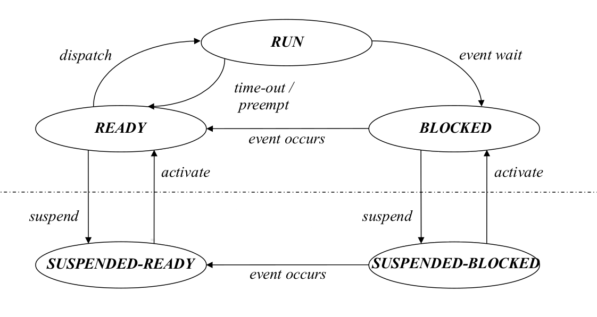

### Temporalidade na vida dos processos
O diagrama assume que os processos são **intemporais**. Excluindo alguns processos de sistema, todos os processos são **temporais**, i.e.:

1. Nascem/São criados
2. Existem (por algum tempo)
3. Morrem/Terminam

Para introduzi a temporalidade no diagrama de estados, são necessários dois novos estados:
- **new:** 
	- O processo foi criado
	- Ainda não foi atribuido à `pool` de processos a serem executados
	- A estrutura de dados associado ao processo é inicializada
- **terminated:** 
	- O processo foi descartado da fila de processos executáveis
	- Antes de ser descartado, existem ações que tem de tomar _(needs clarification)_

Em consequência dos novos estados, passam a existir três novas transições:
	- **admit:** O processo é admitido pelo OS para a `pool` de processos executáveis
	- **exit:** O processo informa o SO que terminou a sua execução
	- **abort:** Um processo é forçado a terminar.
		- Ocorreu um `fatal error`
		- Um processo autorizado abortou a sua execução


## State Diagram of a Unix Process
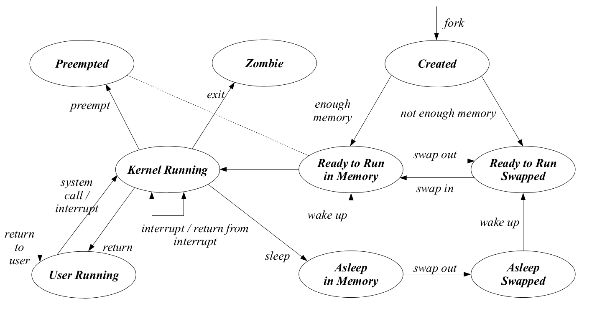

As três diferenças entre o diagrama de estados de um processo e o diagrama de estados do sistema Unix são

1. Existem **dois estados run**
	1. **kernel running**
	2. **user running**
	- Diferem **no modo** como o processador **executa o código máquina**, existindo **mais instruções e diretivas disponíveis** no modo supervisor (`root`)
2. O estado **ready** é dividido em dois estados:
	1. **ready to run in memory:** O processo está pronto para ser executado/continuar a execução, estando guardado o seu estado em memória
	2. **preempted:** O processo que estava a ser executado foi **forçado a sair do processador** porque **existe um processo mais prioritário para ser executado**
	- Estes **estados são equivalentes** porque:
		- estão ambos **armazenado na memória principal**
		- quando um processo é `preempted` continua pronto a ser executado (não precisando de nenhuma informação de I/O)
		- Partilham a mesma fila (`queue`) de processos, logo são tratados de forma idêntica pelo OS
	- Quando um **processo do utilizador abandona o modo de supervisor** (corre com permissões `root`), **pode ser preempted**
3. A transição de `time-out` que existe no diagrama dos estados de um processo em UNIX é coberta pela transição `preempted`

## Supervisor preempting
Tradicionalmente, a **execução** de um processo **em modo supervisor** (`root`) implicava que a execução do processo **não pudesse ser** interrompida, ou seja, o processo não pudesser ser **`preempted`**. Ou seja, o UNIX não permitia **real-time processing**

Nas novas versões o código está dividido em **regiões atómicas**, onde a **execução não pode ser interrompida** para  garantir a **preservação de informação das estruturas de dados a manipular**. Fora das regiões atómicas é seguro interromper a execução do código

Cria-se assim uma nova transição, `return to kernel` entre os estados `preempted` e `kernel running`.

## Unix – traditional login
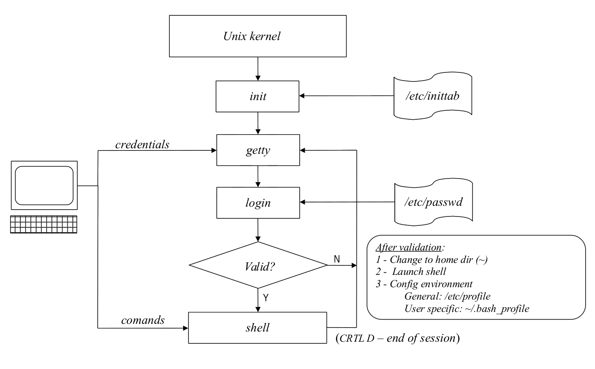

## Criação de Processos

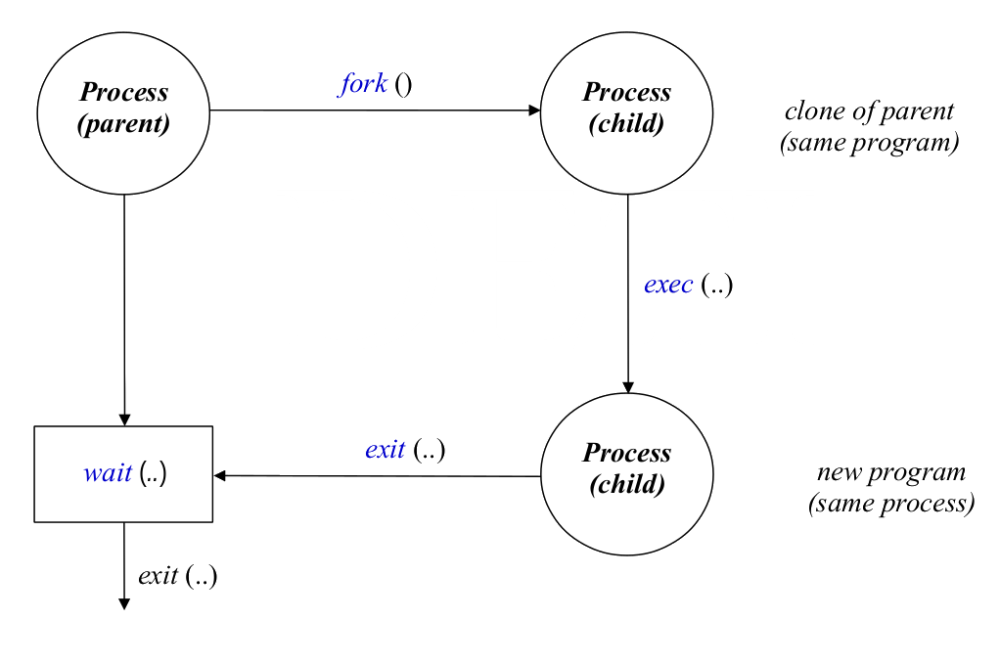

```c
#include <stdio.h>
#include <stdlib.h>
#include <sys/types.h>
#include <unistd.h>

int main(void)
{
	printf("Before the fork:\n");
	printf(" PID = %d, PPID = %d.\n",
	getpid(), getppid());

	fork();

	printf("After the fork:\n");
	printf(" PID = %d, PPID = %d. Who am I?\n", getpid(), getppid());

	return EXIT_SUCCESS;
}
```

- **fork**: **clona** o processo existente, criando uma **réplica**
	- O estado de execução é igual, incluindo o PC _(Program Counter)_
	- O **mesmo programa** é executado em **processos diferentes**
	- Não existem garantias que o pai execute primeiro que o filho
		- Tudo depende do `time quantum` que o processo pai ocupa antes do `fork`
		- É um ambiente multiprogramado: os dois programas correm em **simultâneo no micro tempo**
- O **espaço de endereçamento** dos dois processos é **igual**
	- É seguida uma filosofia **copy-on-write**. Só é efetuada a cópia da página de memória se o **processo filho modificar** os conteúdos das variáveis 

		 
Existem variáveis diferentes: 

- **PPID:** Parent Process ID
- **PID:** Process ID


```c
#include <stdio.h>
#include <stdlib.h>
#include <sys/types.h>
#include <unistd.h>

int main(void)
{
	printf("Before the fork:\n");
	printf(" PID = %d, PPID = %d.\n",
	getpid(), getppid());

	int ret = fork();

	printf("After the fork:\n");
	printf(" PID = %d, PPID = %d, ret = %d\n", getpid(), getppid(), ret);

	return EXIT_SUCCESS;
}
```

O retorno da instrução `fork` é diferente entre o processo pai e filho:

- pai: `PID` do filho
- filho: `0`

O retorno do `fork` pode ser usado como variável booleana, de modo a **distinguir o código a correr no filho e no pai**


```c
#include <stdio.h>
#include <stdlib.h>
#include <sys/types.h>
#include <unistd.h>

int main(void)
{
	printf("Before the fork:\n");
	printf(" PID = %d, PPID = %d.\n", getpid(), getppid());

	int ret = fork();

	if (ret == 0)
	{
		printf("I'm the child:\n");
		printf(" PID = %d, PPID = %d\n", getpid(), getppid());
	}
	else
	{
		printf("I'm the parent:\n");
		printf(" PID = %d, PPID = %d\n", getpid(), getppid());
	}

	printf("After the fork:\n");
	printf(" PID = %d, PPID = %d, ret = %d\n", getpid(), getppid(), ret);

	return EXIT_SUCCESS;
}
```

O `fork` por si só não possui grande interesse. O interesse é puder executar um programa diferente no filho.

- **`exec` system call:** Executar um programa diferente no processo filho
- **`wait` system call:** O pai esperar pela conclusão do programa a correr nos filhos

 

```c
#include <stdio.h>
#include <stdlib.h>
#include <sys/types.h>
#include <unistd.h>

int main(void)
{
	/* check arguments */
	if (argc != 2)
	{
		fprintf(stderr, "spawn <path to file>\n");
		exit(EXIT_FAILURE);
	}
	char *aplic = argv[1];

	printf("===============================\n");

	/* clone phase */
	int pid;
	if ((pid = fork()) < 0)
	{
		perror("Fail cloning process");
		exit(EXIT_FAILURE);
	}

	/* exec and wait phases */
	if (pid != 0) // only runs in parent process
	{
		int status;
		while (wait(&status) == -1);
		printf("===============================\n");
		printf("Process %d (child of %d)”
		“ ends with status %d\n",
		pid, getpid(), WEXITSTATUS(status));
	}
	else // this only runs in the child process
	{
		execl(aplic, aplic, NULL);
		perror("Fail launching program");
		exit(EXIT_FAILURE);
	}
}
```

O `fork` pode **não ser bem sucedido**, ocorrendo um `fork failure`.


## Execução de um programa em C/C++

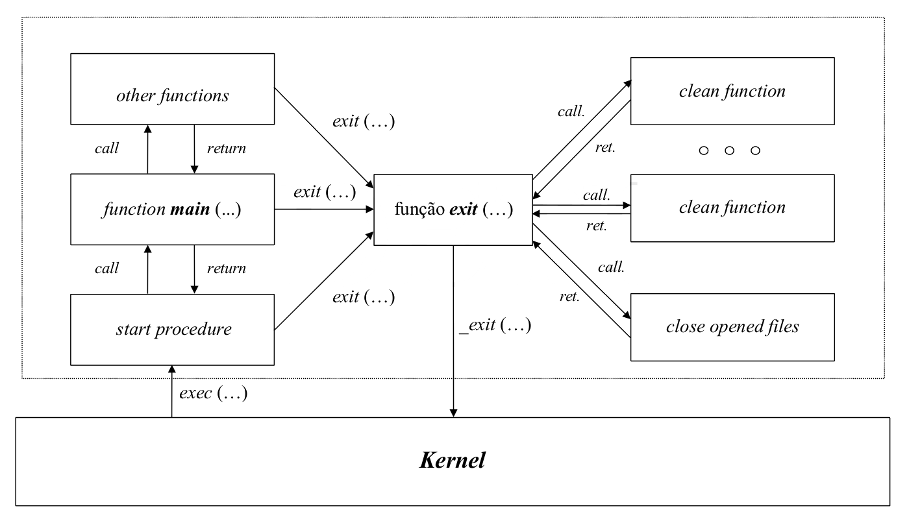

- Em C/C++ o nome de uma função é um ponteiro para a sua função.
- Em C/C++ um include não inclui a biblioteca
	- Indica ao programa que vou usar uma função que tem esta assinatura
- **atexit:** Regista uma função para ser chamada no fim da execução normal do programa
	- São chamadas em ordem inversa ao seu registo

## Argumentos passados pela linha de comandos e variáveis de ambiente
- **argv:** array de strings que representa um conjunto de parâmetros passados ao programa
	- **argv[0]** é a referência do programa
- **env** é um array de strings onde cada string representa uma variável do tipo: `name-value`
- **getenv** devolve o valor de uma variável definida no array **env**

## Espaço de Endereçamento de um Processo em Linux

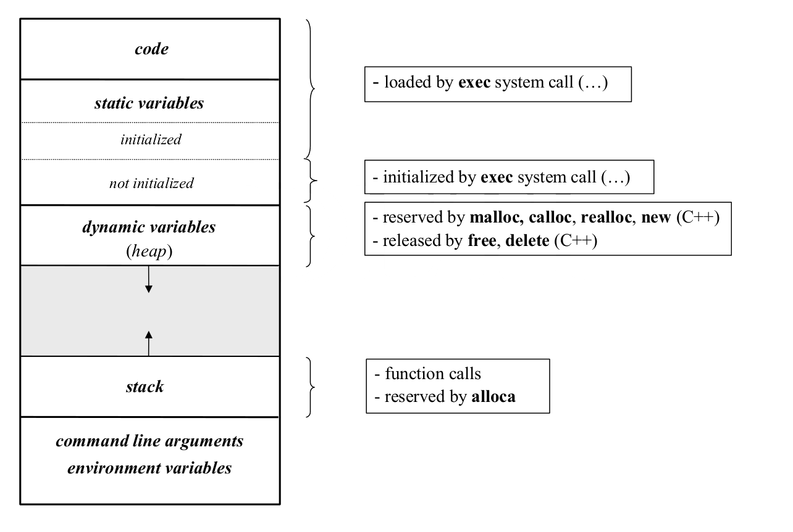

- As variáveis que existem no processo pai também existem no processo filho (clonadas)
- As variáveis globais são comuns aos dois processos 
- Os endereços das variáveis são todos iguais porque o espaço de endereçamento é igual (memória virtual)
- Cada processo tem as suas variáveis, residindo numa página de memória física diferente
- Quando o processo é clonado, o espaço de dados só é clonado quando um processo escreve numa variável, ou seja, após a modificação é que são efetuadas as cópias dos dados

- O programa acede a um endereço de memória virtual e depois existe hardware que trata de alocar esse endereço de memória de virtual num endereço de memória física
- Posso ter dois processos com memmorias virtuais distintas mas fisicamente estarem ligados *ao mesmo endereço de memória*
- Quando faço um `fork` não posso assumir que existem variáveis partilhadas entre os processos 


### Process Control Table
É um array de `process control block`, uma estrutura de dados mantida pelo sistema operativo para guardar a informação relativa todos os processos.

O `process controlo block` é usado para guardar a informação relativa a apenas um processo, possuindo os campos:

- `identification`: id do processo, processo-pai, utilizador e grupo de utilizadores a que pertence
- `address space`: endereço de memória/swap onde se encontra:
	- código
	- dados
	- stack
- `processo state`: valor dos registos internos (incluindo o PC e o `stack pointer`) quando ocorre o switching entre processos
- `I/O context`: canais de comunicação e respetivos buffers que o processo tem associados a si
- `state`: estado de execução, prioridade e eventos
- `statistic`: _start time_, _CPU time_

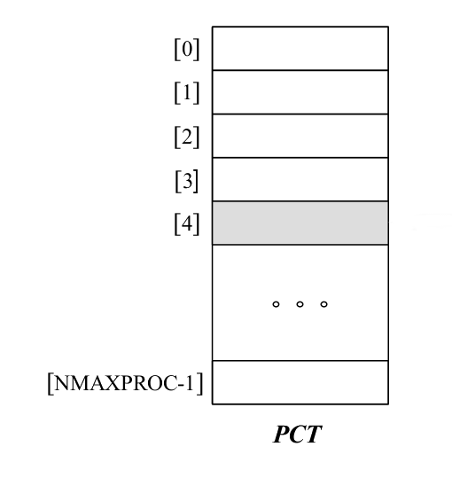


# Threads
Num sistema operativo tradicional, um **processo** inclui:

- um **espaço de endereçamento**
- um **conjunto de canais de comunicação** com dispositivos de I/O
- uma única **`thread` de controlo** que:
	- incorpora os **registos do processador** (incluindo o PC)
	- **stack**

Existem duas stacks no sistema operativo:

- `user stack`: cada `processo`/`thread` possui a sua (em memória virtual e corre com privilégios do `user`)
- `system stack`: global a todo o sistema operativo (no `kernel`)

Podendo estes dois componentes serem **geridos de forma independente**.

Visto que uma `thread` é apenas um **componente de execução** dentro de um processo, várias `threads` **independentes** podem coexisitir no mesmo processo, **partilhando** o mesmo **espaço de endereçamento** e o mesmo contexto de **acesso aos dispositivos de I/O**. Isto é **`multithreading`**.

Na prática, as `threads` podem ser vistas como _light weight processes_

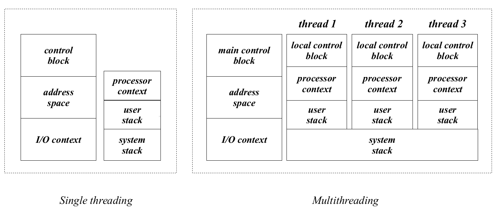

O controlo passa a ser centralizado na `thread` principal que gere o processo. A `user stack`, o **contexto de execução do processador** passa a ser dividido por todas as `threads`.

## Diagrama de Estados de uma thread

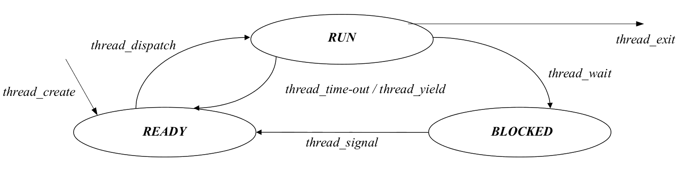

O diagrama de estados de um `thread` é  mais simplificado do que o de um processo, porque só são "necessários" os estados que interagem **diretamente com o processador**:

	- `run`
	- `ready`
	- `blocked`

Os estados `suspend-ready` e `suspended-blocked` estão relacionados com o **espaço de endereçamento** do **processo** e com a zona onde estes dados estão guardados, dizendo respeito ao **processo e não à thread**

Os estado `new` e `terminated`não estão presentes, porque a a gestão do ambiente multiprogramado prende-se com a restrição do número de `threads` que um processo pode ter, logo dizem respeito ao processo

## Vantagens de Multithreading

- **facilita a implementação** (em certas aplicações):
	- Existem aplicações em que **decompor a solução** num conjunto de `threads` que correm paralelamente facilita a implementação 
	- Como o `address space` e o `I/O context` são partilhados por todas as `threads`, `multithreading` favorece esta decomposição
- **melhor utilização dos recursos**
	- A criação, destruição e `switching` é mais eficiente usando `threads` em vez de processos
- **melhor performance**
	- Em aplicações `I/O driven`, `multithreading` permite que **várias atividades se sobreponham**, **aumentando a rapidez** da sua execução
- **`multiprocessing`**
	-  É possível **paralelismo em tempo real** se o processador possuir **múltiplos CPUs**


## Estrutura de um programa multithreaded
- Cada `thread` está tipicamente associada com a execução de uma função que implementa alguma atividade em específico
- A **comunicação entre `threads`** é efetuada através da estrutura de dados do **processo**, que é vista pelas `threads` como uma estrutura de dados global
- o **programa principal** também é uma `thread`
	- A 1ª  a ser criada
	- Por norma a última a ser destruída


## Implementação de Multithreading
**`user level threads:`**

- Implementadas por uma biblioteca
	- Suporta a criação e gestão das `threads` sem intervenção do `kernel`
- Correm com permissões do utilizador
- Solução versátil e portável
- Quando uma `thread` executa uma `system call` bloqueante, **todo o processo bloqueia** (o _kernel_ só "vê" o processo)
- Quando passo variáveis a `threads`, elas têm de ser estáticas ou dinâmicas

**`kernel level threads`**

- As `threads` são implementadas diretamente ao nível do kernel
- Menos versáteis e portáteis
- Quando uma `thread` executa uma `system call` bloqueante, **outra _thread_ pode entrar em execução**


### Libraria pthread

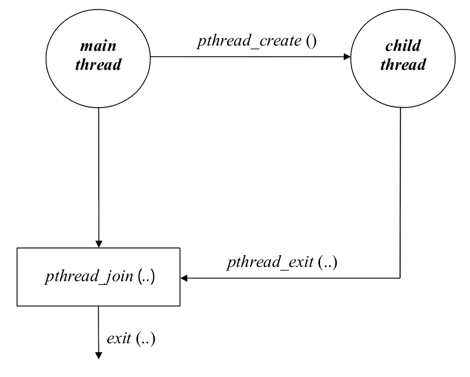

```c
#include <stdio.h>
#include <stdlib.h>
#include <pthread.h>

/* return status */
int status;

/* child thread */
void *threadChild (void *par)
{
	printf ("I'm the child thread!\n");
	status = EXIT_SUCCESS;
	pthread_exit (&status);
}

/* main thread */
int main (int argc, char *argv[])
{
	/* launching the child thread */
	pthread_t thr;
	if (pthread_create (&thr, NULL, threadChild, NULL) != 0)
	{
		perror ("Fail launching thread");
		return EXIT_FAILURE;
	}

	/* waits for child termination */
	if (pthread_join (thr, NULL) != 0)
	{
		perror ("Fail joining child");
		return EXIT_FAILURE;
	}
	
	printf ("Child ends; status %d.\n", status);
	return EXIT_SUCCESS;
}
```

## Threads em Linux
2 `system calls` para criar processos filhos:

- `fork`: 
	- cria uma novo processo que é uma **cópia integral** do processo atual
	- o `address space` é `I/O context` é duplicado
- `clone`:
	- cria um novo processo que pode partilhar elementos com o pai
	- Podem ser partilhados
		- espaço de endereçamento
		- tabela de `file descriptors`
		- tabela de `signal handlers`
	- O processo filho executa uma dada função
	
Do ponto de vista do `kernel`, `processos` e `threads` são **tratados de forma semelhante**

`Threads` do **mesmo processo** foma um `thread group` e possuem o **mesmo** `thread group identifier` (TGID). Este é o valor retornado pela função `getpid()` quando aplicada a um grupo de `threads`

As várias `threads` podem ser distinguidas dentro de um **grupo de `threads`** pelo seu `unique thread identifier` (TID). É o valor retornado pela função `gettid()`

```c
#include <stdio.h>
#include <stdlib.h>
#include <pthread.h>
#include <unistd.h>
#include <unistd.h>
#include <sys/types.h>

pid_t gettid()
{
	return syscall(SYS_gettid);
}

/* child thread */
int status;
void *threadChild (void *par)
{
	/* There is no glibc wrapper, so it was to be called 
	 * indirectly through a system call
	 */

	printf ("Child: PPID: %d, PID: %d, TID: %d\n", getppid(), getpid(), gettid());
	status = EXIT_SUCCESS;
	pthread_exit (&status);
}
```


O `TID` da _main thread_ é a mesma que o `PID` do processo, **porque são a mesma entidade**.
	
Para efetuar a compilação, tenho de indicar que a biblioteca pthread tem de ser usada na linkagem:

```bash
g++ -o x thread.cpp -pthread
```

# Process Switching

Revisitando a o diagrama de estados de um processador `multithreading`


Os processadores atuais possuem **dois modos de funcionamento:**

1. `supervisor mode`
	- Todas as intruções podem ser executadas
	- É um modo **priveligiado**, **reservado para o sistema operativo**
	- O modo em que o **sistema operativo devia funcionar**, para garantir que pode aceder a todas as funcionalidades do processador
	
2. `user mode`
	- Só uma **secção reduzida do instruction set** é que pode ser executada
	- Instruções de I/O e outras que modifiquem os registos de controlo não são executadas em `user mode`
	- É o **modo normal de operação**


A **troca entre os dois modos de operação**, `switching`, só é possível através de `exceções`. Uma `exceção` pode ser causada por:

- Interrupção de um dispositivo de I/O
- Instrução ilegal
	- divisão por zero
	- bus error
	- ...
- trap instruction (aka interrupção por _software_)


As **funções do `kernel`**, incluindo as `system calls` só podem ser lançadas por:

- **hardware** $\implies$ `interrupção`
- **traps** $\implies$ `intreeupção por software`


O ambiente de operação nestas condições é denominado de `exception handling`

## Exception Handling


A **troca do contexto de execução** é feita guardando o estado dos registos PC e PSW na stack do sistema, saltando para a rotina de interrupção e em seguida salvaguardando os registos que a rotina de tratamento da exceção vai precisar de modificar. No fim, os valores dos registos são restaurados e o programa resume a sua execução

## Processing a process switching


O algoritmo é bastante parecido com o tratamento de exceções:

1. Salvaguardar todos os dados relacioandos com o processo atual
2. Efetuar a troca para um novo processo
3. Correr esse novo processo
4. Restaurar os dados e a execução do processo anterior


# Processor Scheduling
A execução de um processo é uma sequência alternada de períodos de:

- `CPU burst`, causado pela execuçao de intruções do CPU 
- `I/O burst`, causados pela espera do resultado de pedidos a dispositivos de I/O


O processo pode então ser classificado como:

- `I/O bound` se possuir muitos e curtos `CPU bursts`
- `CPU bound` se possuir poucos e longos `CPU bursts`


O objetivo da **multiprogramação** é obter vantagem dos períodos de `I/O burst` para permitir outros processos terem acesso ao processador. A componente do sistema responsável por esta gestão é o `scheduler`.

A funcionalidade principal do `scheduler` é decidir da `poll` de processos prontos para serem executados que coexistem no sistema:

- quais é que devem ser executados?
- quando?
- por quanto tempo?
- porque ordem?


## Scheduler
Revisitando o diagrama de estados do processador, identificamos três `schedulers`

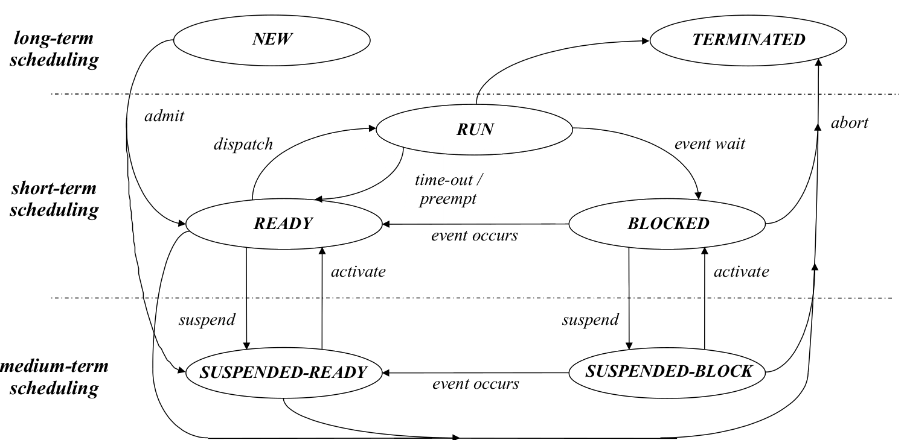

### Long-Term Scheduling
Determina que **programas são admitidos para serem processados**:

- Controla o **grau de multiprogramação** do sistema 
- Se um programa do utilizador ou `job` for aceite, torna-se um **processo** e é adicionado à **_queue_ de processos `ready` em fila de espera**
	- Em princípio é adicionado à `queue` do `short-term scheduler`
	- mas também é possível que seja adicionada à `queue` do `medium-term scheduler`
- Pode colocar processos em `suspended ready`, libertando quer a memória quer a fila de processos

### Medium Term Scheduling
Gere a `swapping area`

- As decisões de `swap-in` são **controladas pelo grau de multiprogramação**
- As decisões de `swap-in` são **condicionadas pela gestão de memória**


### Short-Term Scheduling
Decide qual o **próximo processo a executar**

- É invocado quando existe um evento que:
	- **bloqueia o processo atual**
	- **permite que este seja `preempted`**
- Eventos possíveis são:
	- interrupção de relógio
	- interrupção de I/O
	- `system calls`
	- signal (e.g. através de semáforos)

## Critérios de Scheduling 

### User oriented

**Turnaround Time:**

- Intervalo de de tempo entre a submissão de um processo até à sua conclusão
- Inclui:
	- Tempo de execução enquanto o processo tem a posse do CPU
	- Tempo dispendido à espera pelos recursos que precisa (inclui o processador)
- Deve ser minimizado em sistemas `batch`
- É a medida apropriada para um `batch job`


**Waiting Time:**

- Soma de todos os períodos de tempo em que o processo esteve à espera de ser colocado no estado `ready`
- Deve ser minimizado

**Response Time:**

- Intervalo de tempo que decorre desde a submissão de um pedido até a resposta começa a ser produzida
- Medida apropriada para sistemas/processos interativo
- Deve ser minimizada para este tipo de sistemas/processos
- O número de processos interativos deve ser máximizado desde que seja garantido um tempo de resposta aceitável


**Deadlines:**

- Tempo necessário para um processo terminar a sua execução
- Usado em sistemas de tempo real
- A percentagem de `deadlines` atingidas deve ser maximizada, mesmo que isso implique subordinar/reduzir a importância de outras objetivos/parâmetros do sistema

**Predictability:**

- Quantiza o impacto da carga (de processos) no tempo de resposta dos sistema
- Idealmente, um `job` deve correr no **mesmo intervalo de tempo** e gastar os **mesmos recursos de sistema** independentemente da carga que o sistema possui


### System oriented

**Fairness:**

- Igualdade de tratamento entre todos os processos
- Na ausência de diretivas que condicionem os processos a atender, deve ser efetuada um gestão e partilha justa dos recursos, onde todos os processos são tratados de forma equitativa
- Nenhum processo pode sofrer de `starvation`


**Throughput:**

- Medida do número de processos completados por unidade de tempo ("taxa de transferência" de processos)
- Mede a quantidade de trabalho a ser executada pelos processos
- Deve ser máximizado
- Depende do tamanho dos processos e da **política de escalonamento**


**Processor Utilization:**

- Mede a percentagem que o processador está ocupado
- Deve ser maximizada, especialmente em sistemas onde predomina a partilha do processador


**Enforcing Priorities:**

- Os processos de **maior prioridade** devem ser sempre favorecidos em detrimento de processos menos prioritários

\begin{center}
{\large É \textbf{impossível favorecer todos os critérios em simultâneo}}

Os \textbf{critérios a favorecer} dependem da \textbf{aplicação específica}
\end{center}


## Preemption & Non-Preemption

**Non-preemptive scheduling:**

- O processo mantêm o processador até este ser bloqueado ou terminar
- As **transições são sempre por `time-out`**
- Não existe `preempt`
- Típico de sistemas `batch`
	- Não existem deadlines nem limitações temporais restritas a cumprir

**Preemptive Scheduling:**

- O processo pode **perder o processador devido a eventos externos**
	- esgotou o seu `time-quantum`
	- um processo **mais prioritário** está `ready`
	- Tipico de **sistemas interativos**
		- É preciso garantir que a resposta ocorre em intervalos de tempo limitados
		- É preciso "simular" a ideia de paralelismo no `macro-tempo`
	- Sistemas em tempo real são `preemptive` porque existem `deadlines` **restritas** que precisam de ser cumpridas
	- Nestas situações é importante que um **evento externo** tenha capacidade de libertar o processador


## Scheduling

### Favouring Fearness

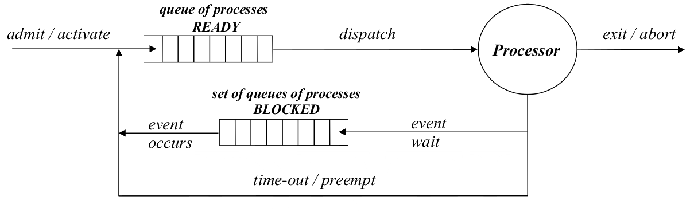

Todos os processos **são iguais** e são atendidos por **ordem de chegada**

- É implementado usando **FIFOs**
- Pode existir mais do que um processo à espera de eventos externos
- Existe uma fila de espera para cada evento
- Fácil de implementar
- Favorece processos `CPU-bound` em detrimento de processos `I/O-bound`
	- Só necessitam de acesso ao processador, não de recursos externos
	- Se for a vez de um processo `I/O-bound` ser atendido e não possuir os recursos de I/O que precisa tem de voltar para a fila
- Em **sistemas interativos**, o `time-quantum` deve ser escolhido cuidadosamente para obter um bom compromisso entre `fairness` e `response time`

Em função do scheduling pode ser definido como:

- `non-preemptive scheduling` $\implies$ `first come, first-served` (FCFS)
- `preemptive scheduling` $\implies$ `round robin`

### Priorities
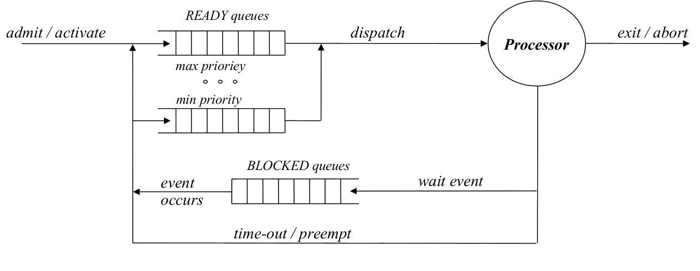

Segue o princípio de que atribuir a mesma importância a todos os processos pode ser uma solução errada. Um sistema injusto _per se_ não é necessariamente mau.

- A **minimização do tempo de resposta** (`response time`) exigue que os processos `I/O-bound` sejam **priveligiados**
- Em **sistemas de tempo real**, os processos associados a **eventos/alarmes** e **ações do sistema operativo** sofrem de várias **limitações e exigências temporais**

	 
Para resolver este problema os processos são **agrupados** em grupos de **diferentes prioridades**

- Processos de maior prioridade são executados primeiros
- Processos de menor prioridade podem sofrer `starvation`

#### Prioridades Estáticas
As prio ridades a atribuir a cada processo são determinadas _a priori_ de forma **determinística**

- Os processos são **agrupados em classes de prioridade fixa**, de acordo com a sua importância relativa
- Existe risco de os processos menos prioritários sofrerem `starvation`
	- Mas se um **processo de baixa prioridade não é executado** é porque o sistema foi **mal dimensionado**
- É o sistema de `scheduling` mais injusto
- É usado em sistemas de tempo real, para garantir que os processos que são críticos são sempre executados


Alternativamente, pode se fazer:

1. Quando um processo é criado, é lhe **atribuído um dado nível de prioridade**
2. Em `time-out` a prioridade do processo é **decrementada**
3. Na ocorrência de um `wait event` a prioridade é **incrementada**
4. Quando o valor de **prioridade atinge um mínimo**, o valor da prioridade sofre um `reset`
	- É colocada no valor inicial, garantindo que o processo é executado
	
Previnem-se as situações de `starvation` impedindo que o processo não acaba por ficar com uma prioridade tão baixa que nunca mais consegue ganhar acesso

#### Prioridades Dinãmicas
- As classes de prioridades estão definidas de forma funcional _a priori_
- A mudança de um processo de classe é efetuada com base na utilização última janela de execução temporal que foi atribuída ao processo


Por exemplo:

- **Prioridade 1:** `terminais`
	- Um processo entra nesta categoria quando se efetua a transição `event occurs` (evento de escrita/leitura de um periférico) quando estava à espera de dados do `standard input device`
- **Prioridade 2:** `generic I/O`
	- Um processo entra nesta categoria quando efetua a transição `event occurs` se estava à espera de dados de **outro tipo de input device** que não o `stdin`
- **Prioridade 3:** `small time quantum`
	- Um processo entra nesta classe quando ocorre um `time-out`
- **Prioridade 4:** `large time quantum`
	- Um processo entra nesta classe após um sucessivo número de `time-outs`
 	- São claramente processos `CPU-bound` e o objetivo é atribuir-lhes janelas de execução com grande `time quantum`, mas menos vezes


##### Shortest job first (SJF) / Shortest process next (SPN)
Em sistemas `batch`, o `turnaround time` deve ser minimizado.

Se forem conhecidas **estimativas do tempo de execução** _a priori_, é possível estabelecer uma **ordem de execução** dos processos que **minimizam o tempo de `turnaround` médio** para um dado grupo de processos

Assumindo que temos N `jobs` e que o tempo de execução de cada um deles é $te_n$, com $n = 1, 2, ..., N$. O `average turnaround time` é:
$$t_m = te_1 + \frac{N-1}{N} \cdot te_2 + ... + \frac{1}{N} \cdot te_N$$

onde $t_m$ é o `turnaround time` mínimo se os `jobs` forem sorteados por ordem ascendente de tempo de execução (estimado)


Para **sistemas interativos**, podemos usar um sistema semelhante:

- Estimamos a taxa de ocupação da próxima janela de execução baseada na taxa de ocupação das janelas temporais passadas
- Atribuímos o processador ao processo cuja estimativa for a **mais baixa**


Considerando $fe_1$ como sendo a **estimativa da taxa de ocupação** da primeira janela temporal atribuída a um processo e $f_1$ a fração de tempo efetivamente ocupada:

- A estimativa da segunda fração de tempo necessária é 
  $$fe_2 = a \cdot fe_1 + (1-a) \cdot f_1$$
- A estimativa da e-nésima fração de tempo necessária é:
$$ fe_N = a \cdot fe_{N-1} + (1-a) \cdot f_{N-1}$$
  Ou alternativamente:
$$a^{N-1} \cdot fe_1 + a^{N-2} \cdot(1-a) \cdot fe_2 + a \cdot (1-a) \cdot fe_{N-2} + (1-a) \cdot fe_{N-1}$$ 


Com $a \in [0, 1]$, onde $a$ é um coeficiente que representa o peso que a história passada de execução do processo influencia a estimativa do presente

Esta alternativa levanta o problema que que processos `CPU-bound` podem sofrer de `starvation`. Este problema pode ser resolvido contabilizando o tempo que um processo está em espera (`aging`) enquanto está na fila de processos `ready`

Normalizando esse tempo em função do período de execução e denominando-o $R$, a **prioridade** de um processo pode ser dada por:
$$p = \frac{1+b \cdot R}{fe_N}$$
onde $b$ é o coeficiente que **controla o peso do aging** na fila de espera dos processos `ready`


## Scheduling Policies

### First Come, First Serve (FCFS)
Também conhecido como `First In First Out` (FIFO). O processo mais antigo na fila de espera dos processos `ready` é o primeiro a ser selecionado.

- `Non-preemptive` (em sentido estrito), podendo ser combinado com um esquema de prioridades baixo
- Favorece processos `CPU-bound` em detrimento de processos `I/O-bound`
- Pode resultar num **mau uso** do processador e dos dispositivos de I/O
- Pode ser utilizado com **low priority schemas**


Usando uma política de `first come first serve`, o resultado do scheduling do processador é:


- O P1 começa a usar o CPU. 
- Como é um sistema FCFS, o processo 1 só larga o CPU passado 3 ciclos. 
- O processo P2 é o processo seguinte na fila `ready`, e ocupa o CPU durante 10 ciclos.
- Quando P2 termina, P1 é o processo que está à mais tempo à espera, sendo ele que é executado
- Quando P2 abandona voluntariamente o CPU, o processo P1 corre os seus primeiros dois ciclos
- Quando P3 liberta o CPU, o processo P1 termina os últimos 3 ciclos que precisa
- Quando P3 liberta o CPU, o processo P1 como é `I/O-bound` e precisa de 5 ciclos para o dispositivo estar pronto fica mais dois ciclos à espera para puder terminar executando o seu último ciclo

### Round-Robin
- `Preemptive`
	- O `scheduler` efetua a gestão baseado num `clock`
	- A cada processo é atribuído um `time-quantum` máximo antes de ser `preempted`
- O processo **mais antigo** em `ready` é o **primeiro a ser selecionado** 
	- não são consideradas prioridades
- Efetivo em sistemas `time sharing` com objetivos globais e sistemas que processem transações
- **Favorece** `CPU-bound` em detrimento de processos `I/O-bound`
- Pode resultar num **mau uso de dispositivos I/O**


Na escolha/otimização do `time quantum` existe um **tradeoff:**

- **tempos muito curtos** favorecem a execução de **processos pequenos**
	- estes processos vão ser executados **rapidamente**
- **tempos muito curtos** obrigam a `processing overheads` devido ao `process switching` **intensivo**

Para os processos apresentados acima, o diagrama temporal de utilização do processador, para um `time-quantum` de 3 ciclos é:


A história de processos em `ready` em fila de espera é: 2, 1, 3, 2, 1, 2, 3, 1


### Shortest Process Next (SPN) ou Shortest Job First (SJF)
- `Non-preemptive`
- O process com o `shortest CPU burst time` (menor tempo espectável de utilização do CPU) é o **próximo a ser selecionado**
	- Se vários processos tem o **mesmo tempo de execução** é usado FCFS para desempatar
- Existe um **risco de `starvation`** para grandes processos
	- o seu acesso ao CPU pode ser **sucessivamente adiado** se existir "forem existindo" processos com **tempo de execução menor**
- Normalmente é usado em escalonamento de logo prazo, `long-term scheduling` em sistemas `batch`, porque os utilizadores esperam estimar com precisão o tempo máximo que o processo necessita para ser executado


### Linux

No Linux existem 3 classes de prioridades:


1. **FIFO**, `SCHED_FIFO`
	- `real-time threads`, com politíca de prioridades
	- uma `thread` em execução é `preempted` apenas se um processo de **mais alta prioridade da mesma classe** transita para o estado `ready`
	- uma `thread` em execução pode **voluntariamente abandonar o processador**, executando a primitiva `sched_yeld`
	- dentro da mesma classe de prioridade a política escolhida é `First Come, First Serve` (FCFS)
	- Só o `root` é que pode lançar processos em modo FIFO
2. **Round-Robin real time threads**,  `SCHED_RR`
	- `threads` com prioridades com necessidades de execução em tempo real
	- Processos nesta classe de prioridades são `preempted` se o seu `time-quantum` termina
3. **Non real time threads**, `SCHED_OTHER`
	- Só são executadas se não existir nenhuma `thread` com necessidades de execução em tempo real
	- Está associada à processos do utilizador
	- A política de escalonamento tem mudado à medida que a são lançadas novas versões do _kernel_


A **escala de prioridades** varia

- 0 a 99 para `real-time threads`
- 100 a 139 para as restantes

Para lançar uma `thread` (sem necessidades de execução em tempo real) com diferentes prioridades, pode ser usado comando `nice`.

Por _default_, o comando lança uma `thread` com prioridade 120. O comando aceita um `offset` de [-20, +19] para obter a prioridade mínima ou máxima.

#### Algoritmo Tradicional
- Na classe `SCHED_OTHER` as prioridades são baseadas em **créditos**
- Os créditos do processo em execução são **decrementados** à medida que ocorre uma interrupção do `real time clock`
- O processo é `preempted` quando são atingidos zero créditos
- Quando todos os processos `ready` têm zero créditos, os créditos de **todos os processos** (incluindo os que estão bloqueados) são **recalculados** segundo a fórmula:
	$$CPU_j(i) = \frac{CPU_j(i-1)}{2} + PBase_j + nice_j$$
onde são tido em conta a **história passada de execução do processo** e as **prioridades**
- O `response time` de processos `I/O-bound` é minimizado
- A `starvation` de processos `CPU-bound` é evitada
- Solução **não adequada para múltiplos processadores** e é má se o número de processos é elevado


## Novo Algoritmo
- Os processos na classe `SCHED_OTHER` passam a usar um `completely fair scheduler (CFS)`
- O scheduling é baseado no `vruntime`, _virtual run time_, que mede durante quanto tempo uma `thread` esteve em execução
	- o `virtual run time` está relacionado quer com o **tempo de execução real** (`physical run time`) e a **prioridade** da `thread`
	- Quanto maior a prioridade de um processo, menor o `physical run time`
- O `scheduler` seleciona as `threads` com menor `virtual run time`
	- Uma `thread` com prioridade mais elevada que fique pronta a ser executada pode "forçar" um `preempt` uma `thread` com menor prioridade
		- Assim é possível que uma `thread I/O bound` "forçar" o processador a `preempt` um processo `CPU-bound`
- O algoritmo é implementado com base numa `red-black tree` do processador


