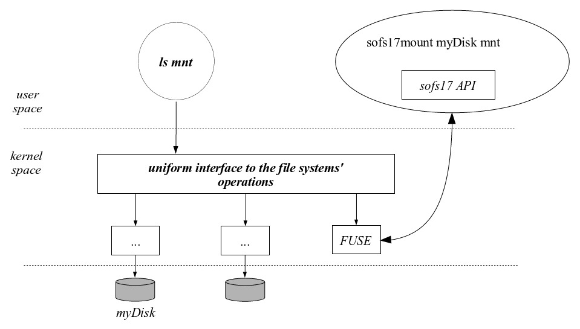

# sofs2017

---

> *The sofs17 is a simple and limited file system, based on the ext2 file system, which was designed for purely educational purposes and is intended to be developed in the practical classes of the Operating Systems course in academic year of 2017/2018. The physical support is a regular file from any other file system.*


- Sistema simples e limitado
- Baseado no ext2 
- Suporte físico: um ficheiro regular de outro sistema operativo
	- Este ficheiro será formatado para imitar uma unidade física formatada no formato sofs17

## Organização das aulas durante o sofs17
2 horas: \
	- 1h30 : interagir relativamente ao trabalho pendente \
	- 0h30 : falar da próxima camada de software \


## Introduction
- Durante a execução de um programa, ele manipula informação (produz, acede e/ou modifica).
- Esta informação tem de ser guardada exteriormente (**mass storage**)
	- discos magnéticos
	- discos ópticos
	- SSD
	- ...

- **mass storage** (armazenamento de massa): dispositivos organizados em arrays de blocos
	- 256 bytes até 8 Kbytes por bloco
	- os blocos são numerados sequencialmente (LBA model)
	- o acesso para R/W é efetuado através de um ID (identification number)

|:-----:|:-------:|:-----:|:---:|:-------:|:----:|
| Block 0 | Block 1 | Block 2| Block 3 | ... | Block NTBK-1 |

- Cada bloco tem BKZS bytes de informação
- O acesso ao disco é feito bloco a bloco:
	- **Não é possível modificar um único byte**

---

> _Direct access to the contents of the device **should not be allowed to the application programmer.** _

---

Porque:

- Um sistema de ficheiros é complexo
- A sua estrutura interna precisa de *enforce quality criteria* para garantir:
	- eficiência
	- integridade
	- partilha de acessos
- O utilizador não sabe o conteúdo de cada bloco de dados nem em que blocos a informação do ficheiro x está.

Daí a necessidade/exigência da existência de um *uniform interaction model* (Nível de abstração).


**ficheiro**: 

- unidade lógica de armazenamento de massa
- *abstract data type*, sobre o ponto de vista do programador
	- composto por um conjunto de atributos e operações
- tipos:
	- NTFS
	- ext3
	- FAT*
	- UDF
	- APFS
	- ...

---

> *Is the operating system’s responsability to provide a set of from the file system point of view: system calls that implement such abstract data type. These system calls should be a simple and safe interface with the mass storage device. The component of the operating system dedicated size — the size in bytes of the file’s data to this task is the file system*

---

Ou seja, operações de leitura e escrita **são sempre efetuadas no contexto de ficheiros**, através de syscall disponibilizadas pelo OS.

A interface de comunicação com o OS é a mesma, mas diferentes sistemas de ficheiros obrigam a diferentes técnicas e manipulação do filesystem, que são transparentes para o programador.

### File as an abstract data type

Os atributos de um ficheiros dependem da implementação do sistema de ficheiros.

Os mais comuns:

- **name**:
- **internal identifier**: ID númerico (e interno - o user desconhece) que é usado pelo OS para aceder ao ficheiro
- **size**: tamanho do ficheiro em bytes
- **ownership**: Identificação de quêm o ficheiro pertence (usado para controlo de acessos)
- **permissions**: Atributos que em conjunto com a ownership (des)autorizam o acesso ao ficheiro
	- Possíveis permissões:
		- r: read
		- w: write
		- x: execute
		- d: directory
	- Nos diretórios, execução `x` significa que eu tenho permissões para atravessar o diretório (posso não ter permissões nem para ler nem para escrever, mas posso seguir no diretório para chegar a outro path)
- **acess monitoring**: data  do último acesso e última modificação
- **localization of the data**: identificação dos clusters onde os dados do ficheiros estão guardados
- **type**: tipo dos ficheiros: 
	1. ordinary or regular: qualquer ficheiro \"normal\" para o utilizador [ID= - ]
		- .txt
		- .doc
		- .png
		- .avi
		- .mp3
		- .pdf
		- .c
		- .exe
		- ...
	2. directory: um tipo de **ficheiro** interno, com um formato pre-definido, usado para localizar outros ficheiros ou diretórios, permitindo visualizar o sistemas de ficheiros como uma árvore de diretórios e fichieros [ID= d]
	3. shortcut (symbolic link): ficheiro interno, com um formato predefinido, que contém uma referência para outro ficheiro/diretório [ID= s]
		- ref pode ser absoluta ou relativa
	4. character device(**special file**): *represents a device handles in bytes* [ID= c]
	5. block device(**special file**): *rep	esents a device handles in block* [ID= b]
	6. socket(**special file**): *represents a file used for inter-process communication* [ID= s]
	7. named pipe: _**another special file** used for inter-process communication_ [ID = p]

ID (`ls -ll`) | meaning 
:-----------:|:-------:
- | ordinary/regular file
d | directory
s | symbolic link
c | character device
b | block device
s | socket
p | named pipe

No sofs17 só serão considerados os três primeiros tipos de ficheiros.

### Operações em ficheiros
- Dependem do OS
- Todas as operações estão disponíveis **apenas** através de syscalls (funções que funcionam como *entry-points* para o OS
- Syscalls em Linux para os tipos de ficheiros a usar no sofs17:
```c
/*[TODO] Inserir descrição das operações para o teste*/
```
	- Comun aos três:
		- open
		- close
		- chmod
		- chown
		- utime
		- stat
		- rename
	- Comun para **ficheiros regulares** e **shortcuts**:
		- link
		- unlink
 	- Só para **ficheiros regulares**:
		- mknod
		- read
		- write
		- truncate
		- lseek
	- Só para **diretórios**
		- mkdir
		- rmdir
		- getdents
	- Só para **shortcuts**
		- symlink
		- readlink


A descrição destas syscalls pode ser obtida executando num terminal o comando:
```bash
man 2 <syscall>
```

## FUSE
Inserir um novo filesystem num OS requer:
1. Integração do software que implementa o novo filesystem no kernel
2. Instanciação de um ou mais dispositivos que usam o formato do novo filesystem

> *In monolitic kernels, the integration task involves the recompilation of the kernel, including the sofware that implements the new file system. In modular kernels, the new software should be compiled and linked separalely and attached to the kernel at run time.* 

Tarefa morosa e difícil, que requer _deep knowledge of the hosting system_ - **OUT OF THE SCOPE OF SO**

> FUSE (File system in User SpacE) is a canny solution that **allows for the implementation of file systems in user space** (memory where normal user programs run). Thus, **any effect of flaws of the suporting software are restricted to the user space, keeping the kernel imune to them.**

O novo filesystem é executado em cima do FUSE com permissões de user e não de root. Assim, certas operações que poderiam danificar fisicamente os dispositivos estão interditas e erros no código não geram kernel-panics.

Isola-se a execução deste novo filesystem do kernel.

### Infrastrutura
- **Interface com o filesystem nativo**: funciona como mediador entre as syscalls do sistema nativo e as implementadas em user sapce
- **Implementation library**: 
	- Estruturas de dados
	- Protótipos de funções (que devem ser desenvolvidas pelo user para criar o filesystem específico)
	- Métodos para instanciar e integrar o novo filesystem com o kernel



## SOFS17 Architecture
- Um disco é um conjunto de blocos numerados
	- No sofs17 cada bloco tem 512 bytes
- Os elementos principais na definição da arquitectura do sofs2017 são:
	- **superblock**: estrutura de dados guardada no bloco 0. Contém atributos globais para
		- o disco como um todo
		- outras estruturas de dados 
	- **inode**: estrutura de dados que contém **todos os atributos de um ficheiro, excepto o nome**
		- Existe um região contínua no disco reservada para guardar todos os inodes (inode table)
		- A identificação de um inode é feita com um indíce que representa a sua posição relativa na inode table
	- **directory**: _special file_ que permite a implementação de uma hierarquia (árvore) para acesso aos ficheiros
		- É composto por um conjunto de entradas (*directory entries*) em que cada uma associa um nome a um inode
		- Assume-se que o diretório de raiz (*root*) está associado ao inode 0
	- **disk blocks**: usados para guardar os dados
		- Estão organizados em grupos de 4 blocos contínuos -> **clusters**
		- A identificação de um cluster é dada através de um indíce que identifica a posição relativa do cluster na cluster zone
	- **cluster**: Para cada cluster existe um bit correspondente que representa o seu estado (vazio/preenchido)
		- Estes bits estão guardados no sistema de ficheiros numa área chamada *reference bitmpa table*


De forma geral, os N blocks de um disco formatado em sof17 organizam-se em 4 áreas:


## List of free inodes


## Generic
- ficheiro showsizes é usado para mostrar os valores dos campos de dados

## createDisk
```bash
createDisk <dir> <num_blocks>
```

- createDisk usa o dd

# showblock
Usado para mostrar o conteudo dos blocos de acordo com a indicação
Não sabe a estrutura interna. Vai formatar o que eu lhe der da forma que eu lhe peço

## inodes
- Cada inode tem dois campos que são reservados para fazer uma lista ligada
- A lista é circular. 
- Cada numero da lista paonta sempre para o seguinte. 
- O previous aponta sempre para o elemento aterior.
- Só preciso de saber a tail porque a previous do head é a tail
- O número de inodes por default é [NUM_BLOCKS]/8


```table
in | name
.. | ..
```

Correspondência univoca entre o inode e o nome do ficheiro

- stat <filename> : mostra a estatísticas do ficheiro (filesize, blocks, ID Block, device, inode, links e datas de aceso, modificação e change)
	- Ficheiro `.` : diretório atual
	- Ficheiro `..` : diretório atual

Na raiz o `..` aponta para a raiz (não existem entradas anteriores

## Comandos para executar
./showblock /tmp/zzz -i 1
./createBlock
./testtools

## Retrieval Chache
Se o disco tiver vazio, a referência deve ser max e não 0.
o 0 significa que está cheio

## Insertion cach
Se o disco tiver vazio, a referência deve ser 0.
o 0 significa que a insertion cahce esta vazia

## Testtools
Permite testar o sistema de ficheiros

## Notes
função alloc cluster tem de verificar se ficou tudo bem no disco
função replentish transfer da reference bitmao block para a retrieval cache
